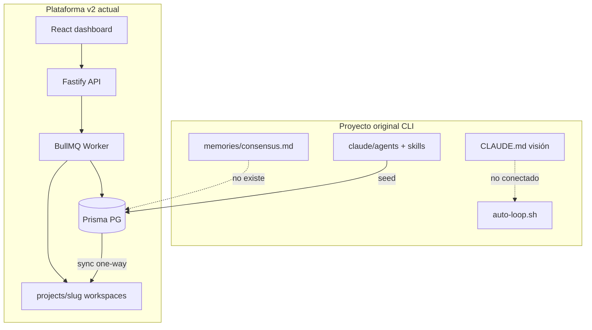

# GAPS — Revisión código vs. proyecto original

> Documento de trabajo generado el 2026-07-22.  
> Branch de referencia: `feat/orchestration-plan` (commits hasta `013aebb`).  
> Base: comparación con `CLAUDE.md`, `docs/platform.md` y visión del repo original MaxMiksa/Auto-Company.

---

## Resumen ejecutivo

El repositorio contiene **dos sistemas paralelos** no unificados:

| Sistema | Qué es | Estado |
|---------|--------|--------|
| **Original (CLI)** | `scripts/core/auto-loop.sh`, `memories/consensus.md`, agentes en `claude/agents/` | Documentado en `CLAUDE.md`, **no conectado** a la plataforma v2 |
| **Plataforma v2** | Fastify + Prisma + BullMQ + React | Lo que se usa en `/ops`, war room, productos |

La plataforma v2 es un **orquestador multi-tenant serio**, pero aún es más un **“AI ops dashboard”** que la **“compañía autónoma que gana dinero”** descrita en `CLAUDE.md`. Falta cerrar el loop: demanda → decisión → entregables verificables → deploy → revenue medible, con consenso confiable y guardrails duros.

**Síntoma reportado (Alebrije MemorIA / pricing-and-monetization):** runs completados con tokens consumidos pero sin documentos visibles. Causas identificadas (parcialmente corregidas en `5a74da7` y `013aebb`):

1. Output LLM vacío en `_history` cuando el agente termina en tool calls
2. Handoff JSON no parseado por paso
3. War room no detectaba runs (faltaba `focusProductSlug` / `lastRunId`)
4. **Bug pendiente:** listado de revisiones usa ID incorrecto → UI vacía aunque BD tenga datos

---

## Arquitectura — dónde se pierde valor

---

## 🔴 Críticos — rompen flujos core

### GAP-001 — Revisiones de consenso por producto: ID incorrecto ✅ Fixed (2026-07-23)

**Severidad:** Crítica  
**Síntoma:** Pestañas *Revisiones* e *Informes por agente* vacías aunque `cycleNumber` > 0 (p. ej. ciclo #20 con “0 revisiones”).

**Causa:** `listProductConsensusRevisions` consultaba con `TenantProduct.id` pero `ProductConsensusRevision.productId` referencia `ProductConsensus.id`.

**Fix aplicado:** `src/lib/product-consensus.ts` — lookup `ProductConsensus` por `tenantProductId` antes del `findMany`. Revisiones nuevas guardan solo la sección del ciclo en `revision.content` (no el documento completo).

**Acción post-deploy:** Recargar `/products/:id/consensus` — deberían aparecer las ~20 revisiones ya en BD.

---

### GAP-002 — Workflow `research-drilldown` no seeded

**Severidad:** Crítica  
**Síntoma:** Pivot desde `/decisions` falla (412 o workflow not found).

**Causa:** Constante en `src/lib/workflow-names.ts` pero ausente en `DEFAULT_WORKFLOWS` de `src/lib/seed-platform.ts`.

**Fix propuesto:** Añadir workflow a seed + clone-templates para tenants existentes.

---

### GAP-003 — Guardrails de shell incompletos

**Severidad:** Crítica  
**Síntoma:** Agente puede ejecutar comandos destructivos vía `run_shell_command`.

**Causa:** `run_shell_command` usa `isCommandSafe()` con lista mínima (`rm -rf /`, fork bomb, etc.). Bloqueos de `gh repo delete`, `wrangler delete`, force-push solo existen en `runShell()` usado por herramientas específicas (`git_*`, `wrangler_deploy`).

- `read_file` bloquea `.env`, pero `cat .env` vía shell pasa
- Contradice `CLAUDE.md` (Safety Guardrails)

**Fix propuesto:** Política única de shell compartida por todas las herramientas.

**Archivos:** `src/core/tools.ts`

---

### GAP-004 — Veto de Munger no detiene el workflow

**Severidad:** Crítica (visión)  
**Síntoma:** Munger emite veto pero el workflow continúa con agentes restantes.

**Causa:** Veto parseado para propuestas GO/NO-GO en `src/lib/convergence.ts`; no hay corte en `src/core/engine.ts`.

**Fix propuesto:** Al detectar veto en output de `critic-munger`, marcar run como bloqueado o saltar steps restantes.

---

### GAP-005 — Dos memorias de consenso desincronizadas

**Severidad:** Crítica (arquitectura)  
**Síntoma:** Confusión tenant vs. producto; humano no puede guiar vía archivo como promete `CLAUDE.md`.

| Capa | Original | Plataforma v2 |
|------|----------|---------------|
| Baton humano | `memories/consensus.md` | No existe (`memories/` ausente) |
| Company | — | `TenantConsensus` + `projects/{tenant-slug}/consensus.md` |
| Producto | — | `ProductConsensus` + `projects/{product-slug}/consensus.md` |

- Sync: **BD → archivo** solamente; edición manual de archivo no vuelve a BD
- Meta-ciclo mezcla memoria tenant y producto; handoff lossy entre capas
- `consensus.md` de producto no se bootstrappea en workspace hasta primer handoff

**Fix propuesto:** Decidir fuente de verdad; opcionalmente restaurar `memories/consensus.md` como puente o documentar modo plataforma-only.

**Archivos:** `src/lib/consensus.ts`, `src/lib/product-consensus.ts`, `CLAUDE.md`

---

### GAP-006 — Legacy CLI no integrado

**Severidad:** Crítica (coherencia del repo)  
**Causa:** `scripts/core/auto-loop.sh` apunta a `memories/consensus.md` y CLI; plataforma usa BD + worker.

**Fix propuesto:** Deprecar formalmente o crear bridge CLI ↔ API.

**Archivos:** `scripts/core/auto-loop.sh`, `INDEX.md`, `README.md`

---

## 🟠 Altos — visión vs. implementación

### GAP-007 — Autonomía real vs. CLAUDE.md

| Promesa | Realidad | Prioridad |
|---------|----------|-----------|
| Sin intervención humana diaria | GO/NO-GO en `/decisions`; gate OpenCode; límites de coste | Alta |
| Entregables en `docs/{role}/` | Auto-save solo en runs con `productSlug`; discovery tenant no persiste | Alta |
| Make money legally | Campo manual `revenueUsd`; sin ingesta Stripe/métricas/CAC | Alta |
| Munger freno real | Solo soft veto en propuestas | Alta |
| Skills arsenal | Texto estático en prompt; no runner dinámico MCP | Media |

---

### GAP-008 — Meta-orchestrator incompleto

**Archivos:** `src/core/meta-orchestrator.ts`, `src/lib/orchestration-plan.ts`

| Gap | Detalle |
|-----|---------|
| Un solo producto en foco | `buildingProducts[0]` o focus; sin rotación multi-producto |
| Decisiones pendientes | Cambia `task` a “Pause…” pero **igual ejecuta** workflow |
| Sin guard de run activo en manual | `tenantHasActiveRun` solo en scheduler, no en launch/run-now/workflow editor |
| Preset por defecto | Discovery semanal, no `full_autonomous` cada 30 min |
| Presets producto (SEO, marketing) | No en routing meta; solo launch manual desde war room |

---

### GAP-009 — Entregables de agentes (post-fixes recientes)

**Fixes aplicados (`5a74da7`, `013aebb`):** agregación output LLM, parseo JSON por paso, auto-guardado docs, detección run en war room.

**Gaps restantes:**

| Gap | Archivos |
|-----|----------|
| Duplicados: persist siempre en convergencia aunque agente ya hizo `write_file` | `src/lib/agent-deliverables.ts`, `src/lib/convergence.ts` |
| `agentWroteDocsInStep()` exportada pero no usada | `src/lib/agent-deliverables.ts` |
| Sin validación de carpeta `docs/{role}/` correcta | `src/lib/workspace-layout.ts`, prompts en `engine.ts` |
| Runs sin producto no generan docs | `src/core/engine.ts` |
| Listado agent-docs solo por producto; no tenant-level | `src/lib/product-code.ts`, `src/server/routes/products.ts` |

---

### GAP-010 — OpenCode integration

**Archivos:** `src/lib/opencode-bridge.ts`, `src/core/engine.ts`, `src/core/tools.ts`, `src/worker/opencode-processor.ts`

| Gap | Severidad |
|-----|-----------|
| Solo `feature-development` usa delegación OpenCode | Alta |
| `resumeFromStepOrder: 3` hardcodeado en tools vs. dinámico en engine | Alta |
| Fallo OpenCode falla run entero; sin retry/degrade | Media |
| Diff en BD; no sync automático al workspace del producto | Media |
| Poll worker single-attempt | Media |
| Sin tests integración gate/poll/finalize/resume | Alta |

---

### GAP-011 — Workspaces y productos externos

**Archivos:** `src/lib/tenant-workspace.ts`, `src/lib/product-workspace.ts`, `src/lib/product-registry.ts`

| Gap | Detalle |
|-----|---------|
| Colisión namespace | Tenant slug y product slug comparten `projects/{slug}/` |
| `ensureDefaultProducts` hardcoded | Solo SnapOG si `tenant.slug === "snapog"` |
| Import/register manual | Sin watcher cuando aparecen carpetas en `projects/` |
| Delete/archive producto | No toca filesystem; dirs huérfanos |
| Doc drift | `CLAUDE.md` dice `projects/`; plataforma separa tenant vs. product slug |

---

### GAP-012 — Worker / queue / scheduler

**Archivos:** `src/core/engine.ts`, `src/worker/queue.ts`, `src/worker/processor.ts`, `src/lib/orchestration-plan.ts`

| Gap | Detalle |
|-----|---------|
| Redis caído → inline en API | Comportamiento divergente silencioso |
| `attempts: 1`, sin DLQ | Jobs fallidos se pierden |
| Concurrency 2 sin aislamiento por tenant | Race en consenso |
| Worker job omite `productId` | Depende de slug lookup en engine |
| Rate limits sparse | Launch, run-now, opencode sin throttle dedicado |

---

## 🟡 Frontend — backend adelantado a la UI

### GAP-013 — API sin exposición en UI

| Endpoint | Gap |
|----------|-----|
| `PUT /products/company-phase` | Fase company solo lectura en `/ops` |
| `GET /products/cycle` | `stuckCounter`, cycle number — no en `api.ts` |
| `PUT /products/:id` (`revenueUsd`, fases) | Solo pause/archive en `ProductActionsMenu` |
| `GET /runs?workflowId&status` | Lista sin filtros |
| `POST /decisions/:id/cancel` | Cliente existe; UI no llama |
| `GET /admin/settings/platform/resolved` | Sin panel admin debug |

---

### GAP-014 — UX incompleta por pantalla

**War room** (`WarRoomContent.tsx`, `WarRoomPage.tsx`)

- Errores de carga silenciados (`.catch(() => undefined)`)
- OpenCode: badge only; sin panel live en war room (hay que ir a `/runs/:id`)
- SSE solo con `activeRun`; sin polling fallback
- Sin poll en estado `DELEGATED`

**Products** (`ProductsPage.tsx`, `ProductWorkLauncher.tsx`)

- Presets deshabilitados sin explicación (`!preset.available`)
- Sin UI para `revenueUsd` ni avance de fase manual
- GO approval solo en `/decisions`; pipeline en products solo evaluate/reject

**Consensus** (`ConsensusPage.tsx`, `ProductConsensusPage.tsx`)

- Scope “idea sin producto” no navega a memoria útil
- Company page siempre guarda tenant consensus aunque scope muestre producto

**Runs** (`RunsPage.tsx`, `RunDetailPage.tsx`)

- Sin filtros ni auto-refresh
- Logs SSE sin empty state “esperando eventos”
- `OpencodeRunPanel` sin `gate.reason`; sin poll en delegación

**Ops / Settings**

- `stuckCounter` no renderizado
- `OrchestrationPreviewPanel` solo en `/ops`, no en settings/schedules
- Settings save sin toast/error visible

**Navegación**

- `/` index → `WorkflowsPage`; login → `/ops` (inconsistencia)
- Redirect war room OK; `/products/:id/team` legacy → war room

---

### GAP-015 — i18n

- Bundles en/es alineados (~986 keys) pero claves rotas en runtime:
  - `runs.list.loadingOne`
  - `workflows.list.loadingOne` (debería ser `workflows.editor.loading`)
- Faltan `workflowDisplay.titles.*` para: `weekly-review`, `seo-review`, `marketing-sprint`, `research-drilldown`
- `consensus.docsRoles.*` en ES siguen en inglés
- Varios `productWork.presets.*.label` en ES sin traducir

---

### GAP-016 — Documentación desactualizada

| Doc | Problema |
|-----|----------|
| `frontend/README.md` | Faltan rutas war-room, products, decisions, product consensus/code |
| `CLAUDE.md` | `.claude/agents/` vs. `claude/agents/` real |
| Root `README.md` | Centrado en daemon macOS |
| `docs/README.md` | No referencia GAPS ni opencode docs completos |

---

## 🟢 Tests — cobertura insuficiente

| Área | Tests actuales | Falta |
|------|----------------|-------|
| Consenso producto | Helpers + FK regression estática | Round-trip list revisions con ID correcto |
| Convergencia post-run | Parcial | Pipeline GO/NO-GO, fases, persist docs |
| Meta-orchestrator | — | `resolveMetaOrchestratorDecision`, skip con decisiones pendientes |
| Engine / steps | Solo topological sort | executeStep, OpenCode branch, tool modes |
| OpenCode bridge | Client/brief/diff unit | Gate, poll, finalize, resume |
| Scheduler | Condiciones/timing | tick + active run guard |
| Tools safety | — | Policy unificada shell |
| Worker + Redis | health | Integración cola |

**Estado:** 64 tests pasan; casi ninguno cubre run → handoff → docs → UI end-to-end.

---

## Código muerto / misleading

| Item | Archivo |
|------|---------|
| `agentWroteDocsInStep` exportada, no usada | `src/lib/agent-deliverables.ts` |
| `persistAgentDeliverableIfMissing` siempre persiste vía wrapper | `src/lib/agent-deliverables.ts` |
| `research-drilldown` en constants sin seed | `src/lib/workflow-names.ts` |

---

## Comparativa visión CLAUDE.md

| Promesa | Estado |
|---------|--------|
| 14 agentes expertos | ✅ Seed desde `claude/agents/` |
| 6 workflows colaborativos + extras | ⚠️ 9 seeded; falta `research-drilldown` |
| Skills arsenal | ⚠️ Prompt estático |
| `memories/consensus.md` baton | ❌ Reemplazado por BD; carpeta ausente |
| Munger required / veto | ⚠️ Soft only |
| Revenue-first | ❌ Campo manual |
| Fully autonomous | ⚠️ Parcial; human gates |
| `docs/{role}/` deliverables | ⚠️ Product runs only; sin enforcement |
| Safety guardrails | ⚠️ Parcial en shell genérico |
| Ship > plan | ⚠️ Plataforma shippable; bugs consenso bloquean autonomía fiable |

---

## Roadmap de trabajo (priorizado)

### Día 1 — Desbloquear síntomas actuales

- [x] **GAP-001** Fix listado revisiones (ID `ProductConsensus.id`) — 2026-07-23
- [ ] **GAP-002** Seed `research-drilldown`
- [ ] **GAP-003** Unificar policy shell
- [ ] **GAP-008** `tenantHasActiveRun` en launch + run-now + execute
- [ ] **GAP-008** Meta-orchestrator: no ejecutar si decisiones pendientes
- [ ] Test integración: launch producto → revisiones → agent-docs

### Día 2 — Autonomía usable

- [ ] **GAP-004** Veto Munger hard stop
- [ ] **GAP-013** UI: fase company, cycle/stuck, revenue, fase producto
- [ ] **GAP-014** War room OpenCode panel + poll `DELEGATED`
- [ ] **GAP-009** Dedupe entregables (`agentWroteDocsInStep`)
- [ ] **GAP-015** Fix i18n keys rotas

### Día 3 — Alinear con visión original

- [ ] **GAP-005 / GAP-006** Decidir CLI vs. plataforma; puente consensus
- [ ] **GAP-008** Rotación multi-producto meta
- [ ] **GAP-007** Métricas revenue (webhook / Stripe)
- [ ] **GAP-007** Skills runner dinámico
- [ ] **GAP-009** Docs en runs tenant-level
- [ ] **GAP-016** Actualizar READMEs

---

## Referencias de archivos clave

| Área | Paths |
|------|-------|
| Consenso producto | `src/lib/product-consensus.ts`, `src/lib/convergence.ts` |
| Consenso tenant | `src/lib/consensus.ts` |
| Engine / steps | `src/core/engine.ts` |
| Tools / safety | `src/core/tools.ts` |
| Meta cycle | `src/core/meta-orchestrator.ts` |
| Orquestación | `src/lib/orchestration-plan.ts`, `src/lib/orchestration-conditions.ts` |
| Product launch | `src/lib/product-work-launcher.ts` |
| Deliverables | `src/lib/agent-deliverables.ts`, `src/lib/product-code.ts` |
| OpenCode | `src/lib/opencode-bridge.ts`, `src/worker/opencode-processor.ts` |
| API productos | `src/server/routes/products.ts` |
| War room UI | `frontend/src/components/war-room/WarRoomContent.tsx` |
| Launcher UI | `frontend/src/components/products/ProductWorkLauncher.tsx` |
| Consensus UI | `frontend/src/pages/ProductConsensusPage.tsx` |
| Seed | `src/lib/seed-platform.ts` |
| Schema | `prisma/schema.prisma` |
| Visión original | `CLAUDE.md` |
| Plataforma v2 | `docs/platform.md` |

---

## Notas de despliegue

Tras aplicar fixes en backend/frontend:

1. Rebuild frontend (`npm run build` en `frontend/`)
2. Reiniciar API **y** worker BullMQ (no solo el server)
3. Runs anteriores con `_history` vacío **no** se recuperan automáticamente; haría falta script de backfill desde logs si se desea

---

*Última actualización: 2026-07-22 — revisión branch `feat/orchestration-plan` @ `013aebb`.*
