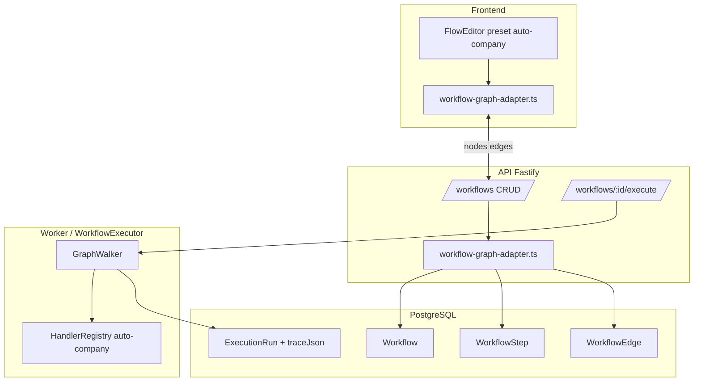

# UPGRADE_WORKFLOW — Plan de implementación

> **Estado:** plan de trabajo (2026-08-27)  
> **Objetivo:** sustituir `WorkflowCanvas` por Kreo `FlowEditor` (preset-driven) y evolucionar el motor de ejecución para soportar ramas, gates y trace visual.  
> **Premisa:** Kreo `FlowEditor` ya es agnóstico — preset genérico por defecto, `dataSources` como mapa abierto, `actionConfigFields` declarativos, handles/i18n configurables, `connectionRules` + validadores en preset, execution trace con ramas/skipped. CRM es solo un preset de ejemplo.

---

## Resumen ejecutivo

Auto-Company ya tiene el **backend y el negocio** de workflows (Prisma, `WorkflowExecutor`, AI Studio, schedules, Office). Le falta la **capa visual y de configuración** que el modelo de datos ya anticipa (`inputConfig`, `outputConfig`, `sourceHandle`).

Este upgrade no reemplaza la visión del producto (pipelines de agentes LLM con memoria compartida). Introduce:

1. **Preset `auto-company`** — vocabulario visual del dominio (agentes, gates, waits, triggers internos).
2. **Adaptador grafo ↔ Prisma** — persistencia compatible con workflows existentes; sin big-bang de migración.
3. **Motor graph-walker** — ejecución con ramas (`true`/`false`), nodos skipped y trace estructurado.
4. **Trace overlay** — lectura del grafo en `/debug/runs/:id` y war room con ramas tomadas/omitidas.

**Principio rector:** el core de Kreo queda agnóstico; todo lo específico de Auto-Company vive en preset + handler registry + adaptador.

---

## Estado actual vs. objetivo

| Capa | Hoy | Objetivo |
|------|-----|----------|
| UI editor | `WorkflowCanvas` — solo nodos `agent`, sin panel de params | Kreo `FlowEditor` + preset `auto-company` |
| Persistencia | `WorkflowStep` + `WorkflowEdge` normalizados | Mismo schema + campo opcional `graphSnapshot` JSON; adaptador bidireccional |
| Ejecución | `topologicalSort` → secuencia lineal | Graph-walker desde nodo entry; ramas por `sourceHandle` |
| Veto Munger | Detectado post-step en output del agente | Nodo `condition` explícito **o** handler `munger_gate` en preset |
| Trace | Eventos SSE `step_start` / `step_complete` + logs | `ExecutionTrace` con `{ nodeId, status, branch?, skippedReason? }[]` |
| AI Studio | Genera steps lineales | Genera nodos/edges compatibles con preset (misma forma que FlowEditor emite) |

### Archivos tocados (referencia)

| Área | Archivos clave |
|------|----------------|
| Editor UI | `frontend/src/components/WorkflowCanvas.tsx` → deprecar |
| Páginas | `frontend/src/pages/WorkflowEditorPage.tsx`, `PlatformWorkflowEditorPage.tsx` |
| API | `src/server/routes/workflows.ts`, `src/server/lib/workflow-graph.ts` |
| Motor | `src/core/engine.ts` (`topologicalSort`, loop principal) |
| AI | `src/lib/workflow-studio.ts`, `frontend/src/components/workflows/*` |
| Runs | `frontend/src/pages/RunDetailPage.tsx`, `src/lib/product-last-run.ts` |
| Tests | `tests/integration/workflow-graph.test.ts`, `tests/engine.test.ts` |

---

## Arquitectura objetivo



---

## Fase 0 — Preparación (medio día)

**Objetivo:** dependencias y contratos locales antes de tocar UI.

### 0.1 Pull Kreo FlowEditor (WORKFLOW A)

```text
get_component_metadata({ name: "FlowEditor" })
pull_source_code_from_registry({ name: "FlowEditor" })
get_dependencies_for_components({ names: ["FlowEditor", ...deps] })
pull_registry_theme_css / pull_registry_utils_code (merge con tokens existentes --flow-canvas-*)
```

**Destino sugerido:** `frontend/src/components/kreo/FlowEditor/` (no mezclar con `components/ui`).

**Checklist:**

- [ ] `@xyflow/react` — una sola versión en monorepo (alinear con Kreo).
- [ ] Tokens `--flow-canvas-*` ya usados en `WorkflowCanvas` → mapear a vars Kreo o mantener alias CSS.
- [ ] Story/dev smoke: render FlowEditor con preset genérico vacío en ruta temporal `/dev/flow-editor`.

### 0.2 Tipos compartidos

Crear `src/lib/workflow-graph-types.ts` (server) y espejo en `frontend/src/lib/workflow-graph-types.ts`:

```ts
/** Forma emitida por FlowEditor — compatible @xyflow/react */
export interface FlowNodeData {
  label: string;
  semanticType: "trigger" | "action" | "condition" | "wait";
  action: string;           // clave handler / tipo nodo preset
  params: Record<string, unknown>;
  description?: string;
}

export interface FlowGraph {
  nodes: Array<{ id: string; type: string; position: { x: number; y: number }; data: FlowNodeData }>;
  edges: Array<{ id: string; source: string; target: string; sourceHandle?: string; targetHandle?: string }>;
  entryNodeId?: string;
  presetId?: string;        // "auto-company" | "generic"
}

export type TraceNodeStatus = "pending" | "running" | "completed" | "failed" | "skipped" | "vetoed";

export interface ExecutionTraceEntry {
  nodeId: string;
  status: TraceNodeStatus;
  branch?: "true" | "false";
  skippedReason?: string;
  startedAt?: string;
  completedAt?: string;
  agentName?: string;
  stepId?: string;          // FK WorkflowStep cuando aplique
}
```

### 0.3 Schema Prisma (migración mínima)

Añadir a `Workflow`:

```prisma
graphSnapshot Json?   // último grafo FlowEditor (source of truth visual)
presetId      String  @default("auto-company")
entryNodeId   String? // default "trigger" o primer agent sin inbound
```

Añadir a `ExecutionRun`:

```prisma
traceJson Json?       // ExecutionTraceEntry[] al completar/fallar
```

**Nota:** mantener `WorkflowStep` / `WorkflowEdge` durante transición. El adaptador sincroniza grafo → filas normalizadas para no romper FKs en `ExecutionLog.stepId`.

---

## Fase 1 — Preset `auto-company` (1 día)

**Objetivo:** definir el vocabulario del dominio Auto-Company en preset Kreo, sin lógica CRM.

### 1.1 Archivo preset

`frontend/src/lib/workflow-presets/auto-company.ts`

| `action` | `semanticType` | Propósito |
|----------|----------------|-----------|
| `on_manual_run` | trigger | Entry por defecto — ejecutar desde editor / Office |
| `on_schedule_tick` | trigger | Disparo desde `AutonomousSchedule` |
| `on_encargo_approved` | trigger | Disparo desde Office encargo |
| `run_agent` | action | Ejecutar agente LLM (params: `agentId`, `label`, `inputConfig`, `outputConfig`) |
| `munger_gate` | condition | Evalúa veto en memoria compartida; edges `true`/`false` |
| `human_wait` | wait | Pausa `AWAITING_USER` (params: `reason`, `resumeKey`) |
| `merge_consensus` | action | Sync/load consensus (params: `sync`, `merge`) |
| `noop` | action | Nodo comentario / anotación (no ejecuta) |

### 1.2 `actionConfigFields` (declarativo)

Ejemplo `run_agent`:

```ts
{
  action: "run_agent",
  fields: [
    { key: "agentId", type: "select", dataSource: "agents", required: true },
    { key: "label", type: "text", i18nLabel: "workflows.node.label" },
    { key: "passSharedMemory", type: "boolean", default: true, mapsTo: "inputConfig.passSharedMemory" },
    { key: "customPrompt", type: "textarea", mapsTo: "inputConfig.customPrompt" },
    { key: "memoryKey", type: "text", mapsTo: "outputConfig.memoryKey" },
    { key: "appendToSharedMemory", type: "boolean", default: true, mapsTo: "outputConfig.appendToSharedMemory" },
  ],
}
```

### 1.3 `dataSources` (mapa abierto)

```ts
export async function loadAutoCompanyDataSources(tenantId: string) {
  return {
    agents: await api.agents.list(),           // { id, name, role }
    workflows: await api.workflows.list(),     // referencias cruzadas
    skills: await api.skills?.list?.(),        // opcional fase 2
  };
}
```

FlowEditor recibe `dataSources` como prop; el preset solo declara claves (`agents`, …).

### 1.4 `connectionRules` + validadores

```ts
connectionRules: [
  { from: "trigger", to: ["action", "condition", "wait"] },
  { from: "action", to: ["action", "condition", "wait"] },
  { from: "condition", to: ["action", "wait"], handles: ["true", "false"] },
  { from: "wait", to: ["action", "condition"] },
],
validators: [
  (graph) => graph.nodes.filter(n => n.data.semanticType === "trigger").length === 1
    ? null : "workflows.validation.singleTrigger",
  (graph) => hasPathFromEntry(graph) ? null : "workflows.validation.disconnected",
  (graph) => everyRunAgentHasAgentId(graph) ? null : "workflows.validation.missingAgent",
],
```

### 1.5 i18n handles

Claves en `frontend/src/i18n/locales/{es,en}/workflows.ts`:

- `workflows.node.run_agent`, `workflows.node.munger_gate`, …
- `workflows.handle.true`, `workflows.handle.false`
- Mensajes de validación del preset

**Entregable Fase 1:** preset completo + FlowEditor renderizando palette `auto-company` en `/dev/flow-editor` con validación client-side.

---

## Fase 2 — Adaptador grafo ↔ Prisma (1 día)

**Objetivo:** API sigue hablando steps/edges; UI habla nodes/edges. Un solo adaptador.

### 2.1 Módulo adaptador

`src/lib/workflow-graph-adapter.ts` (+ espejo frontend para preview offline si hace falta)

**Funciones:**

| Función | Dirección |
|---------|-----------|
| `flowGraphToPrisma(graph, agents[])` | `{ steps, edges, graphSnapshot, entryNodeId }` |
| `prismaToFlowGraph(workflow, steps, edges)` | `FlowGraph` |
| `legacyLinearWorkflowToGraph(steps, edges)` | Migración on-read de workflows v1 |

**Reglas de mapeo:**

- Nodo `run_agent` → `WorkflowStep` con `agentId = params.agentId`, configs desde params.
- Nodo `condition`/`wait`/`merge_consensus` → `WorkflowStep` con agent **sistema** (`platform:flow-condition`) **o** fila sin agentId (requiere relajar FK — ver decisión abajo).
- Edge con `sourceHandle: "true"|"false"` → `WorkflowEdge.sourceHandle`.

### 2.2 Decisión de schema: nodos sin agente

**Opción recomendada (menor riesgo):**

- Crear agente plataforma por tenant: `flow-runtime` (o uno global superadmin) para nodos non-LLM.
- `run_agent` sigue apuntando al agente real.
- `munger_gate`, `human_wait`, `merge_consensus` usan handlers en engine, no LLM — step con `agentId = flow-runtime` y `inputConfig.handler = "munger_gate"`.

**Alternativa (fase posterior):** `WorkflowStep.agentId` nullable + `nodeType` enum.

### 2.3 Actualizar `updateWorkflowGraph`

En `src/server/lib/workflow-graph.ts`:

1. Aceptar body `{ graph: FlowGraph }` **o** legacy `{ steps, edges }`.
2. Si llega `graph`, adaptar → steps/edges → transacción existente.
3. Persistir `graphSnapshot` + `presetId` + `entryNodeId`.

### 2.4 Endpoints

| Método | Cambio |
|--------|--------|
| `GET /workflows/:id` | Incluir `graph`, `presetId`, `entryNodeId` (adaptado) |
| `PATCH /workflows/:id` | Aceptar `{ graph }` desde FlowEditor |
| `POST /workflows/:id/validate` | **Nuevo** — corre validadores preset server-side |

**Entregable Fase 2:** round-trip save/load sin pérdida; tests de integración ampliados.

---

## Fase 3 — Integrar FlowEditor en páginas reales (1 día)

**Objetivo:** reemplazar `WorkflowCanvas` en producción.

### 3.1 Componente wrapper

`frontend/src/components/workflows/WorkflowFlowEditor.tsx`

```tsx
<FlowEditor
  preset={autoCompanyPreset}
  dataSources={dataSources}
  nodes={graph.nodes}
  edges={graph.edges}
  onChange={(nodes, edges) => ...}
  readOnly={mode === "trace"}
  trace={executionTrace}   // overlay ramas/skipped
  locale={i18n.language}
/>
```

### 3.2 Páginas

| Ruta | Cambio |
|------|--------|
| `/office/workflows/:id` | `WorkflowEditorPage` → wrapper + execute panel sin cambios |
| `/admin/templates/workflows/:id` | Idem platform |
| `/debug/runs/:id` | Panel colapsable "Graph trace" read-only |

### 3.3 Eliminar / deprecar

- Marcar `WorkflowCanvas.tsx` `@deprecated` — borrar al final de Fase 5.
- Actualizar `frontend/src/components/workflows/README.md`.

### 3.4 AI Studio / Enrich

`src/lib/workflow-studio.ts`:

- Proposals generan `FlowGraph` (nodos `run_agent` conectados) en lugar de solo `steps[]`.
- `apply` persiste vía adaptador.
- Posición auto-layout simple (columna vertical, mismo layout que seed actual).

**Entregable Fase 3:** editores tenant + platform funcionando; AI Studio abre grafo editable.

---

## Fase 4 — Motor graph-walker + handler registry (2 días)

**Objetivo:** ejecución alineada con Kreo contract + ramas reales.

### 4.1 Handler registry

`src/core/workflow-handlers/auto-company.ts`

```ts
export const autoCompanyHandlers: Record<string, WorkflowHandler> = {
  run_agent: async (ctx, params) => { /* delega a executeStep existente */ },
  munger_gate: async (ctx) => ({ branch: ctx.sharedMemory.veto ? "false" : "true" }),
  human_wait: async (ctx, params) => ({ status: "AWAITING_USER", resumeKey: params.resumeKey }),
  merge_consensus: async (ctx, params) => { /* lógica consensus load/sync */ },
  noop: async () => ({}),
};
```

Triggers (`on_manual_run`, …) no ejecutan — solo marcan entry.

### 4.2 GraphWalker

Nuevo `src/core/graph-walker.ts`:

```ts
async function runGraph(options: {
  graph: FlowGraph;
  handlers: HandlerRegistry;
  entryNodeId: string;
  emit: LogEmitter;
  resumeFromNodeId?: string;
}): Promise<{ sharedMemory; trace: ExecutionTraceEntry[] }>
```

**Loop:**

1. Resolver nodo actual.
2. `wait` → sleep o AWAITING_USER.
3. `condition` → evaluar → `nextNode(id, sourceHandle)`.
4. `action` → handler → avanzar edge default.
5. Registrar trace: `completed` | `skipped` | `vetoed`.
6. Nodos no alcanzados al terminar → `skipped` con `skippedReason: "branch_not_taken"`.

### 4.3 Integrar en `WorkflowExecutor`

En `src/core/engine.ts`:

- Si `workflow.graphSnapshot` presente → `GraphWalker`.
- Else → fallback `topologicalSort` (workflows legacy lineales).
- Munger veto inline post-`run_agent` **se mantiene** hasta migrar workflows a nodo `munger_gate` explícito.

### 4.4 Eventos SSE ampliados

Nuevos tipos (compat hacia atrás):

| Evento | Payload |
|--------|---------|
| `node_start` | `{ nodeId, action, agentName? }` |
| `node_complete` | `{ nodeId, status }` |
| `node_skipped` | `{ nodeId, skippedReason, branch? }` |
| `branch_taken` | `{ fromNodeId, handle: "true"\|"false", toNodeId }` |

Mapear también a `step_start`/`step_complete` cuando el nodo tenga `stepId` (war room / logs existentes).

### 4.5 Persistir trace

Al `COMPLETED` / `FAILED` / `CANCELLED`:

```ts
await prisma.executionRun.update({
  data: { traceJson: trace as object },
});
```

**Entregable Fase 4:** workflow con rama Munger ejecuta solo la rama correcta; trace en BD.

---

## Fase 5 — Trace UI + migración + limpieza (1 día)

### 5.1 Run detail overlay

`RunDetailPage.tsx`:

- Cargar `run.traceJson` + workflow graph.
- `<WorkflowFlowEditor readOnly trace={trace} />` encima del log existente.
- Leyenda: completed (verde), skipped (gris), vetoed (rojo), running (pulse).

### 5.2 War room / product last run

`product-last-run.ts`, `WarRoomContent.tsx` — consumir `traceJson` para diagnóstico (`munger_veto` → nodo resaltado).

### 5.3 Migración workflows existentes

Script `scripts/migrate-workflows-to-graph.ts`:

1. Para cada `Workflow` sin `graphSnapshot`.
2. `prismaToFlowGraph` desde steps/edges lineales.
3. Insertar nodo trigger `on_manual_run` + edges desde trigger al primer step.
4. Guardar snapshot; no alterar semántica de ejecución hasta Fase 4 activa.

Ejecutar en deploy; idempotente.

### 5.4 Seed platform

Actualizar `src/lib/seed-platform.ts` / `DEFAULT_WORKFLOWS`:

- Generar `graphSnapshot` además de steps.
- Workflows con Munger (p. ej. `new-product-evaluation`) → insertar nodo `munger_gate` opcional fase 2.

### 5.5 Limpieza

- [ ] Eliminar `WorkflowCanvas.tsx`
- [ ] Actualizar `docs/platform.md`, help `guia-flujos.*`
- [ ] Cerrar ítem relacionado en `docs/GAPS.md`

**Entregable Fase 5:** migración corrida; documentación al día; canvas legacy eliminado.

---

## Plan de ejecución (calendario sugerido)

| Día | Fase | Entregable verificable |
|-----|------|------------------------|
| D1 AM | 0 + 1 | FlowEditor + preset en `/dev/flow-editor` |
| D1 PM | 2 | Save/load round-trip API test green |
| D2 AM | 3 | `/office/workflows/:id` en producción |
| D2 PM | 3 | AI Studio genera grafo editable |
| D3 | 4 | GraphWalker + un workflow con rama Munger |
| D4 AM | 4 | SSE + traceJson persistido |
| D4 PM | 5 | Run overlay + script migración |
| D5 | 5 | QA, docs, borrar legacy |

---

## Testing

| Suite | Qué cubre |
|-------|-----------|
| `tests/workflow-graph-adapter.test.ts` | Mapeo bidireccional, handles, validadores |
| `tests/integration/workflow-graph.test.ts` | Persistencia PATCH con `graph` |
| `tests/graph-walker.test.ts` | Ramas true/false, skipped, resume |
| `tests/engine.test.ts` | Fallback topological vs graph |
| `tests/workflow-studio.test.ts` | Apply genera grafo válido |
| E2E manual | Editor → execute → run trace overlay |

**Casos críticos:**

1. Workflow lineal legacy sigue ejecutando igual (fallback).
2. Veto Munger en rama `false` — pasos downstream skipped en trace.
3. `AWAITING_USER` en `human_wait` — resume continúa desde nodo correcto.
4. Enrich con impact report — cambiar grafo no rompe schedules referenciados.
5. Platform template clone a tenant — graphSnapshot copiado.

---

## Definition of Done

- [ ] `WorkflowCanvas` eliminado; tenant + platform usan `FlowEditor`.
- [ ] Preset `auto-company` documentado en `frontend/src/lib/workflow-presets/README.md`.
- [ ] API acepta `{ graph }`; GET devuelve grafo listo para editor.
- [ ] Workflows migrados tienen `graphSnapshot`.
- [ ] Motor ejecuta ramas; trace con skipped/branch en `ExecutionRun.traceJson`.
- [ ] Run detail muestra overlay de grafo.
- [ ] AI Studio / Enrich producen/consumen mismo formato.
- [ ] Tests CI verdes; sin regresión en Office execute / schedules.

---

## Fuera de alcance (defer)

| Tema | Motivo |
|------|--------|
| Preset CRM Kreo | Solo referencia; no producto |
| Orquestación visual de schedules | Fase futura — triggers `on_schedule_tick` ya reservados |
| Webhooks Stripe como triggers | Usar `src/server/routes/webhooks.ts` aparte |
| Reemplazar BullMQ | Worker sigue encolando runs; graph-walker es intra-run |
| Nullable `agentId` en Prisma | Evaluar solo si agente `flow-runtime` resulta confuso |

---

## Riesgos y mitigaciones

| Riesgo | Mitigación |
|--------|------------|
| Divergencia graphSnapshot vs steps | Adaptador único; test round-trip; write siempre sincroniza ambos |
| Breaking runs en vuelo | Fallback topological; migración lazy on-read |
| Complejidad Munger dual (inline + nodo) | Documentar; migrar templates seed a nodo explícito en D4 |
| Bundle size Kreo | Lazy route editor; tree-shake nodos no usados |
| Validación client ≠ server | `POST /workflows/:id/validate` comparte validadores preset |

---

## Próxima acción (mañana)

1. **Fase 0.1** — pull FlowEditor + deps; ruta dev smoke.
2. **Fase 0.2** — commit tipos `FlowGraph` / `ExecutionTraceEntry`.
3. **Fase 0.3** — migración Prisma (`graphSnapshot`, `presetId`, `traceJson`).
4. **Paralelo** — esqueleto preset `auto-company` con solo `on_manual_run` + `run_agent`.

Archivo de preset objetivo: `frontend/src/lib/workflow-presets/auto-company.ts`  
Adaptador objetivo: `src/lib/workflow-graph-adapter.ts`

---

## Referencias

- Kreo: `get_workflow_backend_contract`, preset genérico (CRM = ejemplo).
- Plataforma: `docs/platform.md`, `docs/GAPS.md`.
- Editor actual: `frontend/src/components/WorkflowCanvas.tsx`.
- Motor: `src/core/engine.ts`.
- AI workflows: `frontend/src/components/workflows/README.md`.
