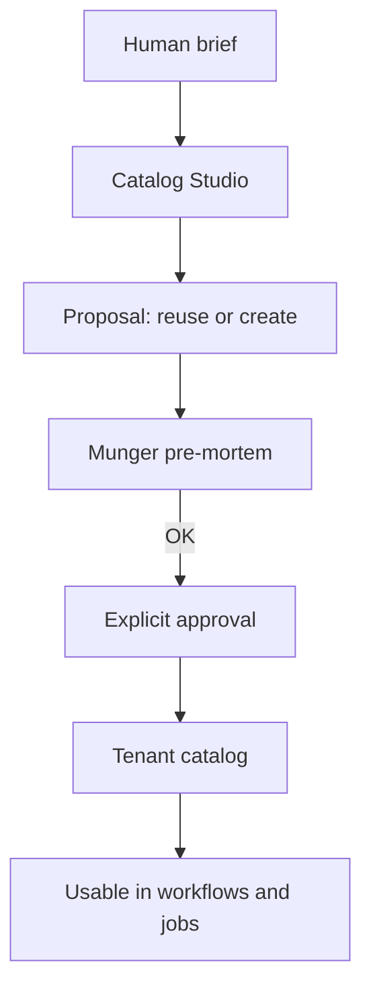
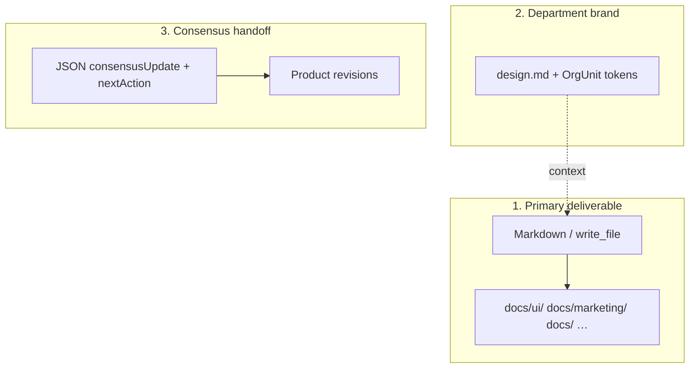

# How to build agents

Define agents that work in Auto-Company: prompt, deliverables, folders, and **mandatory JSON handoff**.

---

## Table of contents

1. [System prompt anatomy](#system-prompt-anatomy)
2. [Handoff: end of every workflow reply](#handoff-end-of-every-workflow-reply)
3. [Markdown deliverables vs JSON](#markdown-deliverables-vs-json)
4. [design.md and department tokens](#designmd-and-department-tokens)
5. [Example: marketing design-lead](#example-marketing-design-lead)
6. [Common mistakes](#common-mistakes)

---

## System prompt anatomy

Catalog Studio and the platform expect a markdown document with:

| Section | Content |
|---------|---------|
| **## Rol / Role** | Responsibility in the virtual company |
| **## Persona** | Thinking style (expert reference if applicable) |
| **## Principios / Principles** | Domain decision rules |
| **## Flujo operativo / Operating flow** | What to do when a task arrives |
| **## Formato de salida / Output format** | Deliverable structure + JSON handoff reminder |

Agent name: **kebab-case** (`design-lead`, `copy-manager`).

Link skills in AI team — do not embed skills inside the prompt as a substitute.



---

## Handoff: end of every workflow reply

When the agent joins a **workflow** or **product-scoped job**, always end with a fenced ` ```json ` block.

### Platform-recognized schema

```json
{
  "consensusUpdate": "## Summary of MY step\n\nSelf-contained markdown: findings, numbers, recommendations.",
  "nextAction": "One concrete sentence for the next agent or cycle.",
  "decisions": [
    { "by": "design-lead", "what": "Mobile single-column layout", "why": "Less friction for B2B ICP" }
  ],
  "openQuestions": ["Custom illustration or existing tokens only?"],
  "veto": null
}
```

| Field | Required | Effect |
|-------|----------|--------|
| `consensusUpdate` | Recommended | Product consensus revision body |
| `nextAction` | Recommended | Guides the next workflow step |
| `decisions` | Optional | Decision trace |
| `openQuestions` | Optional | Open items for human or next agent |
| `veto` | Munger only | `{ "by": "critic-munger", "reason": "..." }` blocks |

> **Do not use** invented schemas (`DesignHandoff`, `schema.org`, `componentName`…) instead of this block. The platform **does not parse them**.

Full detail: **Handoffs and flow** article.

---

## Markdown deliverables vs JSON

Three separate layers:



### `docs/` folders by agent prefix

| Agent | Typical folder |
|-------|----------------|
| `ui-duarte` | `docs/ui/` |
| `marketing-godin` | `docs/marketing/` |
| `design-lead` | `docs/` (fallback; no `docs/design/` in map) |
| `copy-manager` | `docs/` or `docs/marketing/` via write_file |

If the agent uses `write_file`, the system **does not duplicate** the handoff on disk. Otherwise the engine may auto-persist step markdown.

---

## design.md and department tokens

Marketing/design agents **read** linked department `design.md` — do not redefine palettes in JSON.

Reference in the brief (markdown):

```markdown
## Tokens (from dept design.md)
- color.primary: #C9A227
- color.background: #0A0A0A
- typography.fontFamily: Inter
```

Tokens live in Org Studio → sync to the department workspace.

---

## Example: marketing design-lead

### Output format in system prompt

```markdown
## Formato de salida

1. **UX brief (markdown)** — goal, spatial layout, components/states, microcopy.
2. Reference department tokens (design.md).
3. End with platform consensus JSON block.

Optional: technical JSON annex *inside* the brief markdown
(documentation for devs only — does not replace consensus handoff).
```

### Sample reply (fragment)

**UX brief (markdown):**

- Section title: `# Design Brief — Q2 campaign landing`
- Goal, microcopy, referenced tokens

**Mandatory closing (consensus JSON):**

```json
{
  "consensusUpdate": "## Design Lead — Q2 landing\n\nSingle-column mobile, hero + social proof + single CTA. Tokens: primary gold on charcoal.",
  "nextAction": "copy-manager: draft hero headline and body per defined hierarchy.",
  "decisions": [
    { "by": "design-lead", "what": "Single CTA above the fold", "why": "design.md rule: one CTA per asset" }
  ],
  "openQuestions": [],
  "veto": null
}
```

---

## Common mistakes

| Mistake | Consequence | Fix |
|---------|-------------|-----|
| Only `DesignHandoff` JSON at the end | Lost structured handoff | Add consensus JSON |
| `docs/design/` in prompt | Non-standard path | Use `docs/ui/` or `docs/` |
| Missing `consensusUpdate` | Empty revision in UI | Self-contained markdown in field |
| Prompt without ## sections | Inconsistent Catalog Studio | Follow Role/Persona/… template |
| Ignoring design.md | Inconsistent brand | Explicit rule in ## Principles |

---

## Create the agent in the UI

1. **AI team** → **Create agent** (Catalog Studio) or **New agent** (manual).
2. Paste the full system prompt.
3. Assign skills: `frontend-design`, `ui-ux-pro-max` for design-lead.
4. Approve after Munger if applicable.
5. Attach to department in Org Studio or use in a workflow.
