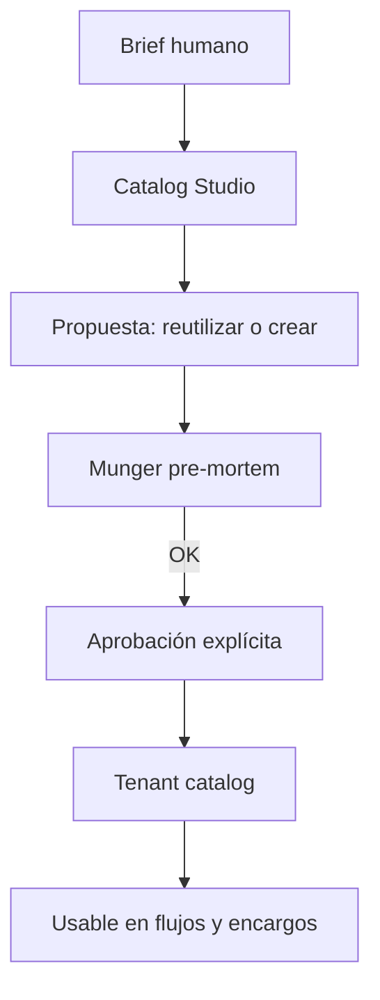
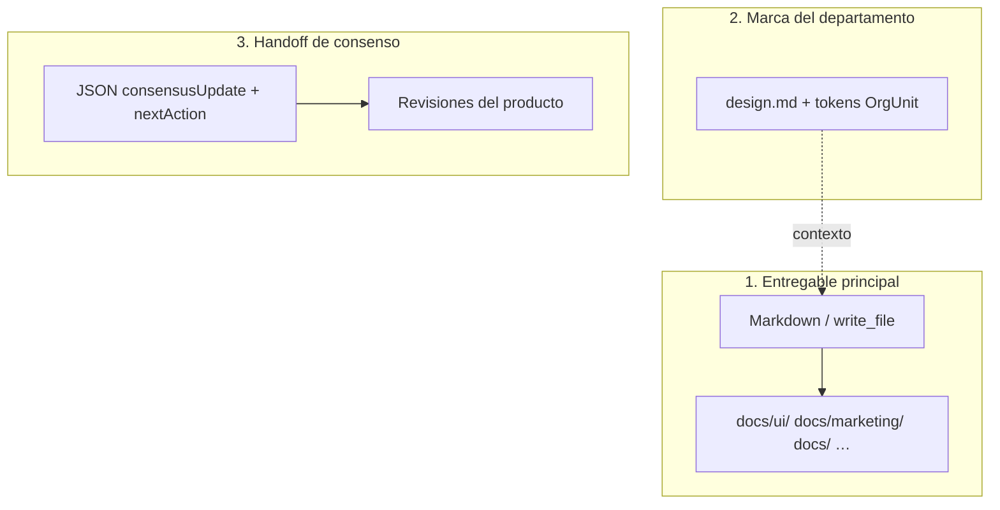

# ¿Cómo construir agentes?

Guía para definir agentes que funcionen en Auto-Company: prompt, entregables, carpetas y **handoff JSON obligatorio**.

---

## Tabla de contenidos

1. [Anatomía del system prompt](#anatomía-del-system-prompt)
2. [Handoff: qué va al final de cada respuesta](#handoff-qué-va-al-final-de-cada-respuesta)
3. [Entregables en markdown vs JSON](#entregables-en-markdown-vs-json)
4. [design.md y tokens del departamento](#designmd-y-tokens-del-departamento)
5. [Ejemplo: design-lead de marketing](#ejemplo-design-lead-de-marketing)
6. [Errores frecuentes](#errores-frecuentes)

---

## Anatomía del system prompt

Catalog Studio y la plataforma esperan un documento markdown con estas secciones:

| Sección | Contenido |
|---------|-----------|
| **## Rol** | Responsabilidad en la empresa virtual |
| **## Persona** | Estilo de pensamiento (referencia a experto si aplica) |
| **## Principios** | Reglas de decisión del dominio |
| **## Flujo operativo** | Qué hacer cuando llega una tarea |
| **## Formato de salida** | Estructura del entregable + recordatorio del JSON handoff |

Nombre del agente: **kebab-case** (`design-lead`, `copy-manager`).

Skills sugeridas se asocian en Equipo IA — no van dentro del prompt como sustituto de habilidades reales.



---

## Handoff: qué va al final de cada respuesta

Cuando el agente participa en un **workflow** o **encargo con producto**, debe terminar **siempre** con un bloque JSON en fenced code ` ```json `.

### Esquema reconocido por la plataforma

```json
{
  "consensusUpdate": "## Resumen de MI paso\n\nMarkdown autocontenido: hallazgos, números, recomendaciones.",
  "nextAction": "Una frase concreta para el siguiente agente o ciclo.",
  "decisions": [
    { "by": "design-lead", "what": "Layout mobile single-column", "why": "Menos fricción para ICP B2B" }
  ],
  "openQuestions": ["¿Ilustración custom o solo tokens existentes?"],
  "veto": null
}
```

| Campo | Obligatorio | Efecto |
|-------|-------------|--------|
| `consensusUpdate` | Recomendado | Contenido de la revisión en consenso del producto |
| `nextAction` | Recomendado | Guía al siguiente paso del flujo |
| `decisions` | Opcional | Trazabilidad de decisiones |
| `openQuestions` | Opcional | Pendientes para humano o siguiente agente |
| `veto` | Solo Munger | `{ "by": "critic-munger", "reason": "..." }` bloquea |

> **No uses** esquemas inventados (`DesignHandoff`, `schema.org`, `componentName`…) como sustituto de este bloque. La plataforma **no los parsea**.

Detalle completo: artículo **Handoffs y flujo**.

---

## Entregables en markdown vs JSON

Tres capas distintas:



### Carpetas `docs/` por prefijo de agente

| Agente | Carpeta típica |
|--------|----------------|
| `ui-duarte` | `docs/ui/` |
| `marketing-godin` | `docs/marketing/` |
| `design-lead` | `docs/` (fallback; no existe `docs/design/` en el mapa) |
| `copy-manager` | `docs/` o `docs/marketing/` según write_file |

Si el agente usa herramienta `write_file`, el sistema **no duplica** el handoff en disco. Si no escribe archivo, el motor puede persistir el markdown del paso automáticamente.

---

## design.md y tokens del departamento

Los agentes de marketing/diseño **leen** el `design.md` del departamento vinculado — no redefinen paleta en JSON.

Ejemplo de referencia en el brief (markdown):

```markdown
## Tokens (desde design.md del dept.)
- color.primary: #C9A227
- color.background: #0A0A0A
- typography.fontFamily: Inter
```

Los tokens viven en Org Studio → se sincronizan al workspace del departamento.

---

## Ejemplo: design-lead de marketing

### Formato de salida en el system prompt

```markdown
## Formato de salida

1. **Brief UX (markdown)** — objetivo, arquitectura espacial, componentes/estados, microcopy.
2. Referencia tokens del departamento (design.md).
3. Termina con el bloque JSON de consenso (esquema de la plataforma).

Opcional: incluir un anexo JSON técnico *dentro* del markdown del brief
(solo documentación para devs — no reemplaza el handoff de consenso).
```

### Respuesta de ejemplo (fragmento)

**Brief UX (markdown):**

- Título de sección: `# Design Brief — Landing campaña Q2`
- Objetivo, microcopy, tokens referenciados

**Cierre obligatorio (JSON de consenso):**

```json
{
  "consensusUpdate": "## Design Lead — Landing Q2\n\nSingle-column mobile, hero + prueba social + CTA único. Tokens: primary gold on charcoal.",
  "nextAction": "copy-manager: redacta headline y body del hero según jerarquía definida.",
  "decisions": [
    { "by": "design-lead", "what": "Un solo CTA above the fold", "why": "Regla design.md: one CTA per asset" }
  ],
  "openQuestions": [],
  "veto": null
}
```

---

## Errores frecuentes

| Error | Consecuencia | Corrección |
|-------|--------------|------------|
| Solo JSON `DesignHandoff` al final | Handoff estructurado perdido | Añadir JSON de consenso |
| `docs/design/` en el prompt | Archivos en ruta no estándar | Usar `docs/ui/` o `docs/` |
| Sin `consensusUpdate` | Revisión vacía en UI | Markdown autocontenido en el campo |
| Prompt sin secciones ## | Catalog Studio inconsistente | Seguir plantilla Rol/Persona/… |
| Ignorar design.md | Marca incoherente | Mandato explícito en ## Principios |

---

## Crear el agente en la UI

1. **Equipo IA** → **Crear agente** (Catalog Studio) o **Nuevo agente** (manual).
2. Pega el system prompt completo.
3. Asigna skills: `frontend-design`, `ui-ux-pro-max` para design-lead.
4. Aprueba tras Munger si aplica.
5. Incorpora al departamento en Org Studio o úsalo en un flujo.
