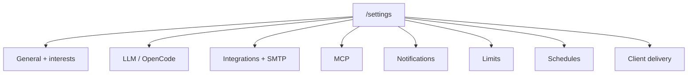

# Guide — Tenant settings

LLM preferences, integrations, limits, schedules, delivery branding, human team, and discovery interests. Visible only to **tenant administrators** (Debug office section in the sidebar).

> Operator scope: does not cover superadmin console or Docker/worker deployment.

---

## Table of contents

1. [Settings map](#settings-map)
2. [Tenant interests](#tenant-interests)
3. [Human team](#human-team)
4. [GitHub and SMTP integrations](#github-and-smtp-integrations)
5. [MCP servers](#mcp-servers)
6. [Frequently asked questions](#frequently-asked-questions)

---

## Settings map

Main route: **Settings** (`/settings`). Tabs use the `?tab=` URL parameter (e.g. `/settings?tab=llm`).

| Tab | URL | What you configure |
|-----|-----|-------------------|
| **General** | `/settings` | Monthly usage summary and link to **Interests** |
| **LLM** | `/settings?tab=llm` | Tenant model override and max cost per run (USD) |
| **OpenCode** | `/settings?tab=opencode` | External OpenCode instance (URL, credentials, default agent/model/path, polling) |
| **Integrations** | `/settings?tab=integrations` | GitHub token + **SMTP** section for outbound agent email |
| **MCP servers** | `/settings?tab=mcp` | MCP server registry and per-agent grants |
| **Notifications** | `/settings?tab=notifications` | Webhook, Slack, email recipients, complete/fail alerts, in-app notifications |
| **Limits** | `/settings?tab=limits` | Monthly caps (cost, runs, tokens) and current usage |
| **Schedules** | `/settings?tab=schedules` | **Orchestration plan** panel — presets and fixed-workflow rules |
| **Client delivery** | `/settings?tab=delivery` | Logo, primary color, contact, footer, and confidentiality notice on `/d/:token` links |

### LLM

The **provider and API key** are managed by the platform superadmin. As a tenant admin you can:

- Set a **model override** (empty = platform default).
- Set **max cost per run** — the Coordinator respects this when proposing jobs.

### OpenCode

Enable delegating code steps to an external OpenCode instance. After saving, use **Test connection** before production runs. Jobs in **Delegated to OpenCode** or **Awaiting decision** show action panels in War room and job detail (see [OpenCode for operators](/help/guia-oficina#opencode-for-operators)).

### Notifications

| Channel | Use |
|---------|-----|
| Webhook / Slack | Completed or failed run events to external systems |
| Email | Recipient list for alerts |
| **In-app** | Header bell + toasts — recommended for day-to-day operators |

### Limits

View spend, runs, and tokens for the current period. **Office** KPIs link here when you need to check the monthly cap.

### Schedules

Same panel described in [Procedures and schedules](/help/guia-flujos#schedules-optional). Direct shortcut: `/settings?tab=schedules`. To edit procedures (playbooks), use **`/settings/procedures`**.

### Client delivery

Customize the public view clients see at `/d/:token`: logo, accent color, contact email, footer text, and confidentiality notice.

---

## Tenant interests

Route: **`/settings/interests`** (also linked from Settings → General).

Pick market categories (emoji + label) you care about. **Discovery** and opportunity pipeline ranking bias toward those areas.

1. Toggle categories in the grid.
2. Click **Save**.
3. Upcoming discovery runs will respect your selection.

This does not replace manually approving ideas — it only steers opportunity generation.

---

## Human team

Route: **Debug office → Team** (`/debug/team`). Also `/team` (alias). **Tenant admin only**.

| Action | Detail |
|--------|--------|
| **Invite user** | Email, name, temporary password, and role (`member` or `admin`) |
| **List members** | Name, email, role, and active status |
| **Roles** | `admin` — Settings, procedures, and specialist templates; `member` — daily ops without tenant adjustments |

Active tenant members can receive agent emails when SMTP is configured (automatic allowlist).

> Do not confuse with **Specialist templates** (`/settings/specialists`) — that is where AI agents live, not people.

---

## GitHub and SMTP integrations

**Integrations** tab (`/settings?tab=integrations`).

### GitHub

| Field | Purpose |
|-------|---------|
| Personal Access Token | Clone private repos and enrich product intake |
| GitHub username | Shown after connecting — visual confirmation |

Use **Test GitHub connection** after saving a new token. Recommended scope: `repo` (private) and `read:org` if applicable.

### SMTP (agent email)

Lower block on the same tab:

- Host, port, TLS, credentials, sender.
- **Extra allowed recipients** (comma-separated) — active tenant users are always allowed.
- **Max emails per day** — abuse control.
- **Test SMTP connection** before relying on email delivery.

Agents can email deliverables only when SMTP is enabled and the recipient is allowed.

---

## MCP servers

**MCP servers** tab (`/settings?tab=mcp`). **Advanced operator** level.

**Model Context Protocol** servers expose external tools (APIs, databases, etc.) to authorized agents.

| Concept | Behavior |
|---------|----------|
| Registry | Name, stdio command, args, env vars (encrypted) |
| Sync | On save, tools are indexed for the tenant |
| Grants | Only agents you authorize see each server's tools |
| Quota | Call limit per agent run — prevents loops |
| Read-only | Blocks mutable tools (`create`, `delete`, `send`, …) |

From **Catalog Studio** or a department **Staff** tab you can propose MCP grants when hiring new agents.

> If you do not need external tools, you can ignore MCP — the platform works with internal skills and procedures.

---

## Frequently asked questions

### Where do I change procedures and AI agents?

| Resource | Route |
|----------|------|
| Procedures (playbooks) | `/settings/procedures` |
| Specialist templates | `/settings/specialists` |

### Can a member open Settings?

No. Only admins see Settings, Team, Procedures, and Templates in the debug section.

### Platform vs tenant settings?

**Superadmin** (`/admin/settings`) — global LLM provider, platform templates. **Tenant** (`/settings`) — overrides, integrations, limits, and your company's delivery branding.

### Where do schedules and Operations fit?

Define rules in **Settings → Schedules**; supervise in **Operations** (`/ops`). See [/help/guia-flujos](/help/guia-flujos).
