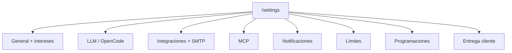

# Guía — Configuración del tenant

Ajustes de LLM, integraciones, límites, programaciones, marca de entregas, equipo humano e intereses de discovery. Solo visible para **administradores del tenant** (sección Oficina de depuración en el menú lateral).

> Alcance operador: no cubre consola superadmin ni despliegue Docker/worker.

---

## Tabla de contenidos

1. [Mapa de Configuración](#mapa-de-configuración)
2. [Intereses del tenant](#intereses-del-tenant)
3. [Equipo humano](#equipo-humano)
4. [Integraciones GitHub y SMTP](#integraciones-github-y-smtp)
5. [Servidores MCP](#servidores-mcp)
6. [Preguntas frecuentes](#preguntas-frecuentes)

---

## Mapa de Configuración

Ruta principal: **Configuración** (`/settings`). Las pestañas usan el parámetro `?tab=` en la URL (p. ej. `/settings?tab=llm`).

| Pestaña | URL | Qué configuras |
|---------|-----|----------------|
| **General** | `/settings` | Resumen de uso del mes e enlace a **Intereses** |
| **LLM** | `/settings?tab=llm` | Modelo override del tenant y coste máximo por ejecución (USD) |
| **OpenCode** | `/settings?tab=opencode` | Conexión a instancia OpenCode (URL, credenciales, agente/modelo/ruta por defecto, polling) |
| **Integraciones** | `/settings?tab=integrations` | Token GitHub + sección **SMTP** para email saliente de agentes |
| **Servidores MCP** | `/settings?tab=mcp` | Registro de servidores MCP y permisos por agente |
| **Notificaciones** | `/settings?tab=notifications` | Webhook, Slack, destinatarios email, avisos al completar/fallar, notificaciones in-app |
| **Límites** | `/settings?tab=limits` | Topes mensuales (coste, runs, tokens) y uso actual |
| **Programaciones** | `/settings?tab=schedules` | Panel **Plan de operaciones** — presets y reglas con workflow fijo |
| **Entrega cliente** | `/settings?tab=delivery` | Logo, color principal, contacto, pie y aviso de confidencialidad en enlaces `/d/:token` |

### LLM

El **proveedor y API key** los gestiona el superadmin de plataforma. Como admin tenant puedes:

- Definir un **modelo override** (si está vacío, se usa el de plataforma).
- Fijar **coste máximo por ejecución** — el Coordinador respeta este tope al proponer encargos.

### OpenCode

Activa la delegación de pasos de código a una instancia OpenCode externa. Tras guardar, usa **Probar conexión** antes de confiar en runs de producción. Los encargos en estado **Delegado a OpenCode** o **Esperando decisión** muestran paneles de acción en War room y detalle del encargo (ver [OpenCode para el operador](/help/guia-oficina#opencode-operador)).

### Notificaciones

| Canal | Uso |
|-------|-----|
| Webhook / Slack | Eventos de runs completados o fallidos hacia sistemas externos |
| Email | Lista de destinatarios para alertas |
| **In-app** | Campana del header + toasts — recomendado para operadores en el día a día |

### Límites

Consulta gasto, runs y tokens del periodo actual. Los KPIs de la **Oficina** enlazan aquí cuando quieres revisar el tope mensual.

### Programaciones

Mismo panel que describe [Flujos y programaciones](/help/guia-flujos#programaciones-opcional). Atajo directo: `/settings?tab=schedules`. Para editar procedimientos (playbooks), usa **`/settings/procedures`**.

### Entrega cliente

Personaliza la vista pública que ven tus clientes en `/d/:token`: logo, color de acento, email de contacto, texto legal en pie y aviso de confidencialidad.

---

## Intereses del tenant

Ruta: **`/settings/interests`** (también enlace desde Configuración → General).

Selecciona categorías de mercado (emoji + etiqueta) que te interesan. El **discovery** y el ranking del pipeline de oportunidades se sesgan hacia esas áreas.

1. Marca o desmarca categorías en la cuadrícula.
2. Pulsa **Guardar**.
3. Los próximos runs de discovery tendrán en cuenta tu selección.

No sustituye aprobar ideas manualmente — solo orienta la generación de oportunidades.

---

## Equipo humano

Ruta: **Oficina de depuración → Equipo** (`/debug/team`). También `/team` (alias). Solo **admin tenant**.

| Acción | Detalle |
|--------|---------|
| **Invitar usuario** | Email, nombre, contraseña temporal y rol (`member` o `admin`) |
| **Listar miembros** | Nombre, email, rol y estado activo |
| **Roles** | `admin` — acceso a Configuración, procedimientos y plantilla de especialistas; `member` — operación diaria sin ajustes de tenant |

Los miembros activos del tenant pueden recibir emails de agentes si SMTP está configurado (allowlist automática).

> No confundir con **Plantilla de especialistas** (`/settings/specialists`) — ahí viven los agentes IA, no las personas.

---

## Integraciones GitHub y SMTP

Pestaña **Integraciones** (`/settings?tab=integrations`).

### GitHub

| Campo | Para qué |
|-------|----------|
| Personal Access Token | Clonar repos privados y enriquecer intake de productos |
| Usuario GitHub | Se muestra tras conectar — confirmación visual |

Usa **Probar conexión GitHub** tras guardar un token nuevo. Scope recomendado: `repo` (privados) y `read:org` si aplica.

### SMTP (email de agentes)

Bloque inferior de la misma pestaña:

- Host, puerto, TLS, credenciales, remitente.
- **Destinatarios extra permitidos** (coma-separados) — los usuarios activos del tenant siempre están permitidos.
- **Máximo de emails por día** — control de abuso.
- **Probar conexión SMTP** antes de confiar en entregas por email.

Los agentes pueden enviar entregables por email solo si SMTP está habilitado y el destinatario está permitido.

---

## Servidores MCP

Pestaña **Servidores MCP** (`/settings?tab=mcp`). Nivel **operador avanzado**.

Los servidores **Model Context Protocol** exponen herramientas externas (APIs, bases de datos, etc.) a agentes autorizados.

| Concepto | Comportamiento |
|----------|----------------|
| Registro | Nombre, comando stdio, argumentos, variables de entorno (cifradas) |
| Sincronización | Al guardar, las herramientas se indexan para el tenant |
| Grants | Solo los agentes que autorices ven las herramientas de cada servidor |
| Cuota | Límite de llamadas por ejecución del agente — evita bucles |
| Solo lectura | Modo que bloquea herramientas mutables (`create`, `delete`, `send`, …) |

Desde **Catalog Studio** o la pestaña **Personal** de un departamento puedes proponer grants MCP al contratar agentes nuevos.

> Si no necesitas herramientas externas, puedes ignorar MCP — la plataforma funciona con skills y procedimientos internos.

---

## Preguntas frecuentes

### ¿Dónde cambio procedimientos y agentes IA?

| Recurso | Ruta |
|---------|------|
| Procedimientos (playbooks) | `/settings/procedures` |
| Plantilla de especialistas | `/settings/specialists` |

### ¿El member puede entrar a Configuración?

No. Solo admins ven Configuración, Equipo, Procedimientos y Plantilla en la sección de depuración.

### ¿Configuración de plataforma vs tenant?

**Superadmin** (`/admin/settings`) — proveedor LLM global, plantillas de plataforma. **Tenant** (`/settings`) — overrides, integraciones, límites y marca de entrega de tu empresa.

### ¿Dónde encajan las programaciones y Operaciones?

Define reglas en **Configuración → Programaciones**; supervisa en **Operaciones** (`/ops`). Ver [/help/guia-flujos](/help/guia-flujos).
