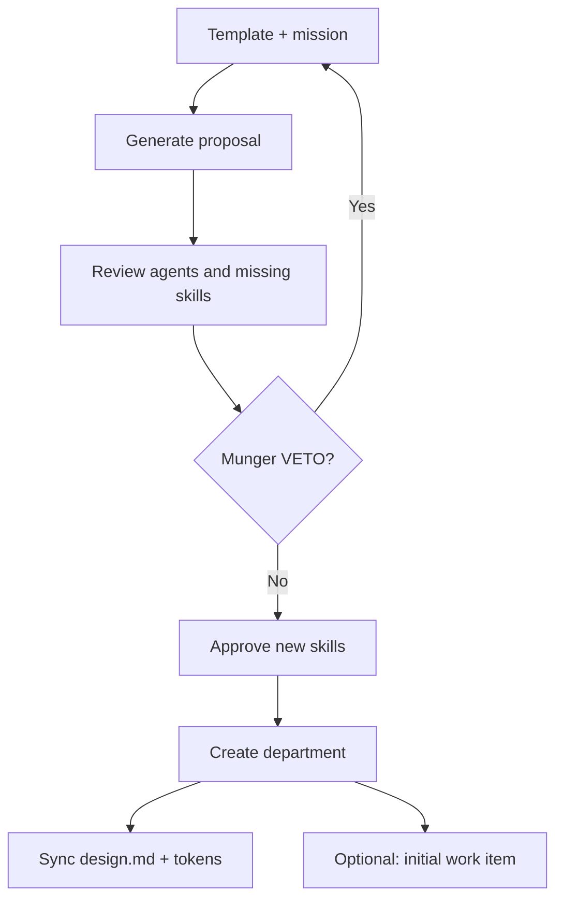

# Guide — Departments

Create departments with Org Studio, `design.md`, tokens, and the artifact gallery.

---

## Table of contents

1. [Two kinds of “department”](#two-kinds-of-department)
2. [Org Studio](#org-studio)
3. [design.md and tokens](#designmd-and-tokens)
4. [Artifact gallery](#artifact-gallery)
5. [Business templates](#business-templates)
6. [Frequently asked questions](#frequently-asked-questions)

---

## Two kinds of “department”

| Type | Where | What it is |
|------|-------|------------|
| **Virtual rooms** | Office floor plan (Strategy, Product, Engineering…) | Visual grouping of platform agents — no own `design.md` |
| **Org Units** | **Departments** (`/org-units`) created in Org Studio | Real departments with brand, agents, work items, gallery |

This guide covers **Org Units**. To request work with dept. context, use the Office selector or open the department room.

---

## Org Studio

Route: **Departments** (`/org-units`) → **Open Org Studio** (`/org-studio`). Also linked from the Office floor plan (“Create in Org Studio”).

UI steps:

1. Pick template, name, and mission → **Generate proposal**.
2. Review suggested agents, config, and Munger review.
3. Check **new skills** you approve creating.
4. **Create department** — redirects to `/org-units/:id`.

If Munger issues VETO, you cannot apply until you adjust the proposal.

---

## design.md and tokens

Each Org Unit has:

| Asset | Purpose |
|-------|---------|
| **design.md** | Voice, colors, deliverable rules — read by dept agents |
| **tokens** (DTCG JSON) | Org colors, typography, spacing |
| **config** | Niche, channels, cadence, brand voice (per template) |

Synced to `projects/_org/{slug}/design.md`. Marketing/copy/design agents **must reference** these tokens, not invent parallel palettes in custom JSON.

Edit operating profile and design on the department page → **Settings** tab → *Operating profile* and *Design & artifacts* subsections.

---

## Artifact gallery

Route: department → **Settings** → **Design & artifacts** (`ArtifactGallery`).

- Typed deliverables: `copy`, `design`, `social_post`, `report`, `code`, …
- Filter by status: draft, approved, published
- Source: run output when product is linked to the Org Unit

The department room also shows recent artifacts in the sidebar panel.

---

## Business templates

Platform templates (slug → UI name):

| Slug | Name |
|------|------|
| `marketing-agency` | Digital Marketing Agency |
| `product-studio` | Product Studio (default) |
| `sales-revops` | Sales & RevOps |
| `customer-success` | Customer Success |
| `seo-content-studio` | SEO & Content Studio |
| `finance-pricing` | Finance & Pricing |
| `customer-support` | Customer Support |
| `custom-department` | Custom Department |

The **Marketing agency** template suggests agents like `copy-manager`, `community-manager`, `design-lead`, `marketing-strategist` and content/design skills.

When applying the template, approve each new agent/skill your tenant does not have yet (Catalog Studio or Org Studio checkboxes).

From `/org-units/:id` you can **launch department work** with a free-form task + optional linked product.

---

## Frequently asked questions

### Are floor plan rooms (Strategy, Engineering…) Org Units?

No. They are **virtual rooms** for platform agents. Real Org Units are created in Org Studio and listed under **Departments**.

### Can I edit design.md without Org Studio?

Yes — department page → **Settings** → *Design & artifacts*. Changes sync to `projects/_org/{slug}/`.
