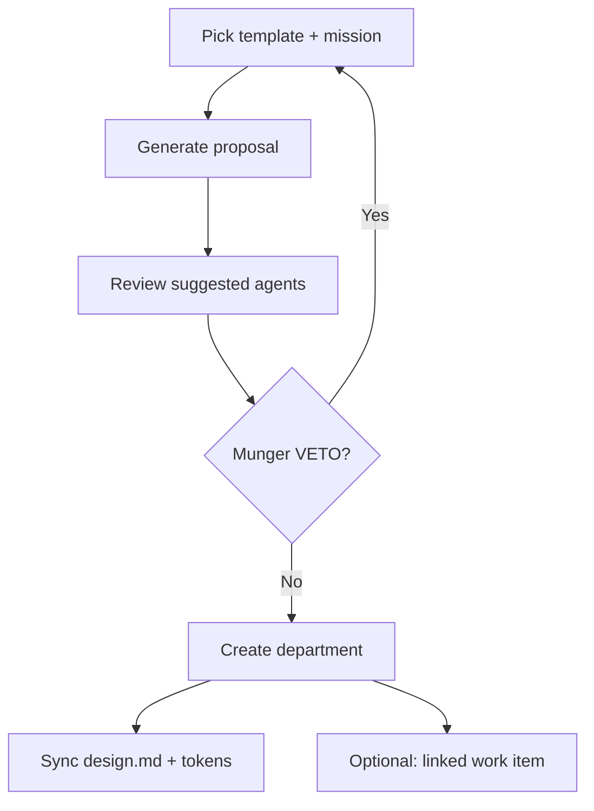

# Guide — Departments

Create departments with Org Studio, `design.md`, tokens, and the artifact gallery.

---

## Table of contents

1. [Org Studio](#org-studio)
2. [design.md and tokens](#designmd-and-tokens)
3. [Artifact gallery](#artifact-gallery)
4. [Business templates](#business-templates)

---

## Org Studio

Route: **Departments** → **Open Org Studio** (`/org-studio`).

Templates: marketing agency, product studio, sales & RevOps, customer success, SEO & content, finance & pricing, custom.

---

## design.md and tokens

Each department has:

| Asset | Purpose |
|-------|---------|
| **design.md** | Voice, colors, deliverable rules — read by all dept agents |
| **tokens** (DTCG JSON) | Org colors, typography, spacing |
| **config** | Niche, channels, cadence, brand voice |

Synced to `projects/_org/{slug}/design.md`. Marketing/copy/design agents **must reference** these tokens, not invent parallel palettes in custom JSON.

---

## Artifact gallery

On the department page → **Gallery**:

- Typed deliverables: `copy`, `design`, `social_post`, `report`, …
- Filter by status: draft, approved, published
- Source: handoffs from runs linked to the product/dept.

---

## Business templates

The **Marketing agency** template suggests:

- `copy-manager`, `community-manager`, `design-lead`, `marketing-strategist`
- Skills: content-strategy, frontend-design, community-led-growth, …

When applying the template, approve each new agent and skill in Catalog Studio if your tenant does not have them yet.
