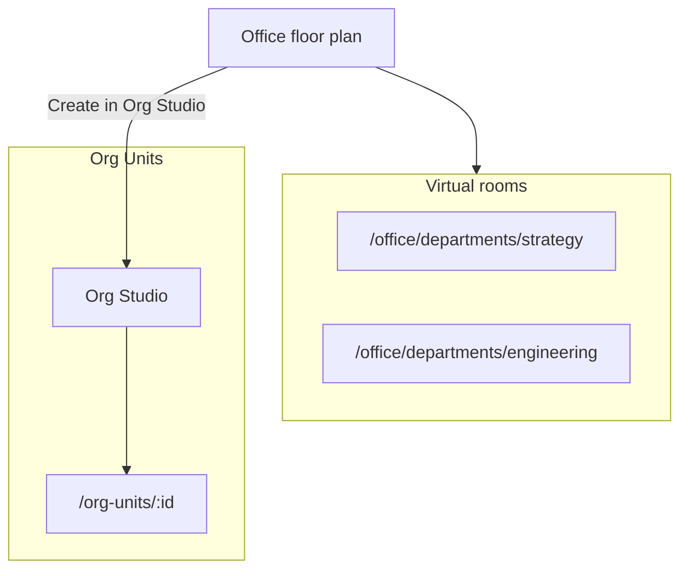
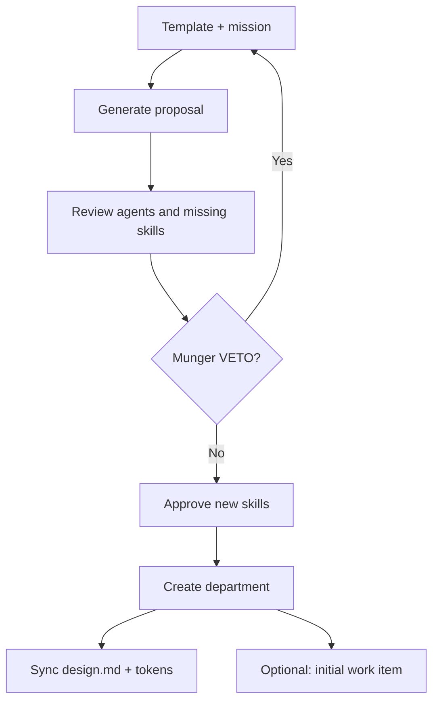

# Guide — Departments

Create departments with Org Studio, `design.md`, tokens, gallery, and staff roster.

---

## Table of contents

1. [Two kinds of “department”](#two-kinds-of-department)
2. [Virtual rooms vs Org Units](#virtual-rooms-vs-org-units)
3. [Org Studio](#org-studio)
4. [Staff tab](#staff-tab)
5. [design.md and tokens](#designmd-and-tokens)
6. [Artifact gallery](#artifact-gallery)
7. [Business templates](#business-templates)
8. [Frequently asked questions](#frequently-asked-questions)

---

## Two kinds of “department”

| Type | Where | What it is |
|------|-------|------------|
| **Virtual rooms** | Office floor plan (Strategy, Product, Engineering…) | Visual grouping of platform agents — no own `design.md` |
| **Org Units** | **Departments** (`/org-units`) created in Org Studio | Real departments with brand, agents, work items, and gallery |

This guide covers **Org Units** in detail and contrasts them with virtual rooms.

---

## Virtual rooms vs Org Units

| Aspect | Virtual room | Org Unit |
|--------|--------------|----------|
| Route | `/office/departments/:slug` | `/org-units/:id` |
| Origin | Fixed Office floor plan | Created in Org Studio |
| `design.md` | No | Yes — synced to `projects/_org/{slug}/` |
| Artifact gallery | No | Yes |
| Staff tab | No | Yes — roster and hiring |
| Dept. procedures | Platform procedures for the area | Procedures linked to the Org Unit |

For work with real brand context, use an **Org Unit**. Virtual rooms help explore platform agents by discipline (strategy, engineering, etc.).

---

## Org Studio

Route: **Departments** (`/org-units`) → **Open Org Studio** (`/org-studio`). Also from the Office floor plan (“Create in Org Studio”).

UI steps:

1. Pick template, name, and mission → **Generate proposal**.
2. Review suggested agents, config, and Munger review.
3. Check **new skills** you approve creating.
4. **Create department** — redirects to `/org-units/:id`.

If Munger issues VETO, you cannot apply until you adjust the proposal.

---

## Staff tab

Route: department page → **Staff** tab (`/org-units/:id?tab=staff`).

Manage the Org Unit **agent roster**:

| Section | Function |
|---------|----------|
| **Current members** | Name, role, live status (idle/busy), provisioned in template |
| **Vacancies** | Dept. template seats without a created agent yet |
| **Hire** | *Create role* mode — brief to Catalog Studio for a new agent |
| **Incorporate** | Link an existing template agent to the department |
| **Unlink** | Remove from roster without deleting from tenant |

Sub-tabs **Hire / Incorporate** via `?tab=staff&hire=create` or `hire=incorporate`.

From vacancies you can launch pre-filled briefs (“hire copy-manager for department X”). After creating the agent, return to Staff to confirm it shows as **provisioned**.

> Hiring AI agents in detail: [/help/guia-equipo-ia](/help/guia-equipo-ia).

---

## design.md and tokens

Each Org Unit has:

| Asset | Use |
|-------|-----|
| **design.md** | Voice, colors, deliverable rules — read by dept. agents |
| **tokens** (DTCG JSON) | Organizational colors, typography, spacing |
| **config** | Niche, channels, cadence, brand voice (per template) |

Synced to `projects/_org/{slug}/design.md`. Marketing/copy/design agents **must reference** these tokens, not invent parallel palettes in JSON.

Edit operating profile and design on the department page → **Settings** tab → *Operating profile* and *Design & artifacts*.

---

## Artifact gallery

Route: department → **Settings** → **Design & artifacts** (`ArtifactGallery`).

- Typed deliverables: `copy`, `design`, `social_post`, `report`, `code`, …
- Filter by status: draft, approved, published
- Source: completed runs with product linked to the department

The department **Room** tab also shows recent artifacts in the side panel.

---

## Business templates

Platform templates (slug → UI name):

| Slug | Name |
|------|------|
| `marketing-agency` | Digital Marketing Agency |
| `product-studio` | Product Studio (default) |
| `sales-revops` | Sales & RevOps |
| `customer-success` | Customer Success |
| `seo-content-studio` | SEO & Content Studio |
| `finance-pricing` | Finance & Pricing |
| `customer-support` | Customer Support |
| `custom-department` | Custom Department |

The **Marketing agency** template suggests agents like `copy-manager`, `community-manager`, `design-lead`, `marketing-strategist` and content/design skills.

When applying the template, approve each new agent/skill not yet in your tenant (Catalog Studio or Org Studio checkboxes).

From `/org-units/:id` you can **launch department work** with a free-form task + optional linked product.

---

## Frequently asked questions

### Are floor plan rooms (Strategy, Engineering…) Org Units?

No. They are **virtual rooms** at `/office/departments/:slug`. Real Org Units are created in Org Studio and listed under **Departments** (`/org-units`).

### Can I edit design.md without Org Studio?

Yes — department page → **Settings** → *Design & artifacts*. Changes sync to `projects/_org/{slug}/`.

### Staff vs Specialist templates?

**Staff** (`/org-units/:id?tab=staff`) — which agents belong to *this* department. **Specialist templates** (`/settings/specialists`) — tenant-wide agent catalog.
