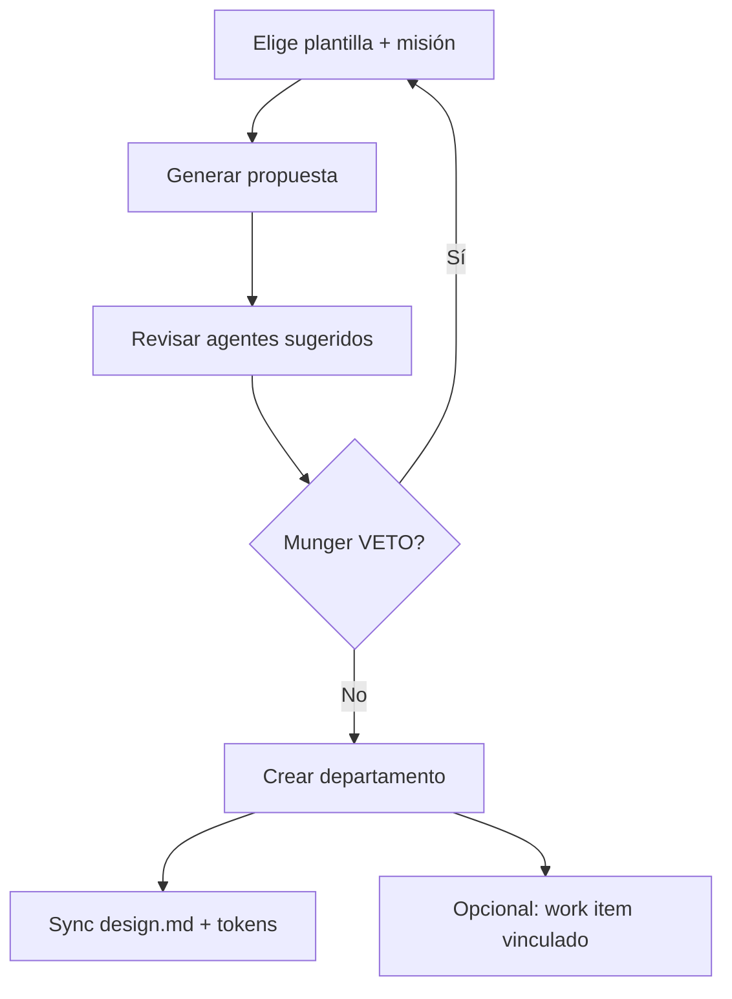

# Guía — Departamentos

Crear departamentos con Org Studio, `design.md`, tokens y galería de artefactos.

---

## Tabla de contenidos

1. [Org Studio](#org-studio)
2. [design.md y tokens](#designmd-y-tokens)
3. [Galería de artefactos](#galería-de-artefactos)
4. [Plantillas de negocio](#plantillas-de-negocio)

---

## Org Studio

Ruta: **Departamentos** → **Abrir Org Studio** (`/org-studio`).

Plantillas disponibles: marketing agency, product studio, sales & RevOps, customer success, SEO & content, finance & pricing, custom.

---

## design.md y tokens

Cada departamento tiene:

| Activo | Uso |
|--------|-----|
| **design.md** | Voz, colores, reglas de entregables — lo leen todos los agentes del dept. |
| **tokens** (JSON DTCG) | Colores, tipografía, spacing organizacionales |
| **config** | Nicho, canales, cadencia, voz de marca |

Se sincroniza a `projects/_org/{slug}/design.md`. Los agentes de marketing/copy/diseño **deben referenciar** estos tokens, no inventar paletas en JSON paralelo.

---

## Galería de artefactos

En la ficha del departamento → **Galería**:

- Entregables tipados: `copy`, `design`, `social_post`, `report`, …
- Filtrar por estado: borrador, aprobado, publicado
- Origen: handoffs de runs vinculados al producto/dept.

---

## Plantillas de negocio

La plantilla **Marketing agency** incluye agentes sugeridos:

- `copy-manager`, `community-manager`, `design-lead`, `marketing-strategist`
- Skills: content-strategy, frontend-design, community-led-growth, …

Al aplicar la plantilla, aprueba cada agente y skill nuevo en Catalog Studio si tu tenant aún no los tiene.
