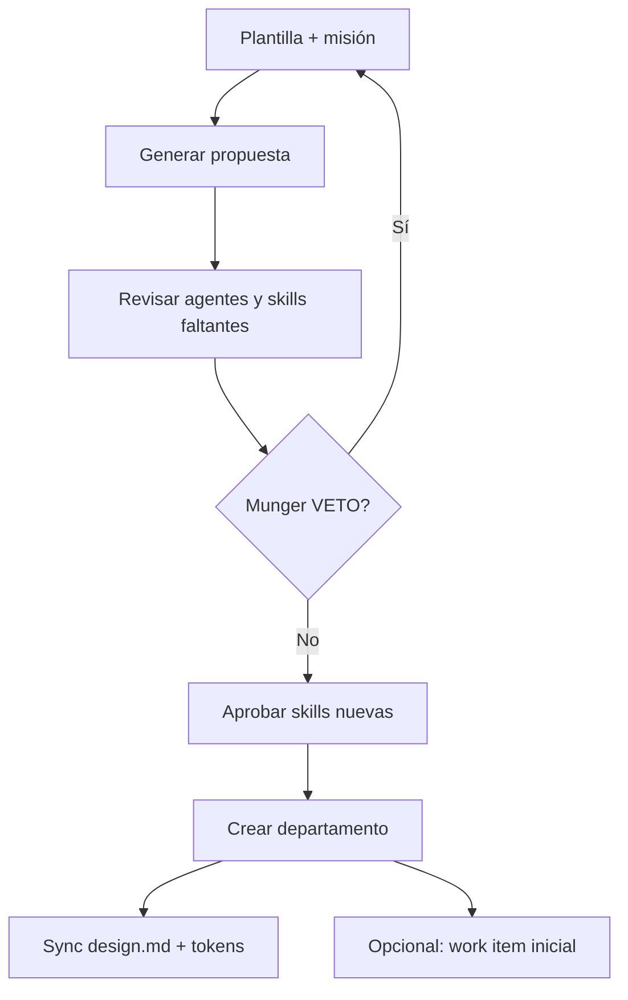

# Guía — Departamentos

Crear departamentos con Org Studio, `design.md`, tokens y galería de artefactos.

---

## Tabla de contenidos

1. [Dos tipos de «departamento»](#dos-tipos-de-departamento)
2. [Org Studio](#org-studio)
3. [design.md y tokens](#designmd-y-tokens)
4. [Galería de artefactos](#galería-de-artefactos)
5. [Plantillas de negocio](#plantillas-de-negocio)
6. [Preguntas frecuentes](#preguntas-frecuentes)

---

## Dos tipos de «departamento»

| Tipo | Dónde | Qué es |
|------|-------|--------|
| **Salas virtuales** | Plano de la Oficina (Strategy, Product, Engineering…) | Agrupación visual de agentes de plataforma — no tienen `design.md` propio |
| **Org Units** | **Departamentos** (`/org-units`) creados en Org Studio | Departamentos reales con marca, agentes, work items y galería |

Esta guía cubre los **Org Units**. Para pedir trabajo con contexto de dept., usa el selector en la Oficina o abre la sala del departamento.

---

## Org Studio

Ruta: **Departamentos** (`/org-units`) → botón **Abrir Org Studio** (`/org-studio`). También accesible desde el plano de la Oficina («Crear en Org Studio»).

Pasos en la UI:

1. Elige plantilla, nombre y misión → **Generar propuesta**.
2. Revisa agentes sugeridos, config y revisión Munger.
3. Marca checkboxes de **skills nuevas** que apruebas crear.
4. **Crear departamento** — redirige a `/org-units/:id`.

Si Munger emite VETO, no puedes aplicar hasta ajustar la propuesta.

---

## design.md y tokens

Cada Org Unit tiene:

| Activo | Uso |
|--------|-----|
| **design.md** | Voz, colores, reglas de entregables — lo leen los agentes del dept. |
| **tokens** (JSON DTCG) | Colores, tipografía, spacing organizacionales |
| **config** | Nicho, canales, cadencia, voz de marca (según plantilla) |

Se sincroniza a `projects/_org/{slug}/design.md`. Los agentes de marketing/copy/diseño **deben referenciar** estos tokens, no inventar paletas en JSON paralelo.

Edita perfil operativo y diseño en la ficha del departamento → pestaña **Configuración** → subsecciones *Operating profile* y *Design & artifacts*.

---

## Galería de artefactos

Ruta: departamento → **Configuración** → **Design & artifacts** (componente `ArtifactGallery`).

- Entregables tipados: `copy`, `design`, `social_post`, `report`, `code`, …
- Filtrar por estado: borrador, aprobado, publicado
- Origen: output de runs completados con producto vinculado al departamento

La sala del departamento también muestra artefactos recientes en el panel lateral.

---

## Plantillas de negocio

Plantillas de plataforma (slug → nombre en UI):

| Slug | Nombre |
|------|--------|
| `marketing-agency` | Digital Marketing Agency |
| `product-studio` | Product Studio (default) |
| `sales-revops` | Sales & RevOps |
| `customer-success` | Customer Success |
| `seo-content-studio` | SEO & Content Studio |
| `finance-pricing` | Finance & Pricing |
| `customer-support` | Customer Support |
| `custom-department` | Custom Department |

La plantilla **Marketing agency** sugiere agentes como `copy-manager`, `community-manager`, `design-lead`, `marketing-strategist` y skills de contenido/diseño.

Al aplicar la plantilla, aprueba cada agente/skill nuevo que aún no exista en tu tenant (Catalog Studio o checkboxes en Org Studio).

Desde `/org-units/:id` puedes **lanzar trabajo del departamento** con tarea libre + producto vinculado opcional.

---

## Preguntas frecuentes

### ¿Las salas del plano (Strategy, Engineering…) son Org Units?

No. Son **salas virtuales** de agentes de plataforma. Los Org Units reales se crean en Org Studio y aparecen en **Departamentos**.

### ¿Puedo editar design.md sin Org Studio?

Sí — ficha del departamento → **Configuración** → *Design & artifacts*. Los cambios se sincronizan al workspace `projects/_org/{slug}/`.
