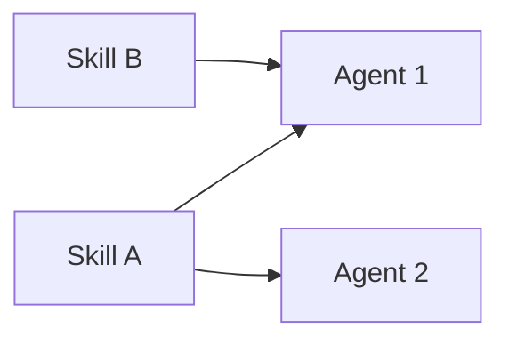

# Guide — AI team and skills

Agent catalog, reusable skills, and Catalog Studio.

---

## Table of contents

1. [AI team hub](#ai-team-hub)
2. [Skills](#skills)
3. [Catalog Studio](#catalog-studio)
4. [Workflows and departments](#workflows-and-departments)

---

## AI team hub

Route: **Your office** → **AI team** (`/ai-team`).

| Tab | Purpose |
|-----|---------|
| **Agents** | List + edit; on mobile, dropdown selector |
| **Skills** | Tenant skills |
| **Create agent** | Catalog Studio with AI |
| **Create skill** | Catalog Studio with AI |

Agents are **reusable specialists**: model, temperature, LLM provider, linked skills.

> For correct prompts and handoffs: **How to build agents** article.

---

## Skills

A skill = named capability (SEO audit, pricing model, UX review…).

- **Reuse** before duplicating — Catalog Studio prefers ≥80% match.
- kebab-case names: `seo-content-strategist`.
- Content: when to use + expected output + constraints.

---

## Catalog Studio

Common flow (agent or skill):

1. Write a natural-language **brief**.
2. AI proposes **reuse** existing or **create** draft.
3. **Munger** pre-mortem → may issue **VETO**.
4. Check explicit approval boxes.
5. **Approve and apply** — nothing is created without your OK.

---

## Workflows and departments

| You need… | Where |
|-----------|-------|
| New catalog role | AI team → Create agent |
| Repeatable process | Workflows (ordered chain) |
| Team + unified brand | Org Studio + design.md |
| Missing role on a job | Coordinator links to Create agent with prefilled brief |
