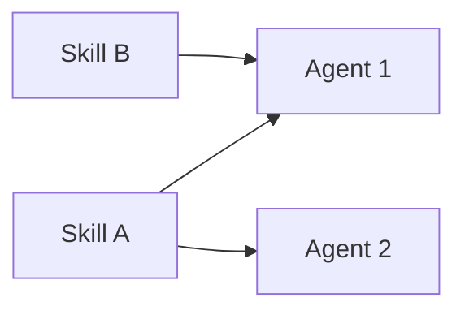
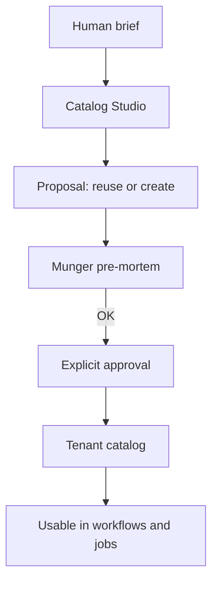
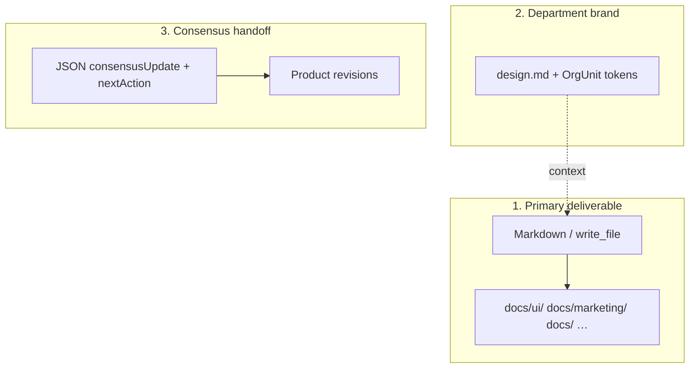
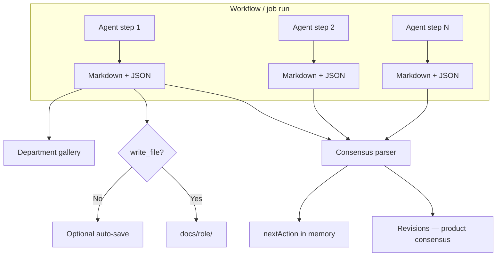
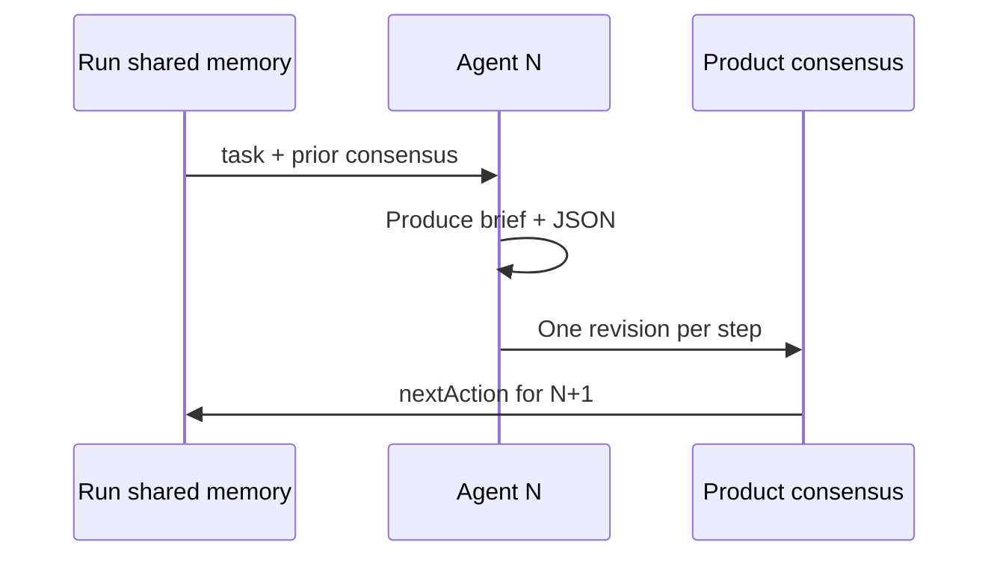
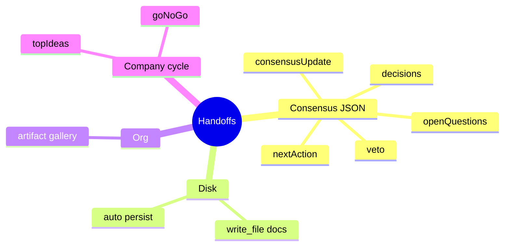

# Guide — AI team and skills

Agent catalog, reusable skills, and Catalog Studio.

---

## Table of contents

1. [AI team hub](#ai-team-hub)
2. [Skills](#skills)
3. [Catalog Studio](#catalog-studio)
4. [Workflows and departments](#workflows-and-departments)
5. [Frequently asked questions](#frequently-asked-questions)

---

## Plantilla de especialistas

Route: **Settings → Specialist templates** (`/settings/specialists`). Legacy `/ai-team` redirects here.

| Tab (UI) | Query `?tab=` | Purpose |
|----------|---------------|---------|
| **Agents** | *(default)* | List + inline edit; **New agent** button (manual form); mobile dropdown selector |
| **Skills** | `skills` | Tenant skills |
| **Create agent** | `create-agent` | Catalog Studio with AI (+ optional `brief`, `orgUnitId` in URL) |
| **Create skill** | `create-skill` | Catalog Studio with AI |

Agents are **reusable specialists**: model, temperature, LLM provider (per platform config), linked skills, system prompt.

Legacy routes `/agents` and `/skills` redirect here with the correct tab.

> For correct prompts and handoffs: **How to build agents** article.

---

## Skills

A skill = named capability (SEO audit, pricing model, UX review…).



- **Reuse** before duplicating — Catalog Studio prefers reusing an existing agent with ≥80% fit.
- kebab-case names: `seo-content-strategist`.
- Content: when to use + expected output + constraints.

---

## Catalog Studio

Common flow (agent or skill):

1. Write a natural-language **brief** (optional: context department).
2. AI proposes **reuse** existing or **create** draft (name, prompt, suggested skills).
3. **Munger** pre-mortem → may issue **VETO** (blocks Approve and apply).
4. Check explicit approval boxes (create new skills/agent).
5. **Approve and apply** — nothing is persisted without your OK.

Munger uses the same veto logic in **Org Studio**.

---

## Workflows and departments

| You need… | Where |
|-----------|-------|
| New catalog role | Specialist templates → Create agent (or New agent manual) |
| Repeatable process | Department room → **Procedures** panel, or Settings → Procedures |
| Team + unified brand | Org Studio + `design.md` |
| Missing role on a job | Coordinator links to `/settings/specialists?tab=create-agent&brief=…` |

Platform agents (`ceo-bezos`, `research-thompson`, …) clone to the tenant on demand when a workflow or service needs them.

---

---

## How to build agents

## System prompt anatomy

Catalog Studio and the platform expect a markdown document with:

| Section | Content |
|---------|---------|
| **## Rol / Role** | Responsibility in the virtual company |
| **## Persona** | Thinking style (expert reference if applicable) |
| **## Principios / Principles** | Domain decision rules |
| **## Flujo operativo / Operating flow** | What to do when a task arrives |
| **## Formato de salida / Output format** | Deliverable structure + JSON handoff reminder |

Agent name: **kebab-case** (`design-lead`, `copy-manager`).

Link skills in AI team — do not embed skills inside the prompt as a substitute.



---

## Handoff: end of every workflow reply

When the agent joins a **workflow** or **product-scoped job**, always end with a fenced ` ```json ` block.

### Platform-recognized schema

```json
{
  "consensusUpdate": "## Summary of MY step\n\nSelf-contained markdown: findings, numbers, recommendations.",
  "nextAction": "One concrete sentence for the next agent or cycle.",
  "decisions": [
    { "by": "design-lead", "what": "Mobile single-column layout", "why": "Less friction for B2B ICP" }
  ],
  "openQuestions": ["Custom illustration or existing tokens only?"],
  "veto": null
}
```

| Field | Required | Effect |
|-------|----------|--------|
| `consensusUpdate` | Recommended | Product consensus revision body |
| `nextAction` | Recommended | Guides the next workflow step |
| `decisions` | Optional | Decision trace |
| `openQuestions` | Optional | Open items for human or next agent |
| `veto` | Munger only | `{ "by": "critic-munger", "reason": "..." }` blocks |

> **Do not use** invented schemas (`DesignHandoff`, `schema.org`, `componentName`…) instead of this block. The platform **does not parse them**.

Full detail: **Handoffs and flow** article.

---

## Markdown deliverables vs JSON

Three separate layers:



### `docs/` folders by agent prefix

| Agent | Typical folder |
|-------|----------------|
| `ui-duarte` | `docs/ui/` |
| `marketing-godin` | `docs/marketing/` |
| `design-lead` | `docs/` (fallback; no `docs/design/` in map) |
| `copy-manager` | `docs/` or `docs/marketing/` via write_file |

If the agent uses `write_file`, the system **does not duplicate** the handoff on disk. Otherwise the engine may auto-persist step markdown.

---

## design.md and department tokens

Marketing/design agents **read** linked department `design.md` — do not redefine palettes in JSON.

Reference in the brief (markdown):

```markdown
## Tokens (from dept design.md)
- color.primary: #C9A227
- color.background: #0A0A0A
- typography.fontFamily: Inter
```

Tokens live in Org Studio → sync to the department workspace.

---

## Example: marketing design-lead

### Output format in system prompt

```markdown
## Formato de salida

1. **UX brief (markdown)** — goal, spatial layout, components/states, microcopy.
2. Reference department tokens (design.md).
3. End with platform consensus JSON block.

Optional: technical JSON annex *inside* the brief markdown
(documentation for devs only — does not replace consensus handoff).
```

### Sample reply (fragment)

**UX brief (markdown):**

- Section title: `# Design Brief — Q2 campaign landing`
- Goal, microcopy, referenced tokens

**Mandatory closing (consensus JSON):**

```json
{
  "consensusUpdate": "## Design Lead — Q2 landing\n\nSingle-column mobile, hero + social proof + single CTA. Tokens: primary gold on charcoal.",
  "nextAction": "copy-manager: draft hero headline and body per defined hierarchy.",
  "decisions": [
    { "by": "design-lead", "what": "Single CTA above the fold", "why": "design.md rule: one CTA per asset" }
  ],
  "openQuestions": [],
  "veto": null
}
```

---

## Common mistakes

| Mistake | Consequence | Fix |
|---------|-------------|-----|
| Only `DesignHandoff` JSON at the end | Lost structured handoff | Add consensus JSON |
| `docs/design/` in prompt | Non-standard path | Use `docs/ui/` or `docs/` |
| Missing `consensusUpdate` | Empty revision in UI | Self-contained markdown in field |
| Prompt without ## sections | Inconsistent Catalog Studio | Follow Role/Persona/… template |
| Ignoring design.md | Inconsistent brand | Explicit rule in ## Principles |

---

## Create the agent in the UI

1. **AI team** → **Create agent** tab (Catalog Studio with Munger) **or** **Agents** tab → **New agent** (manual form).
2. Paste the full system prompt with `## Role`, `## Persona`, etc.
3. Assign skills in the form — e.g. `frontend-design`, `ui-ux-pro-max` for design-lead.
4. In Catalog Studio: check approval boxes and pass Munger when applicable.
5. Attach to a department in Org Studio or use in a workflow / Office job.

Agents run only when they exist in the tenant catalog and are referenced by the Coordinator, a workflow, or a department.

> Departments and `design.md`: [/help/guia-departamentos](/help/guia-departamentos).

---

## Handoffs and flow

## Pipeline overview



When a run **completes** with a product in scope, the engine:

1. Walks the run step history.
2. Extracts the consensus JSON block from each output.
3. Appends **one revision per step** to product consensus.
4. Persists markdown under `docs/{role}/` if the agent did not use `write_file`.
5. Creates department gallery artifacts when an Org Unit is linked.

---

## Consensus handoff (per agent step)

**The primary handoff.** Each agent in a product-scoped workflow must end with:

```json
{
  "consensusUpdate": "<step markdown>",
  "nextAction": "<next action>",
  "decisions": [{ "by": "agent-name", "what": "...", "why": "..." }],
  "openQuestions": ["..."],
  "veto": null
}
```

### Fields the platform interprets

| Field | Effect |
|-------|--------|
| `consensusUpdate` | Revision body; visible under Product consensus → **Revisions** |
| `nextAction` | Next focus; stuck-cycle detection if repeated |
| `decisions` | Decision list on the revision |
| `openQuestions` | Explicit open items |
| `veto` | Valid `by` + `reason` → may stop the run or block convergence |

The parser scans JSON objects in the output (fenced blocks or embedded) and takes the **first object** with at least one recognized field.

If the JSON block is **missing**, the system uses markdown outside fences as content — you lose structured fields.

### Chain between agents



The next agent **reads** product `consensus.md` and revision history — not a custom `DesignHandoff` JSON.

---

## On-disk deliverables (write_file)

Second handoff type: **persistent file** in the product workspace.

| Mechanism | When | Path |
|-----------|------|------|
| Agent uses `write_file` | Explicit tool under `docs/` | `docs/{role}/…` |
| Auto-persist | No write_file on the step | Same convention at run close |

Agent prefix → folder:

| Prefix | Folder |
|--------|--------|
| `research-*` | `docs/research/` |
| `ui-*` | `docs/ui/` |
| `marketing-*` | `docs/marketing/` |
| `fullstack-*` | `docs/fullstack/` |
| *(other role prefixes)* | `docs/{prefix}/` or `docs/` fallback |
| `design-lead` | `docs/` (`design` prefix not mapped) |

**Effect:** if the step already wrote via `write_file`, auto-save is skipped (no duplicate).

---

## Department artifacts

Third destination: Org **gallery** for the department linked to the product.

- Type inferred per agent: `design-lead` → `design`, `copy-manager` → `copy`, etc.
- Body = full step output (markdown + JSON).
- Visible on department → Settings → **Design & artifacts**.
- Requires product with `orgUnitId` and completed run.

---

## Tenant vs product memory

| Handoff / memory | Scope | Where you edit | Written by |
|------------------|-------|----------------|------------|
| **Product consensus** | One product | Debug → Consensus (product) | Each agent step (JSON) |
| **Tenant consensus** | Whole company | Debug → Consensus (`/debug/consensus`) | Last agent of autonomous cycle / CEO |
| **Run memory** | One run | Internal (not editable) | Engine between steps |

Do not mix: a marketing step JSON handoff **does not** replace company-wide consensus. After product-scoped runs, product `nextAction` **does not** leak into tenant consensus.

---

## Autonomous cycle handoffs

Extra rules for company cycles (convergence prompts + structured memory):

| Cycle | JSON / memory field | Effect |
|-------|---------------------|--------|
| 1 | `topIdeas[]` (3 titles) | Feeds idea pipeline |
| 2 | `goNoGo`: `"GO"` / `"NO-GO"` | Bootstrap or drop product (per workflow) |
| 3+ | Real artifacts required | No discussion-only output |
| Any | `revenueUsd`, `productSlug`, … | Structured memory enrichment |

Extracted in addition to the standard consensus handoff.

---

## Munger VETO

Special handoff — control agents (`critic-munger`) or Munger gate in studios:

```json
{
  "veto": {
    "by": "critic-munger",
    "reason": "Unit economics fail at current CAC assumptions."
  }
}
```

**Effects:**

- **Catalog Studio / Org Studio:** blocks **Approve and apply** when Munger rejects the proposal.
- **Workflow run:** `_stoppedByVeto` may cancel convergence; run error `VETO:…`.
- Shown on revision as highlighted **VETO** and War room banner.

---

## Formats by department type

Beyond consensus JSON, templates suggest **content** inside `consensusUpdate`:

| Dept / agent | Expected markdown content |
|--------------|---------------------------|
| Marketing / copy | Ready copy, CTAs, tone per design.md |
| Marketing / community | Calendar + posts; hooks/hashtags in markdown |
| Marketing / design-lead | UX brief + referenced tokens |
| Product studio / fullstack | Implementation notes, code paths |
| SEO / content | Briefs, keywords, H1-H3 structure |

None replace the consensus JSON wrapper.

---

## Deliverable status in the UI

After a product-scoped run, the last-run trace classifies **each step**:

| Status | Meaning |
|--------|---------|
| `saved_to_disk` | At least one step used write_file or persisted doc |
| `handoff_only` | Output / JSON but no workspace files |
| `missing` | No useful output |

Aggregate run diagnoses (internal codes from `buildProductLastRunDiagnosis`):

| Diagnosis | Meaning |
|-----------|---------|
| `ok` | Steps with output; coherent structured handoffs |
| `partial_handoff` | Some steps with structured JSON (`consensusUpdate`/`nextAction`), others text-only |
| `no_docs_and_weak_handoff` | No workspace files and no structured JSON on steps |
| `no_docs_on_disk` | Structured JSON present but no persisted docs |
| `munger_veto` | Run cancelled by veto |
| `run_failed` / `run_in_progress` | Failed or still running |
| `empty_agent_output` | Steps with no useful output |

**Where to see it:** War room → **Deliverable health**; Product consensus → last run panel. **My jobs** shows reports and documents, not these per-step status codes.

---

## What is NOT a platform handoff

External AI schemas **not parsed** as consensus:

- `DesignHandoff` / `schema.org`
- JSON with `componentName`, `layout`, `children[]` as the only closing block
- Any JSON without recognized consensus fields

You **may** include them as an annex inside brief markdown — documentation for humans or `fullstack-dhh`, not engine memory.

### Quick summary



**Golden rule:** markdown deliverable + consensus JSON at the end. Everything else is complementary.

---

## Frequently asked questions

### Catalog Studio vs. manual New agent?

- **Create agent** (Catalog Studio) — AI proposes a draft + Munger; best for new roles.
- **Agents → New agent** — manual form; paste a full system prompt without AI proposal.

### What if Munger issues VETO?

You cannot **Approve and apply** until you adjust the proposal. Same logic in Org Studio.

### Links from jobs with a missing role

The Coordinator may open `/settings/specialists?tab=create-agent&brief=…` with a prefilled brief.
