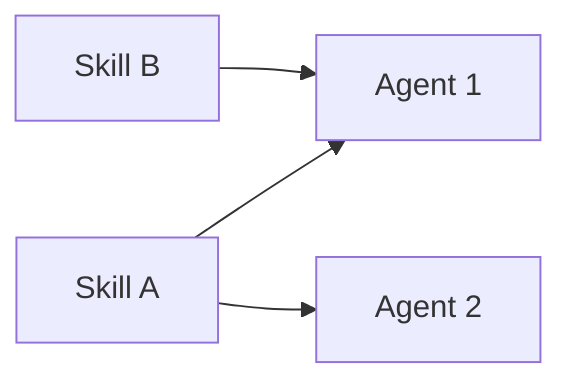

# Guide — AI team and skills

Agent catalog, reusable skills, and Catalog Studio.

---

## Table of contents

1. [AI team hub](#ai-team-hub)
2. [Skills](#skills)
3. [Catalog Studio](#catalog-studio)
4. [Workflows and departments](#workflows-and-departments)
5. [Frequently asked questions](#frequently-asked-questions)

---

## AI team hub

Route: **AI team** (`/ai-team`).

| Tab (UI) | Query `?tab=` | Purpose |
|----------|---------------|---------|
| **Agents** | *(default)* | List + inline edit; **New agent** button (manual form); mobile dropdown selector |
| **Skills** | `skills` | Tenant skills |
| **Create agent** | `create-agent` | Catalog Studio with AI (+ optional `brief`, `orgUnitId` in URL) |
| **Create skill** | `create-skill` | Catalog Studio with AI |

Agents are **reusable specialists**: model, temperature, LLM provider (per platform config), linked skills, system prompt.

Legacy routes `/agents` and `/skills` redirect here with the correct tab.

> For correct prompts and handoffs: **How to build agents** article.

---

## Skills

A skill = named capability (SEO audit, pricing model, UX review…).

- **Reuse** before duplicating — Catalog Studio prefers reusing an existing agent with ≥80% fit.
- kebab-case names: `seo-content-strategist`.
- Content: when to use + expected output + constraints.

---

## Catalog Studio

Common flow (agent or skill):

1. Write a natural-language **brief** (optional: context department).
2. AI proposes **reuse** existing or **create** draft (name, prompt, suggested skills).
3. **Munger** pre-mortem → may issue **VETO** (blocks Approve and apply).
4. Check explicit approval boxes (create new skills/agent).
5. **Approve and apply** — nothing is persisted without your OK.

Munger uses the same veto logic in **Org Studio**.

---

## Workflows and departments

| You need… | Where |
|-----------|-------|
| New catalog role | AI team → Create agent (or New agent manual) |
| Repeatable process | Workflows (`/office/workflows`) — ordered chain |
| Team + unified brand | Org Studio + `design.md` |
| Missing role on a job | Coordinator links to `/ai-team?tab=create-agent&brief=…` |

Platform agents (`ceo-bezos`, `research-thompson`, …) clone to the tenant on demand when a workflow or service needs them.

---

## Frequently asked questions

### Catalog Studio vs. manual New agent?

- **Create agent** (Catalog Studio) — AI proposes a draft + Munger; best for new roles.
- **Agents → New agent** — manual form; paste a full system prompt without AI proposal.

### What if Munger issues VETO?

You cannot **Approve and apply** until you adjust the proposal. Same logic in Org Studio.

### Links from jobs with a missing role

The Coordinator may open `/ai-team?tab=create-agent&brief=…` with a prefilled brief.
