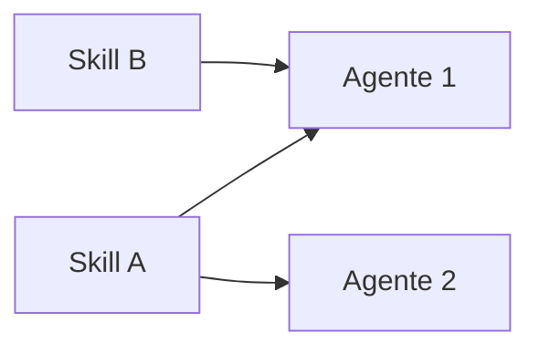

# Guía — Equipo IA y habilidades

Catálogo de agentes, skills reutilizables y Catalog Studio.

---

## Tabla de contenidos

1. [Equipo IA hub](#equipo-ia-hub)
2. [Habilidades (skills)](#habilidades-skills)
3. [Catalog Studio](#catalog-studio)
4. [Relación con flujos y departamentos](#relación-con-flujos-y-departamentos)
5. [Preguntas frecuentes](#preguntas-frecuentes)

---

## Equipo IA hub

Ruta: **Equipo IA** (`/ai-team`).

| Pestaña (UI) | Query `?tab=` | Función |
|--------------|---------------|---------|
| **Agentes** | *(default)* | Lista + edición inline; botón **Nuevo agente** (formulario manual); en móvil, selector desplegable |
| **Habilidades** | `skills` | Skills del tenant |
| **Crear agente** | `create-agent` | Catalog Studio con IA (+ `brief`, `orgUnitId` opcionales en URL) |
| **Crear habilidad** | `create-skill` | Catalog Studio con IA |

Los agentes son **especialistas reutilizables**: modelo, temperatura, proveedor LLM (según config de plataforma), skills asociadas, system prompt.

Rutas legacy `/agents` y `/skills` redirigen aquí con la pestaña correcta.

> Para construir prompts y handoffs correctos: artículo **¿Cómo construir agentes?**

---

## Habilidades (skills)

Una skill = capacidad nombrada (SEO audit, pricing model, UX review…).

- **Reutiliza** antes de duplicar — Catalog Studio prioriza reutilizar agente existente con fit ≥80%.
- Nombre en kebab-case: `seo-content-strategist`.
- Contenido: cuándo usarla + qué debe entregar + restricciones.

---

## Catalog Studio

Flujo común (agente o skill):

1. Escribes un **brief** en lenguaje natural (opcional: departamento de contexto).
2. La IA propone **reutilizar** existente o **crear** borrador (nombre, prompt, skills sugeridas).
3. **Munger** hace pre-mortem → puede emitir **VETO** (bloquea Aprobar y aplicar).
4. Marcas checkboxes de aprobación explícita (crear skills/agente nuevos).
5. **Aprobar y aplicar** — nada se persiste sin tu OK.

Munger también interviene en **Org Studio** con la misma lógica de veto.

---

## Relación con flujos y departamentos

| Necesitas… | Dónde |
|------------|-------|
| Rol nuevo en el catálogo | Equipo IA → Crear agente (o Nuevo agente manual) |
| Mismo proceso repetible | Flujos (`/office/workflows`) — cadena ordenada |
| Equipo + marca unificada | Org Studio + `design.md` |
| Falta un rol en encargo | Coordinador enlaza a `/ai-team?tab=create-agent&brief=…` |

Los agentes de plataforma (`ceo-bezos`, `research-thompson`, …) se clonan al tenant bajo demanda cuando un flujo o servicio los necesita.

---

## Preguntas frecuentes

### ¿Catalog Studio y «Nuevo agente» manual?

- **Crear agente** (Catalog Studio) — IA propone borrador + Munger; ideal para roles nuevos.
- **Agentes → Nuevo agente** — formulario manual; pega system prompt completo sin propuesta IA.

### ¿Qué pasa si Munger emite VETO?

No puedes **Aprobar y aplicar** hasta ajustar la propuesta. Misma lógica en Org Studio.

### Enlaces desde encargos con rol faltante

El Coordinador puede abrir `/ai-team?tab=create-agent&brief=…` con el brief precargado.
