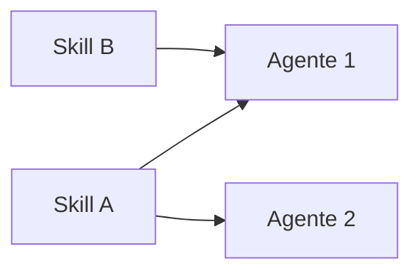
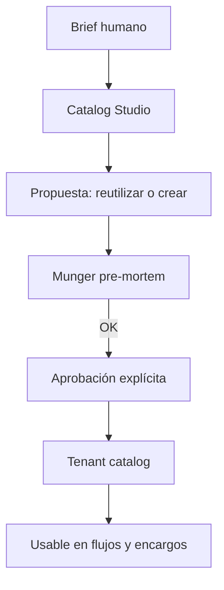
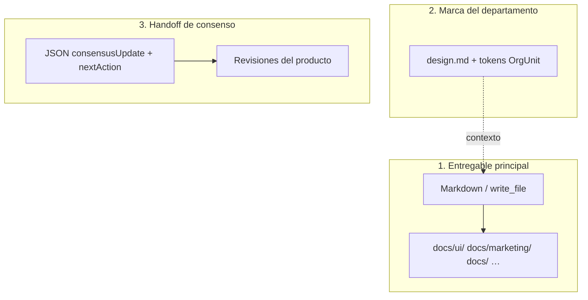
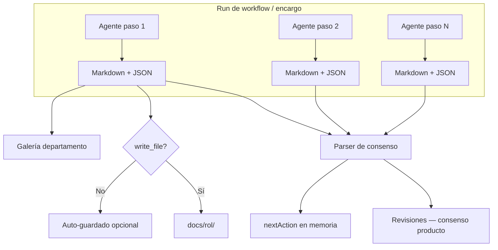
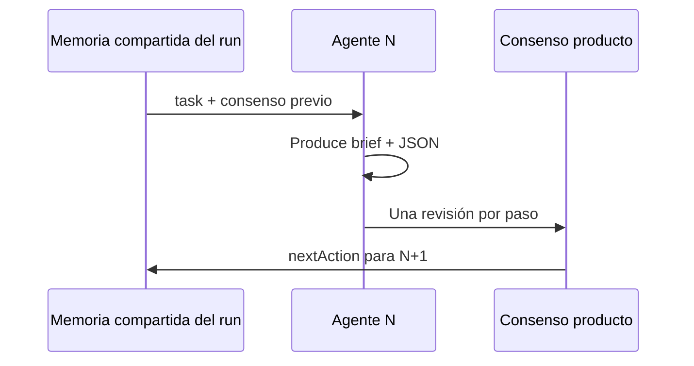
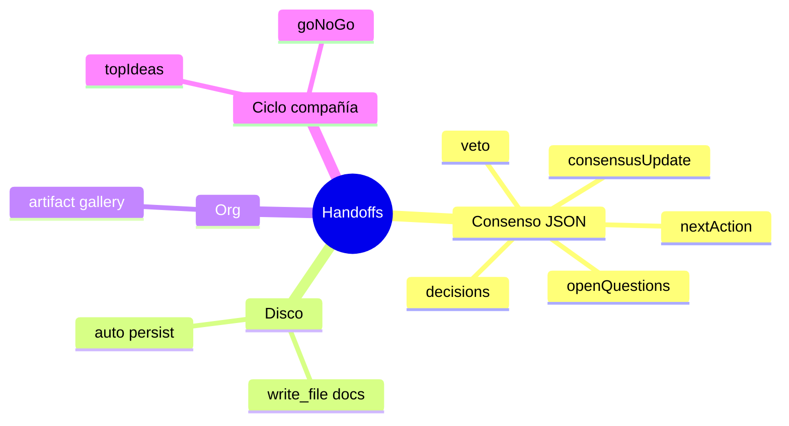

# Guía — Plantilla de especialistas y habilidades

Contrata y configura roles reutilizables. La operación diaria (encargos, procedimientos) ocurre en las **salas de departamento**.

---

## Tabla de contenidos

1. [Plantilla de especialistas](#plantilla-de-especialistas)
2. [Habilidades (skills)](#habilidades-skills)
3. [Catalog Studio](#catalog-studio)
4. [Relación con flujos y departamentos](#relación-con-flujos-y-departamentos)
5. [Cómo construir agentes](#cómo-construir-agentes)
6. [Handoffs y flujo](#handoffs-y-flujo)
7. [Preguntas frecuentes](#preguntas-frecuentes)

---

## Plantilla de especialistas

Ruta: **Configuración → Plantilla de especialistas** (`/settings/specialists`). La ruta legacy `/ai-team` redirige aquí.

| Pestaña (UI) | Query `?tab=` | Función |
|--------------|---------------|---------|
| **Agentes** | *(default)* | Lista + edición inline; botón **Nuevo agente** (formulario manual); en móvil, selector desplegable |
| **Habilidades** | `skills` | Skills del tenant |
| **Crear agente** | `create-agent` | Catalog Studio con IA (+ `brief`, `orgUnitId` opcionales en URL) |
| **Crear habilidad** | `create-skill` | Catalog Studio con IA |

Los agentes son **especialistas reutilizables**: modelo, temperatura, proveedor LLM (según config de plataforma), skills asociadas, system prompt.

Rutas legacy `/agents` y `/skills` redirigen aquí con la pestaña correcta.

> Para construir prompts y handoffs correctos: artículo **¿Cómo construir agentes?**

---

## Habilidades (skills)

Una skill = capacidad nombrada (SEO audit, pricing model, UX review…).



- **Reutiliza** antes de duplicar — Catalog Studio prioriza reutilizar agente existente con fit ≥80%.
- Nombre en kebab-case: `seo-content-strategist`.
- Contenido: cuándo usarla + qué debe entregar + restricciones.

---

## Catalog Studio

Flujo común (agente o skill):

1. Escribes un **brief** en lenguaje natural (opcional: departamento de contexto).
2. La IA propone **reutilizar** existente o **crear** borrador (nombre, prompt, skills sugeridas).
3. **Munger** hace pre-mortem → puede emitir **VETO** (bloquea Aprobar y aplicar).
4. Marcas checkboxes de aprobación explícita (crear skills/agente nuevos).
5. **Aprobar y aplicar** — nada se persiste sin tu OK.

Munger también interviene en **Org Studio** con la misma lógica de veto.

---

## Relación con flujos y departamentos

| Necesitas… | Dónde |
|------------|-------|
| Rol nuevo en el catálogo | Plantilla de especialistas → Crear agente |
| Mismo proceso repetible | **Procedimientos** — `/settings/procedures` o sala del departamento |
| Equipo + marca unificada | Org Studio + `design.md` |
| Falta un rol en encargo | Coordinador enlaza a `/settings/specialists?tab=create-agent&brief=…` |
| Lanzar trabajo del día | Sala del departamento → coordinador o procedimiento |

Los agentes de plataforma (`ceo-bezos`, `research-thompson`, …) se clonan al tenant bajo demanda cuando un flujo o servicio los necesita.

---

---

## Cómo construir agentes

## Anatomía del system prompt

Catalog Studio y la plataforma esperan un documento markdown con estas secciones:

| Sección | Contenido |
|---------|-----------|
| **## Rol** | Responsabilidad en la empresa virtual |
| **## Persona** | Estilo de pensamiento (referencia a experto si aplica) |
| **## Principios** | Reglas de decisión del dominio |
| **## Flujo operativo** | Qué hacer cuando llega una tarea |
| **## Formato de salida** | Estructura del entregable + recordatorio del JSON handoff |

Nombre del agente: **kebab-case** (`design-lead`, `copy-manager`).

Skills sugeridas se asocian en **Plantilla de especialistas** — no van dentro del prompt como sustituto de habilidades reales.



---

## Handoff: qué va al final de cada respuesta

Cuando el agente participa en un **workflow** o **encargo con producto**, debe terminar **siempre** con un bloque JSON en fenced code ` ```json `.

### Esquema reconocido por la plataforma

```json
{
  "consensusUpdate": "## Resumen de MI paso\n\nMarkdown autocontenido: hallazgos, números, recomendaciones.",
  "nextAction": "Una frase concreta para el siguiente agente o ciclo.",
  "decisions": [
    { "by": "design-lead", "what": "Layout mobile single-column", "why": "Menos fricción para ICP B2B" }
  ],
  "openQuestions": ["¿Ilustración custom o solo tokens existentes?"],
  "veto": null
}
```

| Campo | Obligatorio | Efecto |
|-------|-------------|--------|
| `consensusUpdate` | Recomendado | Contenido de la revisión en consenso del producto |
| `nextAction` | Recomendado | Guía al siguiente paso del flujo |
| `decisions` | Opcional | Trazabilidad de decisiones |
| `openQuestions` | Opcional | Pendientes para humano o siguiente agente |
| `veto` | Solo Munger | `{ "by": "critic-munger", "reason": "..." }` bloquea |

> **No uses** esquemas inventados (`DesignHandoff`, `schema.org`, `componentName`…) como sustituto de este bloque. La plataforma **no los parsea**.

Detalle completo: sección **Handoffs y flujo**.

---

## Entregables en markdown vs JSON

Tres capas distintas:



### Carpetas `docs/` por prefijo de agente

| Agente | Carpeta típica |
|--------|----------------|
| `ui-duarte` | `docs/ui/` |
| `marketing-godin` | `docs/marketing/` |
| `design-lead` | `docs/` (fallback; no existe `docs/design/` en el mapa) |
| `copy-manager` | `docs/` o `docs/marketing/` según write_file |

Si el agente usa herramienta `write_file`, el sistema **no duplica** el handoff en disco. Si no escribe archivo, el motor puede persistir el markdown del paso automáticamente.

---

## design.md y tokens del departamento

Los agentes de marketing/diseño **leen** el `design.md` del departamento vinculado — no redefinen paleta en JSON.

Ejemplo de referencia en el brief (markdown):

```markdown
## Tokens (desde design.md del dept.)
- color.primary: #C9A227
- color.background: #0A0A0A
- typography.fontFamily: Inter
```

Los tokens viven en Org Studio → se sincronizan al workspace del departamento.

---

## Ejemplo: design-lead de marketing

### Formato de salida en el system prompt

```markdown
## Formato de salida

1. **Brief UX (markdown)** — objetivo, arquitectura espacial, componentes/estados, microcopy.
2. Referencia tokens del departamento (design.md).
3. Termina con el bloque JSON de consenso (esquema de la plataforma).

Opcional: incluir un anexo JSON técnico *dentro* del markdown del brief
(solo documentación para devs — no reemplaza el handoff de consenso).
```

### Respuesta de ejemplo (fragmento)

**Brief UX (markdown):**

- Título de sección: `# Design Brief — Landing campaña Q2`
- Objetivo, microcopy, tokens referenciados

**Cierre obligatorio (JSON de consenso):**

```json
{
  "consensusUpdate": "## Design Lead — Landing Q2\n\nSingle-column mobile, hero + prueba social + CTA único. Tokens: primary gold on charcoal.",
  "nextAction": "copy-manager: redacta headline y body del hero según jerarquía definida.",
  "decisions": [
    { "by": "design-lead", "what": "Un solo CTA above the fold", "why": "Regla design.md: one CTA per asset" }
  ],
  "openQuestions": [],
  "veto": null
}
```

---

## Errores frecuentes

| Error | Consecuencia | Corrección |
|-------|--------------|------------|
| Solo JSON `DesignHandoff` al final | Handoff estructurado perdido | Añadir JSON de consenso |
| `docs/design/` en el prompt | Archivos en ruta no estándar | Usar `docs/ui/` o `docs/` |
| Sin `consensusUpdate` | Revisión vacía en UI | Markdown autocontenido en el campo |
| Prompt sin secciones ## | Catalog Studio inconsistente | Seguir plantilla Rol/Persona/… |
| Ignorar design.md | Marca incoherente | Mandato explícito en ## Principios |

---

## Crear el agente en la UI

1. **Plantilla de especialistas** → pestaña **Crear agente** (Catalog Studio con Munger) **o** pestaña **Agentes** → **Nuevo agente** (formulario manual).
2. Pega el system prompt completo con secciones `## Rol`, `## Persona`, etc.
3. Asigna skills en el formulario: p. ej. `frontend-design`, `ui-ux-pro-max` para design-lead.
4. En Catalog Studio: aprueba checkboxes y supera Munger si aplica.
5. Incorpora al departamento en Org Studio o úsalo en un flujo / encargo de Oficina.

Los agentes solo ejecutan en runs cuando están en el catálogo del tenant y referenciados por el Coordinador, un flujo o un departamento.

> Departamentos y `design.md`: [/help/guia-departamentos](/help/guia-departamentos).

---

## Handoffs y flujo

## Visión general del pipeline



Al **completar** un run con producto en scope, el motor:

1. Recorre el historial de pasos del run.
2. Extrae el bloque JSON de consenso de cada output.
3. Añade **una revisión por paso** al consenso del producto.
4. Persiste markdown en `docs/{rol}/` si el agente no usó `write_file`.
5. Crea artefactos en galería del departamento cuando hay Org Unit vinculado.

---

## Handoff de consenso (por paso de agente)

**El handoff principal.** Cada agente en un flujo con producto debe cerrar con:

```json
{
  "consensusUpdate": "<markdown del paso>",
  "nextAction": "<siguiente acción>",
  "decisions": [{ "by": "agent-name", "what": "...", "why": "..." }],
  "openQuestions": ["..."],
  "veto": null
}
```

### Campos que la plataforma interpreta

| Campo | Efecto |
|-------|--------|
| `consensusUpdate` | Cuerpo de la revisión; visible en Consenso del producto → **Revisiones** |
| `nextAction` | Próximo foco; detección de ciclos atascados si se repite |
| `decisions` | Lista de decisiones en la revisión |
| `openQuestions` | Pendientes explícitos |
| `veto` | Si `by` + `reason` válidos → puede detener el run o bloquear convergencia |

El parser busca objetos JSON en el output (bloques fenced o embebidos) y toma el **primer objeto** con al menos uno de esos campos reconocidos.

Si **falta** el bloque JSON, el sistema usa el markdown fuera de fences como contenido — pierdes campos estructurados.

### Cadena entre agentes



El agente siguiente **lee** `consensus.md` del producto y el historial de revisiones — no un JSON `DesignHandoff` custom.

---

## Entregables en disco (write_file)

Segundo tipo de handoff: **archivo persistente** en el workspace del producto.

| Mecanismo | Cuándo | Ruta |
|-----------|--------|------|
| Agente usa `write_file` | Herramienta explícita bajo `docs/` | `docs/{rol}/…` |
| Auto-persist | Sin write_file en el paso | Misma convención al cerrar el run |

Prefijos de agente → carpeta:

| Prefijo | Carpeta |
|---------|---------|
| `research-*` | `docs/research/` |
| `ui-*` | `docs/ui/` |
| `marketing-*` | `docs/marketing/` |
| `fullstack-*` | `docs/fullstack/` |
| *(otros prefijos de rol)* | `docs/{prefijo}/` o `docs/` fallback |
| `design-lead` | `docs/` (prefijo `design` no mapeado) |

**Efecto:** si el paso ya escribió con `write_file`, no se duplica el auto-guardado.

---

## Artefactos de departamento

Tercer destino: **galería Org** del departamento vinculado al producto.

- Tipo inferido por agente: `design-lead` → `design`, `copy-manager` → `copy`, etc.
- Body = output completo del paso (markdown + JSON).
- Visible en departamento → Configuración → **Design & artifacts**.
- Requiere producto con `orgUnitId` y run completado.

---

## Memoria tenant vs producto

| Handoff / memoria | Scope | Dónde editas | Quién escribe |
|-------------------|-------|--------------|---------------|
| **Consenso producto** | Un producto | Depuración → Consenso (producto) | Cada paso de agente (JSON) |
| **Consenso tenant** | Toda la compañía | Depuración → Consenso (`/debug/consensus`) | Último agente del ciclo autónomo / CEO |
| **Memoria del run** | Un run | Interno (no editable) | Motor entre pasos |

No mezcles: el handoff JSON de un paso de marketing **no** reemplaza el consenso global de la compañía. Tras runs con producto, el `nextAction` del producto **no** se filtra al consenso tenant.

---

## Handoffs de ciclo autónomo

Reglas extra en ciclos de compañía (prompts de convergencia + memoria estructurada):

| Ciclo | Campo JSON / memoria | Efecto |
|-------|----------------------|--------|
| 1 | `topIdeas[]` (3 títulos) | Alimenta pipeline de ideas |
| 2 | `goNoGo`: `"GO"` / `"NO-GO"` | Bootstrap o descarta producto (según workflow) |
| 3+ | Artefactos reales obligatorios | No solo discusión |
| Cualquiera | `revenueUsd`, `productSlug`, … | Enriquecimiento de memoria estructurada |

Estos campos se extraen además del handoff de consenso estándar.

---

## VETO de Munger

Handoff especial — agentes de control (`critic-munger`) o gate Munger en estudios:

```json
{
  "veto": {
    "by": "critic-munger",
    "reason": "Unit economics fail at current CAC assumptions."
  }
}
```

**Efectos:**

- **Catalog Studio / Org Studio:** bloquea **Aprobar y aplicar** si Munger no aprueba la propuesta.
- **Run de workflow:** `_stoppedByVeto` puede cancelar convergencia; error `VETO:…` en el run.
- Visible en revisión como **VETO** destacado y banner en War room.

---

## Formatos por tipo de departamento

Además del JSON de consenso, las plantillas sugieren **contenido** dentro de `consensusUpdate`:

| Dept / agente | Contenido esperado en markdown |
|---------------|-------------------------------|
| Marketing / copy | Copy listo, CTAs, tono según design.md |
| Marketing / community | Calendario + posts; hooks/hashtags en markdown |
| Marketing / design-lead | Brief UX + tokens referenciados |
| Product studio / fullstack | Notas de implementación, paths de código |
| SEO / content | Briefs, keywords, estructura H1-H3 |

Ninguno sustituye el wrapper JSON de consenso.

---

## Estados de entregable en la UI

Tras un run con producto, la traza del último run clasifica **cada paso**:

| Estado | Significado |
|--------|-------------|
| `saved_to_disk` | Al menos un paso usó write_file o doc persistido |
| `handoff_only` | Hay output / JSON pero sin archivos en workspace |
| `missing` | Sin output útil |

Diagnósticos agregados del run (códigos internos en `buildProductLastRunDiagnosis`):

| Diagnóstico | Significado |
|-------------|-------------|
| `ok` | Pasos con output; handoffs estructurados coherentes |
| `partial_handoff` | Algunos pasos con JSON estructurado (`consensusUpdate`/`nextAction`), otros solo texto |
| `no_docs_and_weak_handoff` | Sin archivos en workspace ni JSON estructurado en los pasos |
| `no_docs_on_disk` | Hay handoff JSON pero ningún doc persistido |
| `munger_veto` | Run cancelado por veto |
| `run_failed` / `run_in_progress` | Fallo o aún en curso |
| `empty_agent_output` | Pasos sin output útil |

**Dónde verlo:** War room → **Salud de entregables**; Consenso del producto → panel del último run. **Mis encargos** muestra informes y documentos, no estos códigos de estado por paso.

---

## Qué NO es un handoff de plataforma

Esquemas de IAs externas **no parseados** como consenso:

- `DesignHandoff` / `schema.org`
- JSON con `componentName`, `layout`, `children[]` como cierre único
- Cualquier JSON sin campos de consenso reconocidos

**Puedes** incluirlos como anexo dentro del markdown del brief — son documentación para humanos o `fullstack-dhh`, no memoria del motor.

### Resumen rápido



**Regla de oro:** markdown entregable + JSON de consenso al final. Todo lo demás es complemento.

---

## Preguntas frecuentes

### ¿Catalog Studio y «Nuevo agente» manual?

- **Crear agente** (Catalog Studio) — IA propone borrador + Munger; ideal para roles nuevos.
- **Agentes → Nuevo agente** — formulario manual; pega system prompt completo sin propuesta IA.

### ¿Qué pasa si Munger emite VETO?

No puedes **Aprobar y aplicar** hasta ajustar la propuesta. Misma lógica en Org Studio.

### Enlaces desde encargos con rol faltante

El Coordinador puede abrir `/settings/specialists?tab=create-agent&brief=…` con el brief precargado.
