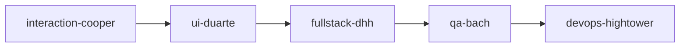
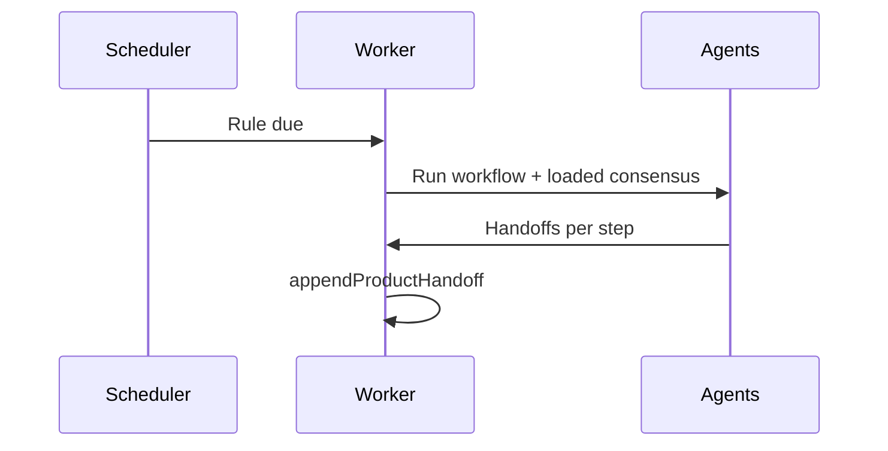

# Guide — Workflows and schedules

Agent playbooks in sequence and optional timer rules.

---

## Table of contents

1. [What is a workflow](#what-is-a-workflow)
2. [Create and run](#create-and-run)
3. [Schedules (optional)](#schedules-optional)
4. [GO / NO-GO decisions](#go--no-go-decisions)

---

## What is a workflow

A **workflow** = ordered agent sequence. Example feature development:

Each step produces deliverables and a **JSON handoff** for the next (see **Handoffs and flow**).

Route: **Workflows** (`/office/workflows`).

---

## Create and run

1. **New workflow** → name and description.
2. Visual editor: drag agent nodes and connect order.
3. **Save**.
4. Run with a task seed from the editor, or let the **Coordinator** pick it for complex jobs.

Platform workflows (product evaluation, launch, pricing…) clone to the tenant as templates.

---

## Schedules (optional)

**Settings** → **Schedules** / **Operations**.

| Preset | Behavior |
|--------|----------|
| **On demand** | No rules — recommended to start |
| **Discovery only** | Light automatic idea cycle |
| **Fixed rule** | Workflow + interval/cron + conditions |

Master manual jobs from the Office first.

---

## GO / NO-GO decisions

In autonomous company cycles (not the same as per-step handoff):

- Cycle 1 → `topIdeas` field (3 short titles)
- Cycle 2 → `goNoGo`: `"GO"` or `"NO-GO"`
- Cycle 3+ → tangible artifacts required

Proposals needing a human appear under **Decisions** (debug menu).
