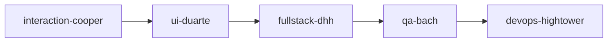
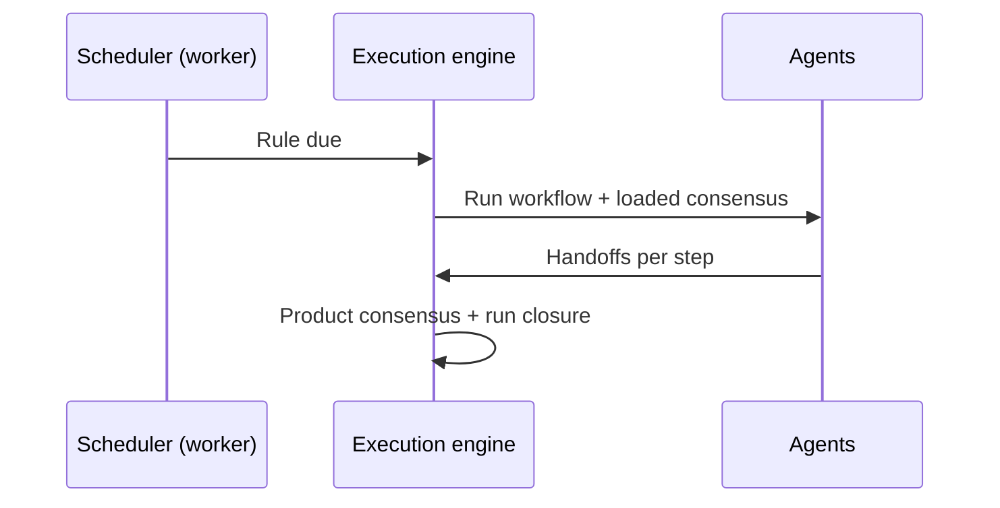

# Guide — Workflows and schedules

Agent playbooks in sequence and optional timer rules.

---

## Table of contents

1. [What is a workflow](#what-is-a-workflow)
2. [Create and run](#create-and-run)
3. [Schedules (optional)](#schedules-optional)
4. [GO / NO-GO decisions](#go--no-go-decisions)

---

## What is a workflow

A **workflow** = ordered agent sequence (steps + edges). Example feature development:

Each step should produce deliverables and a **consensus JSON handoff** (see **Handoffs and flow**).

Route: **Workflows** (`/office/workflows`). The editor uses a visual canvas (`WorkflowCanvas`) to order nodes.

Platform workflows (product evaluation, launch, pricing…) are **ensured on the tenant** automatically the first time you need them.

---

## Create and run

1. **New workflow** → name and description.
2. Editor: add agent nodes and connect order.
3. **Save**.
4. **Run** from the editor:
   - “Load and sync tenant consensus” (next action as seed)
   - Optional manual task seed
   - After run → **Debug → Runs** (`/debug/runs/:id`)

From the **Office**, the Coordinator may pick a workflow for complex jobs or quick services (e.g. `idea-validation` → `new-product-evaluation`).

> Jobs approved from the Office appear under **My jobs**; manual editor runs appear under **Runs**.

---

## Schedules (optional)

Route: **Settings → Schedules** (`/settings?tab=schedules`) — **Operations plan** panel.

The primary flow remains on-demand Office work. Here you define optional rules:

| Preset | Behavior |
|--------|----------|
| **On demand** | No rules — recommended to start |
| **Discovery only** | Weekly discovery (Saturday 9:00) when pipeline is empty |
| **Light exploration** | Discovery + periodic evaluation + weekly review (no meta-orchestrator) |
| **Custom rule** | **Fixed workflow** or **Dynamic orchestrator** (advanced) |

Rule modes:

- **Fixed workflow** — specific workflow + interval/cron + conditions (empty pipeline, building product, no pending decisions…).
- **Dynamic orchestrator** — each tick the meta-orchestrator picks a workflow from phase and portfolio (**advanced**, not recommended to start).

Review upcoming runs, KPIs, and skip reasons under **Debug → Operations** (`/ops`) — see **[Operations](/help/guia-operaciones)**.

---

## GO / NO-GO decisions

Two distinct contexts:

### Autonomous company cycles (meta-orchestrator / schedules)

Rules injected into cycle prompts:

- Cycle 1 → `topIdeas` field (3 short titles)
- Cycle 2 → `goNoGo`: `"GO"` or `"NO-GO"`
- Cycle 3+ → tangible artifacts required (no discussion-only output)

Extra structured memory: `revenueUsd`, `productSlug`, …

### Product evaluation with human in the loop

Workflow **`new-product-evaluation`**: after the run, if Munger did not veto, a **decision proposal** (`DecisionProposal`) is created with a GO/NO-GO recommendation.

Approve, reject, or pivot in:

- **Debug → Decisions** (`/decisions`)
- **Job detail** (`/office/encargos/:runId`)

Until you approve, the product does not automatically advance to `building` through this path.

Per-step JSON handoffs (`consensusUpdate`, `nextAction`) are **separate** from these portfolio decisions.
