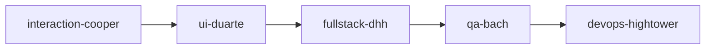
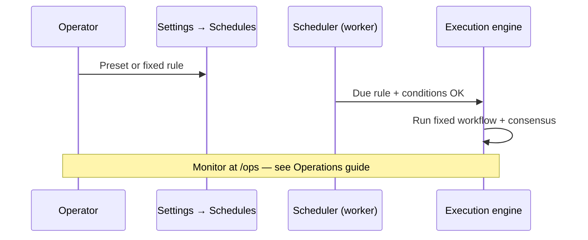

# Guide — Workflows and schedules

Agent playbooks in sequence and optional timer rules.

---

## Table of contents

1. [What is a workflow](#what-is-a-workflow)
2. [Create and run](#create-and-run)
3. [Schedules (optional)](#schedules-optional)
4. [GO / NO-GO decisions](#go--no-go-decisions)
5. [Frequently asked questions](#frequently-asked-questions)

---

## What is a workflow

A **workflow** = ordered agent sequence (steps + edges). Example feature development:

Each step should produce deliverables and a **consensus JSON handoff** (see **Handoffs and flow**).

Route: **Workflows** (`/office/workflows`). The editor uses a visual canvas (`WorkflowCanvas`) to order nodes.

Platform workflows (product evaluation, launch, pricing…) are **ensured on the tenant** automatically the first time you need them.

---

## Create and run

1. **New workflow** → name and description.
2. Editor: add agent nodes and connect order.
3. **Save**.
4. **Run** from the editor:
   - “Load and sync tenant consensus” (next action as seed)
   - Optional manual task seed
   - After run → **Debug → Runs** (`/debug/runs/:id`)

From the **Office**, the Coordinator may pick a workflow for complex jobs or quick services (e.g. `idea-validation` → `new-product-evaluation`).

> Jobs approved from the Office appear under **My jobs**; manual editor runs appear under **Runs**.

---

## Schedules (optional)

Route: **Settings → Schedules** (`/settings?tab=schedules`) — **Operations plan** panel (tenant admin only).

The primary flow remains **on-demand Office** work. Apply presets or create **fixed workflow** rules only.

### Available presets

| Preset (ID) | Rules | Behavior |
|-------------|-------|----------|
| **On demand** (`on_demand`) | 0 | Clears active rules — recommended to start |
| **Discovery only** (`discovery_only`) | 1 | `opportunity-discovery` Saturdays 9:00 when pipeline is empty and no pending decisions |
| **Light exploration** (`light_exploration`) | 3 | Weekly discovery + evaluation ~every 3 days when an idea is pending + weekly review Mondays |

All current presets use **`orchestrationMode: fixed`**. They do not include a dynamic orchestrator.

### Custom rule (fixed workflow)

In the **Add rule** section of the same panel:

1. Rule name.
2. **Workflow** — pick a tenant workflow (required).
3. **Timing** — interval (1 h – 7 days in UI) or cron (e.g. Saturday 9:00).
4. **Priority** — tie-break when several rules are due (higher number wins).
5. **Conditions** (optional) — empty pipeline / has ideas, pending idea, building/launch product, growing product, no GO/NO-GO decisions, department scope.

On save, the API always creates a **fixed** rule. There is no “Dynamic orchestrator” selector in the current UI.

> **Legacy / deprecated:** rules with `orchestrationMode === meta_dynamic` (“Dynamic orchestrator”) may still exist on older tenants. The meta-orchestrator picked the workflow each tick. **New Meta rules cannot be created or converted** — the API returns `400`. Pause or delete legacy rules from **[Operations](/help/guia-operaciones)**. The “Next meta step” banner on `/ops` still works without Meta rules.

Review KPIs, upcoming runs, and skip reasons under **Debug office → Operations** (`/ops` or `/debug/ops`) — **[Operations](/help/guia-operaciones)**.

---

## GO / NO-GO decisions

Two distinct contexts:

### Autonomous company cycles (meta-orchestrator / schedules)

Rules injected into cycle prompts:

- Cycle 1 → `topIdeas` field (3 short titles)
- Cycle 2 → `goNoGo`: `"GO"` or `"NO-GO"`
- Cycle 3+ → tangible artifacts required (no discussion-only output)

Extra structured memory: `revenueUsd`, `productSlug`, …

### Product evaluation with human in the loop

Workflow **`new-product-evaluation`**: after the run, if Munger did not veto, a **decision proposal** (`DecisionProposal`) is created with a GO/NO-GO recommendation.

Approve, reject, or pivot in:

- **Debug → Decisions** (`/decisions`)
- **Job detail** (`/office/encargos/:runId`)

Until you approve, the product does not automatically advance to `building` through this path.

Per-step JSON handoffs (`consensusUpdate`, `nextAction`) are **separate** from these portfolio decisions.

---

## Frequently asked questions

### Can I create a “Dynamic orchestrator” rule?

No. **Fixed workflow** only. Legacy Meta rules are managed (pause/delete) in Operations; you cannot recreate them as Meta.

### Do schedules replace Office approval?

Not for manual jobs. Active rules enqueue workflows **without** a Coordinator proposal card. Office jobs still require **Approve and run**.

### Where do I see if weekly discovery will fire?

The **Next 7 days** panel in **[Operations](/help/guia-operaciones)** — not in the workflow editor.

### Run from editor vs. Office?

| Source | Where the run appears |
|--------|----------------------|
| Workflow editor → Run | **Runs** (`/debug/runs`) |
| Office → Approve job | **My jobs** + War room when a product is in scope |
