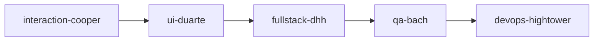
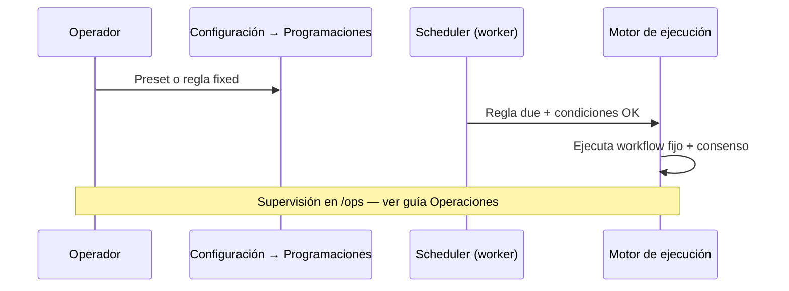

# Guía — Flujos y programaciones

Playbooks de agentes en cadena y reglas opcionales en timer.

---

## Tabla de contenidos

1. [Qué es un flujo](#qué-es-un-flujo)
2. [Crear y ejecutar](#crear-y-ejecutar)
3. [Programaciones (opcional)](#programaciones-opcional)
4. [Decisiones GO / NO-GO](#decisiones-go--no-go)
5. [Preguntas frecuentes](#preguntas-frecuentes)

---

## Qué es un flujo

Un **flujo** = secuencia ordenada de agentes (pasos + conexiones). Ejemplo feature development:

Cada paso debe producir entregables y un **handoff JSON de consenso** (ver **Handoffs y flujo**).

Ruta: **Flujos** (`/office/workflows`). El editor usa un canvas visual (`WorkflowCanvas`) para ordenar nodos.

Los workflows de plataforma (evaluación de producto, launch, pricing…) se **copian al tenant** automáticamente la primera vez que los necesitas.

---

## Crear y ejecutar

1. **Nuevo flujo** → nombre y descripción.
2. Editor: añade nodos de agentes y conecta el orden.
3. **Guarda**.
4. **Ejecutar** desde el editor:
   - Opción «Cargar y sincronizar consensus del tenant» (next action como semilla)
   - Semilla de tarea manual opcional
   - Tras ejecutar → **Depuración → Ejecuciones** (`/debug/runs/:id`)

Desde la **Oficina**, el Coordinador puede elegir un flujo en encargos complejos o servicios rápidos (p. ej. `idea-validation` → `new-product-evaluation`).

> Los encargos aprobados desde la Oficina aparecen en **Mis encargos**; las ejecuciones manuales del editor aparecen en **Ejecuciones**.

---

## Programaciones (opcional)

Ruta: **Configuración → Programaciones** (`/settings?tab=schedules`) — panel **Plan de operaciones** (solo admin tenant).

El flujo principal sigue siendo la **Oficina bajo demanda**. Aquí aplicas presets o creas reglas con **workflow fijo** únicamente.

### Presets disponibles

| Preset (ID) | Reglas | Comportamiento |
|-------------|--------|----------------|
| **Bajo demanda** (`on_demand`) | 0 | Elimina reglas activas — recomendado al empezar |
| **Solo discovery** (`discovery_only`) | 1 | `opportunity-discovery` los sábados 9:00 si pipeline vacío y sin decisiones pendientes |
| **Exploración ligera** (`light_exploration`) | 3 | Discovery semanal + evaluación cada ~3 días si hay idea pendiente + revisión semanal los lunes |

Todos los presets actuales usan **`orchestrationMode: fixed`**. No incluyen orquestador dinámico.

### Regla personalizada (workflow fijo)

En la sección **Añadir regla** del mismo panel:

1. Nombre de la regla.
2. **Flujo** — elige un workflow del tenant (obligatorio).
3. **Periodicidad** — intervalo (1 h – 7 días en UI) o expresión cron (p. ej. sábado 9:00).
4. **Prioridad** — desempate cuando varias reglas coinciden (mayor número gana).
5. **Condiciones** (opcional) — pipeline vacío/con ideas, idea pendiente, producto en build/launch, producto growing, sin decisiones GO/NO-GO, alcance por departamento.

Al guardar, la API crea la regla siempre en modo **fixed**. No hay selector de «Orquestador dinámico» en la UI actual.

> **Legacy / deprecado:** reglas con `orchestrationMode === meta_dynamic` («Orquestador dinámico») pueden existir en tenants antiguos. El meta-orchestrator elegía el workflow en cada tick. **No se pueden crear ni convertir reglas Meta nuevas** — la API responde `400`. Pausa o elimina reglas legacy desde **[Operaciones](/help/guia-operaciones)**. El banner «Próximo paso meta» en `/ops` sigue informando sin necesidad de reglas Meta.

Revisa KPIs, próximas ejecuciones y motivos de skip en **Oficina de depuración → Operaciones** (`/ops` o `/debug/ops`) — **[Operaciones](/help/guia-operaciones)**.

---

## Decisiones GO / NO-GO

Dos contextos distintos:

### Ciclos autónomos de compañía (meta-orchestrator / schedules)

Reglas inyectadas en prompts de ciclo:

- Ciclo 1 → campo `topIdeas` (3 títulos cortos)
- Ciclo 2 → `goNoGo`: `"GO"` o `"NO-GO"`
- Ciclo 3+ → artefactos tangibles obligatorios (no solo discusión)

Campos extra en memoria estructurada: `revenueUsd`, `productSlug`, …

### Evaluación de producto con humano en el loop

Workflow **`new-product-evaluation`**: tras el run, si Munger no vetó, se crea una **propuesta de decisión** (`DecisionProposal`) con recomendación GO/NO-GO.

Aprueba, rechaza o pivot en:

- **Depuración → Decisiones** (`/decisions`)
- Detalle del **encargo** (`/office/encargos/:runId`)

Hasta que apruebes, el producto no avanza a fase `building` automáticamente por este camino.

Los handoffs JSON por paso (`consensusUpdate`, `nextAction`) son **independientes** de estas decisiones de portfolio.

---

## Preguntas frecuentes

### ¿Puedo crear una regla «Orquestador dinámico»?

No. Solo **workflow fijo**. Las reglas Meta legacy se gestionan (pausa/cancelar) en Operaciones; no se reactivan como Meta nuevas.

### ¿Las programaciones sustituyen aprobar en la Oficina?

No para encargos manuales. Las reglas activas encolan workflows **sin** tarjeta del Coordinador. Los encargos de Oficina siguen requiriendo **Aprobar y ejecutar**.

### ¿Dónde veo si el discovery semanal se ejecutará?

Panel **Próximos 7 días** en **[Operaciones](/help/guia-operaciones)** — no en el editor de flujos.

### ¿Ejecutar desde el editor vs. Oficina?

| Origen | Dónde aparece el run |
|--------|---------------------|
| Editor de flujos → Ejecutar | **Ejecuciones** (`/debug/runs`) |
| Oficina → Aprobar encargo | **Mis encargos** + War room si hay producto |
