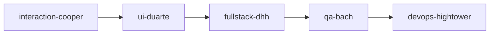
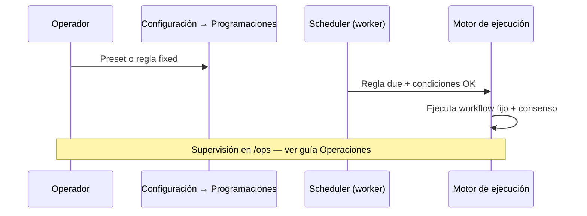
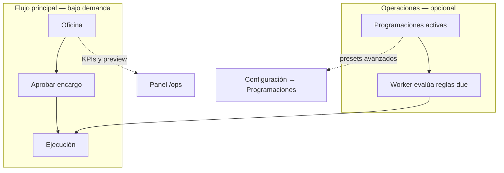
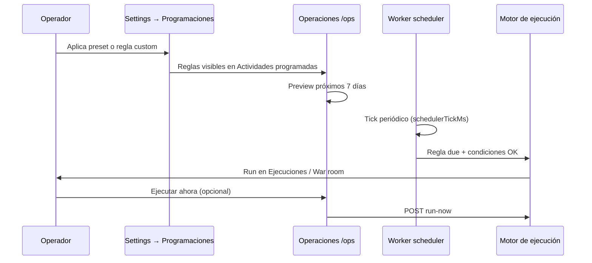

# Guía — Flujos y programaciones

Playbooks de agentes en cadena y reglas opcionales en timer.

---

## Tabla de contenidos

1. [Qué es un flujo](#qué-es-un-flujo)
2. [Crear y ejecutar](#crear-y-ejecutar)
3. [Programaciones (opcional)](#programaciones-opcional)
4. [Operaciones (/ops)](#operaciones-ops)
5. [Decisiones GO / NO-GO](#decisiones-go--no-go)
6. [Preguntas frecuentes](#preguntas-frecuentes)

---

## Qué es un flujo

Un **flujo** = secuencia ordenada de agentes (pasos + conexiones). Ejemplo feature development:

Cada paso debe producir entregables y un **handoff JSON de consenso** (ver **[Handoffs y flujo](/help/guia-equipo-ia#handoffs-y-flujo)**).

Ruta diaria: **Procedimientos del departamento** (dentro de cada sala en `/office/departments/:slug` o `/org-units/:id`). Configuración avanzada: **Configuración → Procedimientos** (`/settings/procedures`). El editor visual sigue en `/office/workflows/:id`. La ruta `/office/workflows` redirige al catálogo agrupado por departamento.

Los procedimientos de plataforma (evaluación de producto, launch, pricing…) se **copian al tenant** automáticamente la primera vez que los necesitas.

---

## Crear y ejecutar

1. **Nuevo flujo** → nombre y descripción.
2. Editor: añade nodos de agentes y conecta el orden.
3. **Guarda**.
4. **Ejecutar** desde el editor:
   - Opción «Cargar y sincronizar consensus del tenant» (next action como semilla)
   - Semilla de tarea manual opcional
   - Tras ejecutar → **Depuración → Ejecuciones** (`/debug/runs/:id`)

Desde la **Oficina**, el Coordinador puede elegir un flujo en encargos complejos o servicios rápidos (p. ej. `idea-validation` → `new-product-evaluation`).

> Los encargos aprobados desde la Oficina aparecen en **Mis encargos**; las ejecuciones manuales del editor aparecen en **Ejecuciones**.

---

## Programaciones (opcional)

Ruta: **Configuración → Programaciones** (`/settings?tab=schedules`) — panel **Plan de operaciones** (solo admin tenant).

El flujo principal sigue siendo la **Oficina bajo demanda**. Aquí aplicas presets o creas reglas con **workflow fijo** únicamente.

### Presets disponibles

| Preset (ID) | Reglas | Comportamiento |
|-------------|--------|----------------|
| **Bajo demanda** (`on_demand`) | 0 | Elimina reglas activas — recomendado al empezar |
| **Solo discovery** (`discovery_only`) | 1 | `opportunity-discovery` los sábados 9:00 si pipeline vacío y sin decisiones pendientes |
| **Exploración ligera** (`light_exploration`) | 3 | Discovery semanal + evaluación cada ~3 días si hay idea pendiente + revisión semanal los lunes |

Todos los presets actuales usan **`orchestrationMode: fixed`**. No incluyen orquestador dinámico.

### Regla personalizada (workflow fijo)

En la sección **Añadir regla** del mismo panel:

1. Nombre de la regla.
2. **Flujo** — elige un workflow del tenant (obligatorio).
3. **Periodicidad** — intervalo (1 h – 7 días en UI) o expresión cron (p. ej. sábado 9:00).
4. **Prioridad** — desempate cuando varias reglas coinciden (mayor número gana).
5. **Condiciones** (opcional) — pipeline vacío/con ideas, idea pendiente, producto en build/launch, producto growing, sin decisiones GO/NO-GO, alcance por departamento.

Al guardar, la API crea la regla siempre en modo **fixed**. No hay selector de «Orquestador dinámico» en la UI actual.

> **Legacy / deprecado:** reglas con `orchestrationMode === meta_dynamic` («Orquestador dinámico») pueden existir en tenants antiguos. El meta-orchestrator elegía el workflow en cada tick. **No se pueden crear ni convertir reglas Meta nuevas** — la API responde `400`. Pausa o elimina reglas legacy desde **[Operaciones](#operaciones-ops)**. El banner «Próximo paso meta» en `/ops` sigue informando sin necesidad de reglas Meta.

Revisa KPIs, próximas ejecuciones y motivos de skip en **Oficina de depuración → Operaciones** (`/ops` o `/debug/ops`) — **[Operaciones](#operaciones-ops)**.

---

## Operaciones (/ops)

### Qué es Operaciones

**Operaciones** (`/ops`) es el panel donde ves el estado global de tu tenant: ciclo de compañía, productos, revenue acumulado, decisiones pendientes y — si las activaste — las **reglas de programación automática**.

No sustituye la **Oficina**. La Oficina sigue siendo el flujo principal **bajo demanda**: tú pides trabajo, revisas el plan y pulsas **Aprobar y ejecutar**. Operaciones añade:

- Un **mapa de fases** (Descubrir → Evaluar → Construir → Crecer).
- **KPIs** resumidos del portfolio.
- Gestión rápida de **programaciones** (pausar, cambiar periodicidad, ejecutar ya).
- **Proyección** de disparos en los próximos 7 días, con indicación de si se ejecutarán u omitirán.

Para definir flujos (playbooks) y presets de programación, usa la sección **Programaciones** más arriba. Aquí se centra en el panel Operaciones y su relación con el scheduler.

---

### Cuándo usarlo

| Situación | Qué hacer en Operaciones |
|-----------|--------------------------|
| Quieres ver en qué **fase** está la compañía y qué workflow ejecutaría el sistema a continuación | Revisa el banner de fase y el stepper de cuatro pasos |
| Tienes **programaciones** activas y quieres pausarlas, cambiar intervalo o lanzar una ya | Panel **Actividades programadas** |
| Quieres saber si el discovery semanal **se disparará** o se omitirá este sábado | Panel **Próximos 7 días** |
| Hay **decisiones GO/NO-GO** pendientes y el ciclo automático está en pausa | Banner de alerta → **Revisar decisiones** |
| Ya hay una **ejecución en curso** y no arranca otra automática | Banner «Meta cycle en pausa» → ver ejecuciones |
| Modo bajo demanda puro (sin timers) | KPIs + acceso a Oficina; la sección de programaciones estará vacía (normal) |

---

### Cómo llegar

| Ruta | Notas |
|------|-------|
| **Oficina de depuración → Operaciones** | Entrada en la barra lateral (también `/debug/ops`) |
| `/ops` | Alias directo; **login tenant** redirige aquí tras iniciar sesión |
| Enlace desde **Productos** o **Configuración → Programaciones** | Atajos contextuales |

> Operaciones es una vista de **operador tenant**. No requiere consola ni comandos; el worker en segundo plano es responsabilidad de la plataforma desplegada.

---

### Secciones del panel

#### Cabecera y acción principal

- **Ejecutar programación** — visible si hay al menos una regla **activa**. Lanza la regla de **mayor prioridad** (`POST /schedules/:id/run-now`). Si el resultado va ligado a un producto, te lleva a **War room**; si no, a **Ejecuciones**.
- **Ir a la Oficina** — si no hay programaciones activas (modo bajo demanda).

El botón de ejecución se **deshabilita** cuando el meta-ciclo está bloqueado (decisiones pendientes o run activo).

#### KPIs (franja superior)

| KPI | Significado |
|-----|-------------|
| **Ciclo** | Número de ciclo del tenant y, si aplica, el **próximo workflow** que elegiría el meta-orchestrator |
| **Productos** | Total de productos; desglose de activos en build/launch y oportunidades en pipeline |
| **Revenue total** | Suma de `revenueUsd` de todos los productos |
| **Decisiones pendientes** | Propuestas GO/NO-GO en `pending_review` o `drilling` |

#### Alertas

- **Meta cycle en pausa** — bloqueo al lanzar programación: run activo o decisiones humanas pendientes. Enlaces a **Decisiones** o **Ejecuciones** según el código de bloqueo.
- **Decisiones pendientes** — recordatorio independiente con enlace a `/decisions`.
- **Productos y oportunidades** — atajo a **Productos** cuando hay pipeline o productos activos.

#### Banner de fase y stepper

Muestra la **fase de compañía** (`exploring`, `validating`, `building`, `growing`; `launching` se agrupa con building en el stepper) y el workflow previsto para el próximo ciclo automático.

El **stepper** visualiza cuatro etapas:

1. **Descubrir** — agentes proponen ideas → aparecen en Productos.
2. **Evaluar** — tú apruebas → workflow de evaluación (GO/NO-GO).
3. **Construir** — con GO, código en `projects/{slug}/`.
4. **Crecer** — lanzamiento, pricing e ingresos.

Debajo pueden aparecer:

- **Próximo paso meta** — texto explicativo del meta-orchestrator (`reason` de `/ops/next-run`).
- **Siguiente acción** — campo `nextAction` del consenso del tenant, si existe.
- Enlace al **producto en foco** → War room de ese producto.

#### Actividades programadas

Ver sección dedicada más abajo.

#### Próximos 7 días

Ver sección dedicada más abajo.

#### Últimas ejecuciones

Hasta **5 runs** recientes con estado y fecha. Enlace a **Ejecuciones** para el historial completo.

#### Programación automática (opcional)

Bloque informativo al pie: recuerda que la Oficina es bajo demanda y resume los tres pasos para activar presets en Configuración.

---

### Actividades programadas

Lista las reglas `AutonomousSchedule` del tenant, ordenadas por **prioridad** (mayor número = gana en empate).

Por cada regla ves:

| Campo | Descripción |
|-------|-------------|
| **Nombre** | Etiqueta definida en el preset o regla personalizada |
| **Estado** | Activa (running) o pausada |
| **Meta** | Badge **legacy** si `orchestrationMode === meta_dynamic`: en cada tick el meta-orchestrator elegía el workflow. **No se pueden crear reglas Meta nuevas** (API deprecada); los presets actuales usan solo **workflow fijo** |
| **Workflow fijo** | Nombre del flujo asociado cuando el modo es `fixed` |
| **Cada** | Expresión cron (p. ej. sábado 9:00) o intervalo (15 min – 24 h en presets de UI) |
| **Prioridad** | Desempate cuando varias reglas coinciden |
| **Próxima / Última** | Timestamps calculados con la zona horaria del tenant |

**Acciones por regla:**

| Acción | Efecto |
|--------|--------|
| **Ejecutar ahora** | Encola la regla de inmediato (mismas guardas que el scheduler) |
| **Pausar / Activar** | `enabled: false/true` sin borrar la regla |
| **Periodicidad** | Selector 15 min, 30 min, 1 h, 2 h, 6 h, 12 h, 24 h (mínimo **60 s** en backend) |
| **Cancelar** | Elimina la regla (`DELETE /schedules/:id`); no borra runs ni workflows |

Enlace **Configurar presets →** abre **Configuración → Programaciones** (`/settings?tab=schedules`).

Si no hay reglas: estado vacío normal en modo **Bajo demanda** — botones a Oficina o a presets.

---

### Vista previa — próximos 7 días

El panel **Próximos 7 días** llama a `GET /ops/orchestration-preview?days=7` y lista hasta **50** disparos proyectados, ordenados por fecha.

Cada fila incluye:

- Nombre de la regla
- Workflow proyectado (fijo o el que resolvería el meta-orchestrator en ese momento)
- Modo: **Workflow fijo** o **Orquestador dinámico**
- Fecha/hora local
- **Se ejecutará** (condiciones cumplidas) u **Omitido: {motivo}**

> La vista previa evalúa condiciones **con el estado actual** del tenant; no simula cambios futuros del pipeline. Si apruebas una idea hoy, un skip de «Pipeline has no ideas» puede convertirse en «Se ejecutará» en la siguiente recarga.

Si no hay reglas activas con disparos en la ventana: mensaje «No hay reglas activas programadas en los próximos 7 días».

---

### Motivos de omisión (skip)

Una regla puede aparecer en la preview como **Omitido** o ser saltada por el worker en runtime. Motivos verificables en código:

#### Condiciones de regla (`evaluateScheduleConditions`)

| Motivo (UI, inglés en API) | Significado para el operador |
|----------------------------|------------------------------|
| Pipeline is not empty | La regla exige pipeline vacío (p. ej. discovery semanal) pero ya hay ideas |
| Pipeline has no ideas | La regla exige ideas pendientes (p. ej. evaluación) pero el pipeline está vacío |
| Company phase is {phase} | La fase actual no está en la lista permitida de la regla |
| No building/launching product | Condición «hay producto en construcción» no se cumple |
| No growing product | Condición «hay producto en crecimiento» no se cumple |
| No pending idea to evaluate | No hay idea lista para evaluar automáticamente |
| Human decisions pending | Hay decisiones GO/NO-GO sin revisar — revisa **Decisiones** |
| Department has no linked work items | Regla scoped a un departamento sin productos vinculados |
| Conditions not met | Genérico cuando no encaja ninguna condición anterior |

Presets de ejemplo (ver **Programaciones** arriba):

- **Discovery semanal** — `pipelineEmpty` + a menudo `noPendingDecisions`
- **Evaluación de ideas** — `hasPendingIdea` + `noPendingDecisions`

#### Bloqueos de ejecución (worker / lanzamiento manual)

| Motivo | Cuándo |
|--------|--------|
| Active run in progress | Ya hay un run en `PENDING`, `RUNNING`, `DELEGATED` o `AWAITING_USER` |
| Could not start run | El motor no pudo encolar (p. ej. límites de uso o workflow ausente) |

#### Bloqueos del botón «Ejecutar programación»

| Código | Mensaje típico | Acción |
|--------|----------------|--------|
| `PENDING_DECISIONS` | Decisiones GO/NO-GO pendientes | `/decisions` |
| `ACTIVE_RUN` | Workflow ya en ejecución | `/runs` |

> Las decisiones pendientes **no bloquean** encargos manuales desde la Oficina; solo afectan al meta-ciclo y a reglas con condición `noPendingDecisions`.

---

### Relación con Configuración → Programaciones

| Operaciones | Configuración → Programaciones |
|-------------|-------------------------------|
| Vista operativa día a día | Diseño del plan: presets y reglas personalizadas |
| Cambiar intervalo, pausar, ejecutar ya, eliminar regla | Aplicar preset (**Bajo demanda**, **Solo discovery**, **Exploración ligera**, regla custom) |
| Preview 7 días | Detalle de condiciones, cron, workflow fijo vs orquestador dinámico, prioridad |
| — | Zona horaria de programaciones del tenant |

Flujo recomendado:

1. Define el plan en **Configuración → Programaciones** (panel **Plan de operaciones**).
2. Supervisa y ajusta en **Operaciones** sin entrar en formularios largos.
3. Audita resultados en **Ejecuciones** y **Mis encargos**.

---

### Relación con el worker y el motor de ejecución

El **worker** (`npm run worker` en despliegue) ejecuta un **scheduler** que llama a `tickOrchestrationSchedules` en cada tick (intervalo `schedulerTickMs` de configuración de plataforma).

En cada tick, por tenant:

1. Busca reglas **activas** cuya `nextRunAt` ya venció.
2. Si hay **run activo**, pospone todas las reglas del tenant y registra skip «Active run in progress».
3. Si no, elige la regla **due** de mayor prioridad cuyas **condiciones** se cumplen (`pickDueScheduleForTenant`).
4. Ejecuta el **workflow fijo** de la regla con memoria inicial de consenso/producto. (Reglas **Meta legacy**, si existieran, delegarían en el meta-orchestrator — modo deprecado.)
5. Actualiza `lastRunAt`, `nextRunAt`, y opcionalmente `lastSkipReason` / `lastSkippedAt`.

Como operador **no necesitas** arrancar el worker; basta con saber que las programaciones **solo corren** si el worker está activo en tu entorno. Si las reglas nunca disparan pese a condiciones OK, contacta al administrador de la plataforma (fuera del alcance de esta guía de usuario).

---

### Meta-orchestrator y próximo paso

Cuando una regla **Meta legacy** existe, o cuando la página consulta `/ops/next-run`, el **meta-orchestrator** decide el workflow según portfolio, fase, ideas pendientes y producto en foco. Las **reglas programadas nuevas** son siempre workflow fijo; el meta-orchestrator sigue informando el **próximo paso** en el banner aunque no tengas reglas Meta.

| Situación | Workflow típico |
|-----------|-----------------|
| Idea pendiente de evaluar | Evaluación de producto |
| Productos en building/launching | Feature development o product launch |
| Producto growing sin revenue | Pricing / monetización |
| Pipeline vacío | Opportunity discovery |
| Fase de compañía por defecto | Mapeo exploring → discovery, validating → evaluación, etc. |

El texto **Próximo paso meta** en Operaciones muestra el `reason` de esa decisión (p. ej. «Evaluate pipeline idea: …» o «Build product acme-saas»).

Para reglas de ciclo autónomo en prompts (campos `topIdeas`, `goNoGo`, artefactos obligatorios), ver **[Decisiones GO/NO-GO](#decisiones-go--no-go)**.

---

### Preguntas frecuentes y solución de problemas

#### ¿Operaciones ejecuta agentes sin mi permiso?

Solo si activaste **programaciones** con reglas habilitadas y el worker está corriendo. Los encargos de la **Oficina** siguen requiriendo **Aprobar y ejecutar**. Las reglas programadas encolan workflows directamente (sin tarjeta de propuesta del Coordinador).

#### La preview dice «Se ejecutará» pero no pasó nada

Comprueba: (1) regla **activa**, (2) worker en marcha en el entorno, (3) no hay **run activo** que pospuso el tick, (4) límites de uso del tenant no bloquearon el arranque.

#### Todo aparece «Omitido: Human decisions pending»

Revisa **Decisiones** (`/decisions`). Hasta resolver propuestas GO/NO-GO, las reglas con `noPendingDecisions` no disparan.

#### Cambié el intervalo pero la «Próxima» no cuadra

La **próxima ejecución** usa la zona horaria configurada en Programaciones. Tras guardar intervalo, recarga Operaciones. Los cron (p. ej. `0 9 * * 6`) siguen anclados al calendario, no al intervalo.

#### ¿Puedo eliminar la regla Meta?

Desde Operaciones puedes **pausar** o **cancelar** (eliminar) reglas como cualquier otra. Si el preset solo tenía reglas fijas, **Cancelar** las quita; para volver a **Bajo demanda**, aplica ese preset en Configuración.

#### ¿Dónde encajan Productos y War room?

Operaciones no gestiona el pipeline ni el foco de producto en detalle — usa atajos a **Productos** y al **producto en foco**. Para aprobar ideas, evaluar y war room en vivo, **[Productos](/help/guia-productos)** y **[Oficina](/help/guia-oficina)**.

#### Diferencia con Flujos y programaciones

| Tema | Guía |
|------|------|
| Crear/editar workflows, canvas, presets, condiciones avanzadas | [Flujos y programaciones](/help/guia-flujos) |
| KPIs, preview 7 días, pausar/ejecutar reglas ya creadas | Esta guía (Operaciones) |

---

## Decisiones GO / NO-GO

Dos contextos distintos:

### Ciclos autónomos de compañía (meta-orchestrator / schedules)

Reglas inyectadas en prompts de ciclo:

- Ciclo 1 → campo `topIdeas` (3 títulos cortos)
- Ciclo 2 → `goNoGo`: `"GO"` o `"NO-GO"`
- Ciclo 3+ → artefactos tangibles obligatorios (no solo discusión)

Campos extra en memoria estructurada: `revenueUsd`, `productSlug`, …

### Evaluación de producto con humano en el loop

Workflow **`new-product-evaluation`**: tras el run, si Munger no vetó, se crea una **propuesta de decisión** (`DecisionProposal`) con recomendación GO/NO-GO.

Aprueba, rechaza o pivot en:

- **Depuración → Decisiones** (`/decisions`)
- Detalle del **encargo** (`/office/encargos/:runId`)

Hasta que apruebes, el producto no avanza a fase `building` automáticamente por este camino.

Los handoffs JSON por paso (`consensusUpdate`, `nextAction`) son **independientes** de estas decisiones de portfolio.

---

## Preguntas frecuentes

### ¿Puedo crear una regla «Orquestador dinámico»?

No. Solo **workflow fijo**. Las reglas Meta legacy se gestionan (pausa/cancelar) en Operaciones; no se reactivan como Meta nuevas.

### ¿Las programaciones sustituyen aprobar en la Oficina?

No para encargos manuales. Las reglas activas encolan workflows **sin** tarjeta del Coordinador. Los encargos de Oficina siguen requiriendo **Aprobar y ejecutar**.

### ¿Dónde veo si el discovery semanal se ejecutará?

Panel **Próximos 7 días** en **[Operaciones](#operaciones-ops)** — no en el editor de flujos.

### ¿Ejecutar desde el editor vs. Oficina?

| Origen | Dónde aparece el run |
|--------|---------------------|
| Editor de flujos → Ejecutar | **Ejecuciones** (`/debug/runs`) |
| Oficina → Aprobar encargo | **Mis encargos** + War room si hay producto |
