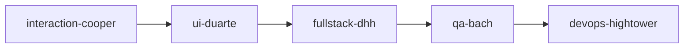
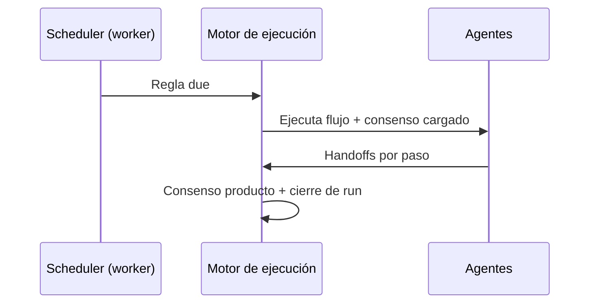

# Guía — Flujos y programaciones

Playbooks de agentes en cadena y reglas opcionales en timer.

---

## Tabla de contenidos

1. [Qué es un flujo](#qué-es-un-flujo)
2. [Crear y ejecutar](#crear-y-ejecutar)
3. [Programaciones (opcional)](#programaciones-opcional)
4. [Decisiones GO / NO-GO](#decisiones-go--no-go)

---

## Qué es un flujo

Un **flujo** = secuencia ordenada de agentes (pasos + conexiones). Ejemplo feature development:

Cada paso debe producir entregables y un **handoff JSON de consenso** (ver **Handoffs y flujo**).

Ruta: **Flujos** (`/office/workflows`). El editor usa un canvas visual (`WorkflowCanvas`) para ordenar nodos.

Los workflows de plataforma (evaluación de producto, launch, pricing…) se **copian al tenant** automáticamente la primera vez que los necesitas.

---

## Crear y ejecutar

1. **Nuevo flujo** → nombre y descripción.
2. Editor: añade nodos de agentes y conecta el orden.
3. **Guarda**.
4. **Ejecutar** desde el editor:
   - Opción «Cargar y sincronizar consensus del tenant» (next action como semilla)
   - Semilla de tarea manual opcional
   - Tras ejecutar → **Depuración → Ejecuciones** (`/debug/runs/:id`)

Desde la **Oficina**, el Coordinador puede elegir un flujo en encargos complejos o servicios rápidos (p. ej. `idea-validation` → `new-product-evaluation`).

> Los encargos aprobados desde la Oficina aparecen en **Mis encargos**; las ejecuciones manuales del editor aparecen en **Ejecuciones**.

---

## Programaciones (opcional)

Ruta: **Configuración → Programaciones** (`/settings?tab=schedules`) — panel **Plan de operaciones**.

El flujo principal sigue siendo la Oficina bajo demanda. Aquí defines reglas opcionales:

| Preset | Comportamiento |
|--------|----------------|
| **Bajo demanda** | Sin reglas — recomendado al empezar |
| **Solo discovery** | Discovery semanal (sábado 9:00) si pipeline vacío |
| **Exploración ligera** | Discovery + evaluación periódica + revisión semanal (sin meta-orchestrator) |
| **Regla personalizada** | Modo **Workflow fijo** o **Orquestador dinámico** (avanzado) |

Modos de regla:

- **Workflow fijo** — un flujo concreto + intervalo/cron + condiciones (pipeline vacío, producto en building, sin decisiones pendientes…).
- **Orquestador dinámico** — en cada tick el meta-orchestrator elige workflow según fase y portfolio (**modo avanzado**, no recomendado para empezar).

Revisa próximas ejecuciones, KPIs y motivos de skip en **Depuración → Operaciones** (`/ops`) — ver **[Operaciones](/help/guia-operaciones)**.

---

## Decisiones GO / NO-GO

Dos contextos distintos:

### Ciclos autónomos de compañía (meta-orchestrator / schedules)

Reglas inyectadas en prompts de ciclo:

- Ciclo 1 → campo `topIdeas` (3 títulos cortos)
- Ciclo 2 → `goNoGo`: `"GO"` o `"NO-GO"`
- Ciclo 3+ → artefactos tangibles obligatorios (no solo discusión)

Campos extra en memoria estructurada: `revenueUsd`, `productSlug`, …

### Evaluación de producto con humano en el loop

Workflow **`new-product-evaluation`**: tras el run, si Munger no vetó, se crea una **propuesta de decisión** (`DecisionProposal`) con recomendación GO/NO-GO.

Aprueba, rechaza o pivot en:

- **Depuración → Decisiones** (`/decisions`)
- Detalle del **encargo** (`/office/encargos/:runId`)

Hasta que apruebes, el producto no avanza a fase `building` automáticamente por este camino.

Los handoffs JSON por paso (`consensusUpdate`, `nextAction`) son **independientes** de estas decisiones de portfolio.
