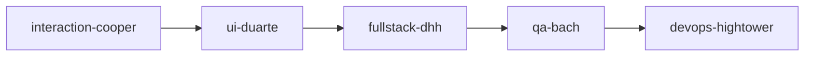
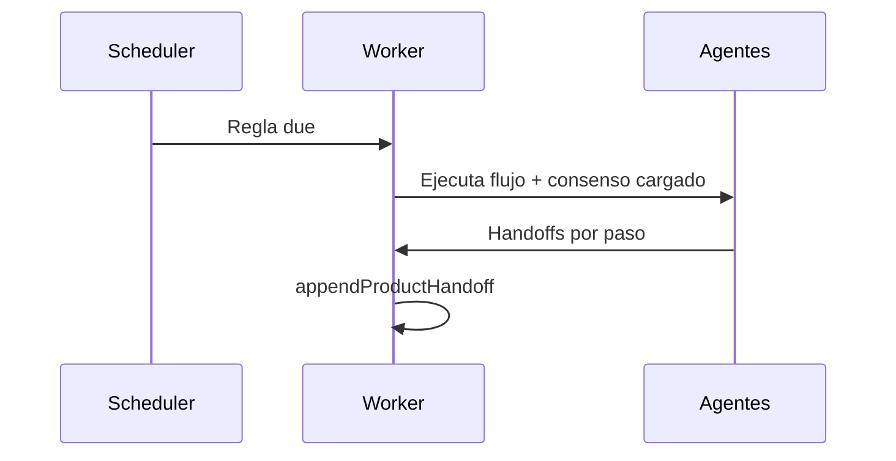

# Guía — Flujos y programaciones

Playbooks de agentes en cadena y reglas opcionales en timer.

---

## Tabla de contenidos

1. [Qué es un flujo](#qué-es-un-flujo)
2. [Crear y ejecutar](#crear-y-ejecutar)
3. [Programaciones (opcional)](#programaciones-opcional)
4. [Decisiones GO / NO-GO](#decisiones-go--no-go)

---

## Qué es un flujo

Un **flujo** = secuencia ordenada de agentes. Ejemplo feature development:

Cada paso produce entregables y un **handoff JSON** que alimenta el siguiente (ver artículo **Handoffs y flujo**).

Ruta: **Flujos** (`/office/workflows`).

---

## Crear y ejecutar

1. **Nuevo flujo** → nombre y descripción.
2. Editor visual: arrastra nodos de agentes y conecta orden.
3. **Guarda**.
4. Ejecuta con semilla de tarea desde el editor, o deja que el **Coordinador** lo elija en encargos complejos.

Los flujos de plataforma (evaluación de producto, launch, pricing…) se clonan al tenant como plantillas.

---

## Programaciones (opcional)

**Configuración** → **Programaciones** / **Operaciones**.

| Preset | Comportamiento |
|--------|----------------|
| **Bajo demanda** | Sin reglas — recomendado al empezar |
| **Solo discovery** | Ciclo ligero automático de ideas |
| **Regla fija** | Flujo + intervalo/cron + condiciones |

Domina primero encargos manuales desde la Oficina.

---

## Decisiones GO / NO-GO

En ciclos autónomos de compañía (no confundir con handoff por paso):

- Ciclo 1 → campo `topIdeas` (3 títulos)
- Ciclo 2 → `goNoGo`: `"GO"` o `"NO-GO"`
- Ciclo 3+ → artefactos tangibles obligatorios

Las propuestas que requieren humano aparecen en **Decisiones** (menú depuración).
