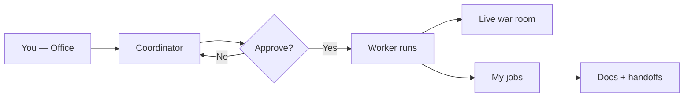

# Guide — Office and jobs

How to request work, approve runs, and collect results from the **Office**.

---

## Table of contents

1. [Overall flow](#overall-flow)
2. [Coordinator and scope](#coordinator-and-scope)
3. [My jobs](#my-jobs)
4. [War room](#war-room)
5. [Quick services](#quick-services)

---

## Overall flow

1. Describe what you need on **Home** (`/office`).
2. The **Coordinator** proposes team, deliverables, and estimates.
3. Click **Approve and run** — nothing executes without your OK.
4. Track progress in **War room** and collect output in **My jobs**.

> By default everything is **on demand**. Optional schedules are covered in the Workflows guide.

---

## Coordinator and scope

Before approving you can narrow context:

| Scope | When to use |
|-------|-------------|
| **General exploration** | New ideas without a specific product |
| **One product** | That product's memory, code, and consensus |
| **One department** | Department agents, `design.md`, and artifacts |

The Coordinator picks individual agents or a predefined **workflow** based on job complexity.

---

## My jobs

Route: **My jobs** (`/office/encargos`).

Each completed job includes:

- Executive summary of the run
- Per-agent reports (markdown)
- Deliverable status: saved to disk, handoff-only in memory, or missing

If a step did not write to `docs/{role}/`, check the product **Revisions** tab — parsed JSON handoffs live there.

---

## War room

Tactical view **while the team is working**:

- Status per agent and workflow step
- Active run selector (when several run in parallel)
- Partial output when available

Use it to spot blockers before the job finishes.

---

## Quick services

Ready-made templates in the Office (discovery, idea validation, feature sprint…). Edit the brief before launching. Same as a job with a preset task seed.
