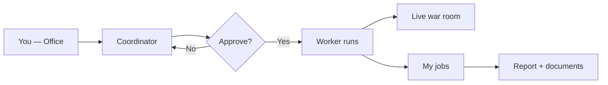

# Guide — Office and jobs

How to request work, approve runs, and collect results from the **Office**.

---

## Table of contents

1. [Overall flow](#overall-flow)
2. [Coordinator and scope](#coordinator-and-scope)
3. [My jobs](#my-jobs)
4. [War room](#war-room)
5. [Office archive](#office-archive)
6. [Quick services](#quick-services)

---

## Overall flow

1. Describe what you need on **Home** (`/office`).
2. Request a **team plan** (or the Coordinator proposes one when intent is clear).
3. Review scope, agents, cost, and deliverable on the proposal card.
4. Click **Approve and run** — nothing executes without your OK.
5. The app opens **War room** (with a product when applicable). Collect output in **My jobs**.

> By default everything is **on demand**. Optional schedules are covered in the Workflows guide.

---

## Coordinator and scope

### Main Office

On `/office` you can filter by **Department** (Org Unit). That loads `design.md`, dept agents, and artifact pipeline context — it does not replace picking a product.

| Control | Effect |
|---------|--------|
| **Department = any** | Default platform agents and workflows |
| **Specific department** | Org context (design.md, dept agents) and launch from the department room |

### Product scope

The **General exploration / product** selector appears in:

- **Department rooms** (`/org-units/:id`) — products linked to the dept.
- **War room** (`/war-room/:productId`) — chat always scoped to the product

On the Coordinator proposal, **Scope** shows the detected product or “General exploration”. Pass an explicit `productId` from War room or a department room.

The Coordinator picks individual agents, an **ad hoc team**, or a saved **workflow** based on the service and job complexity.

### Execution modes

| Mode | When |
|------|------|
| **single** | One agent |
| **team** | Several agents in a light sequence |
| **workflow** | Saved workflow (e.g. discovery, feature development) |

---

## My jobs

Route: **My jobs** (`/office/encargos`).

Lists jobs by phase: queued, in progress, delivered, failed, cancelled. Each detail page includes:

- Run summary and status
- Linked product (if any)
- Link to **War room** while in progress
- **Final report** and **Documents** tab (markdown per agent)
- Pending **GO/NO-GO** proposals (`new-product-evaluation` workflow) with approve / reject / pivot

To audit handoff quality (structured JSON, files on disk), use **War room → Deliverable health** or **Product consensus → last run** — not the jobs list.

If a step did not write to `docs/{role}/`, check **Product consensus → Revisions** — parsed JSON handoffs live there.

---

## War room

Route: **War room** (`/war-room` or `/war-room/:productId`).

Tactical view **while the team works** on a product:

- Status per agent and workflow step
- Active run selector (when several run in parallel)
- KPIs, OpenCode panel, Munger veto banner
- **Deliverable health** (last run diagnosis)
- Coordinator chat scoped to the product

After **Approve and run** from the Office, navigation lands here automatically when a product is in scope.

---

## Office archive

Route: **Archive** (`/office/archive`) — link in the Office header.

Indexed workspace deliverables: filter by department, product, agent, or source. Useful for finding reports without opening the repo.

---

## Quick services

Templates in the Office right panel:

| ID | Typical flow | Deliverable |
|----|--------------|-------------|
| market-scan | opportunity-discovery | Market report |
| idea-validation | new-product-evaluation | GO/NO-GO recommendation |
| feature-sprint | feature-development | Code + docs |
| *(others)* | Per template | See UI description |

Choosing a template seeds the chat. Edit the brief, request a plan, and approve. Some presets **require a registered product** — the UI will tell you if one is missing.
