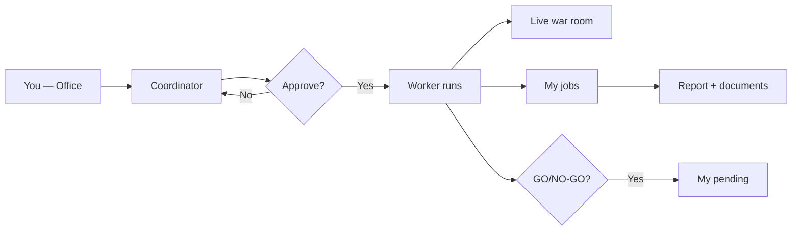
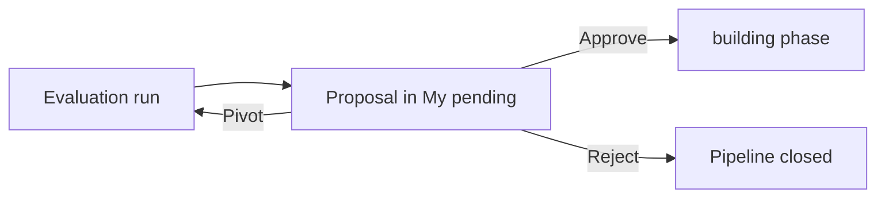

# Guide — Office and jobs

How to request work, approve runs, and collect results from the **Office**.

> **Daily pilot routine:** if you run the platform alongside another job, see [/help/guia-piloto](/help/guia-piloto).

---

## Table of contents

1. [Overall flow](#overall-flow)
2. [Home panel](#home-panel)
3. [Coordinator and scope](#coordinator-and-scope)
4. [My pending decisions](#my-pending-decisions)
5. [My jobs](#my-jobs)
6. [War room](#war-room)
7. [General war room](#general-war-room)
8. [OpenCode for operators](#opencode-for-operators)
9. [Office archive](#office-archive)
10. [Quick services](#quick-services)
11. [Frequently asked questions](#frequently-asked-questions)

---

## Overall flow

1. Describe what you need on **Home** (`/office`).
2. Request a **team plan** (or the Coordinator proposes one when intent is clear).
3. Review scope, agents, cost, and deliverable on the proposal card.
4. Click **Approve and run** — nothing runs without your OK.
5. The app opens **War room** (with product when applicable). Collect results in **My jobs**.
6. If the flow creates a GO/NO-GO proposal, resolve it in **My pending**.

> By default everything is **on demand**. Automatic schedules are optional (see the Workflows guide).

---

## Home panel

**Home** (`/office`) is your daily tenant pulse.

### Onboarding

On first visits with no agents or activity, a three-step panel appears:

| Step | Suggested action |
|------|------------------|
| Team | Hire at least one agent at `/settings/specialists` |
| Department | Create an Org Unit at `/org-studio` |
| First job | Write in the Coordinator chat |

You can **Dismiss** the panel — preference is stored in your browser.

### KPI strip

Five cards link to key views:

| KPI | Link | Meaning |
|-----|------|---------|
| **Monthly spend** | Limits (`/settings?tab=limits`) | Accumulated cost vs monthly cap |
| **Active jobs** | My jobs | Runs in progress (includes delegated OpenCode) |
| **Pending** | My pending | Unreviewed GO/NO-GO decisions |
| **Agents** | Specialist templates | Total hired; busy count delta |
| **Portfolio ROI** | Active products | (Revenue − investment) / investment when data exists |

The header **mode** shows **On demand**, **Scheduled tasks**, or **Autonomous mode** (legacy Meta rule).

When pending decisions exist, the header shows a highlighted **My pending (N)** button.

### Activity feed

Left sidebar with recent events: active/completed jobs, pending decisions, cost per event. Each row links to the relevant destination.

Auto-refreshes while jobs are active (~every 8 s).

### Notifications

**Bell** in the top bar (with active tenant):

- In-app notification list (completed, failed, client delivery opened…).
- Mark read individually or all.
- With browser permission, native alerts too.

Configure webhooks, Slack, and email under **Settings → Notifications** (`/settings?tab=notifications`). **In-app notifications** must be enabled for the bell.

---

## Coordinator and scope

### Main Office

At `/office` you can filter by **department**. That loads `design.md` context, dept. agents, and artifact pipeline — it does not replace choosing a product.

| Control | Effect |
|---------|--------|
| **Department = any** | Default platform agents and flows |
| **Specific department** | Org context (design.md, dept. agents) and launch from the department room |

### Product scope

The **General exploration / product** selector appears in:

- **Department rooms** (`/org-units/:id`) — products linked to the dept.
- **War room** (`/war-room/:productId`) — chat always scoped to the product

On the Coordinator proposal, **Scope** shows the detected product or “General exploration”. You can pass explicit `productId` from War room or a department room.

The Coordinator picks standalone agents, an **ad hoc team**, or a saved **workflow** depending on service and complexity.

### Execution modes

| Mode | When |
|------|------|
| **single** | One agent |
| **team** | Several agents in a light sequence |
| **workflow** | Saved flow (e.g. discovery, feature development) |

---

## My pending decisions

Route: **My pending** (`/office/pendientes`) — main **Office** nav entry with a numeric **badge** when proposals need review. Legacy `/decisions` redirects here.

Operational inbox for **GO / NO-GO / pivot** after workflows like `new-product-evaluation`.

### Tabs

| Tab | Content |
|-----|---------|
| **Pending** | `pending_review` and `drilling` — need your action |
| **Approved** | Confirmed GO history |
| **Rejected** | NO-GO and cancelled |

URL: `/office/pendientes?tab=approved` or `?tab=rejected`.

### Per proposal

- Idea title, status, date, and link to source **job**
- **Rationale** — AI team argument
- **Evidence** — attached documents and excerpts
- Actions: **Approve**, **Reject**, **Pivot** (free text to relaunch evaluation)

> Advanced aggregated view: **Debug office → Decisions** (`/debug/decisions`) — not the daily inbox.

---

## My jobs

Route: **My jobs** (`/office/encargos`).

Lists jobs by phase: queued, in progress, delivered, failed, cancelled. Each card includes:

- Summary and run status
- Linked product (if any)
- **War room** link while in progress (`?run=` to focus a specific run)
- **Final report** and **Documents** tab (markdown per agent)
- **Client delivery** when delivered (see [Pilot flow](/help/guia-piloto#client-delivery))

For handoff quality (structured JSON, files on disk), use **War room → Deliverable health** or **Product consensus → last run** — not the job list.

If a step left no file under `docs/{role}/`, check **Product consensus → Revisions** for parsed JSON handoffs.

---

## War room

Route: **War room** (`/war-room` or `/war-room/:productId`).

Tactical view **while the team works**:

- Status per agent and workflow step
- Active run selector — keeps `?run=<runId>` when switching products
- KPIs, OpenCode panel, Munger veto banner
- **Deliverable health** (last run diagnostics)
- Coordinator chat scoped to the product (product view)

After **Approve and run** from the Office, navigation lands here automatically when a product is in scope.

---

## General war room

Route: **War room** without product (`/war-room`) — **portfolio** mode.

| Element | What it shows |
|---------|---------------|
| Top selector | “General” vs each active product |
| KPIs | Agents on duty, jobs in progress, pending decisions |
| Job table | Up to 12 active jobs with detail links |
| Side Coordinator | Company-scoped chat (not a single product) |

**`?run=<runId>`** highlights the selected job and keeps context when switching between General and a product.

Useful when managing several products from one control desk before diving into a product war room.

---

## OpenCode for operators

When OpenCode is enabled (`/settings?tab=opencode` or per-product settings), a job may pause in special states:

| Status (UI) | Meaning | Action |
|-------------|---------|--------|
| **Awaiting decision** (`AWAITING_USER`) | Run needs human confirmation before delegating or continuing | War room, My jobs, or job detail → OpenCode panel |
| **Delegated to OpenCode** (`DELEGATED`) | External session is running code | Wait or **Cancel delegation** to abort |

### Confirmation gate

When an agent proposes OpenCode delegation:

- Pending brief preview
- Fields: agent, model, project path (suggested from product)
- **Delegate to OpenCode** — continues externally
- **Continue locally** — proceed without OpenCode
- **Cancel job**

### During delegation

Panel with session ID and status. War room polls more often (~8 s). Cancel delegation if stuck.

> Technical setup: [Tenant settings](/help/guia-configuracion). Product code: `/products/:id/code`.

---

## Office archive

Route: **Archive** (`/office/archive`) — link in the Office header.

Indexed workspace deliverables: filter by department, product, agent, or source. Recover reports without opening the repo.

---

## Quick services

Templates in the Office right panel (internal IDs → workflow):

| ID | Workflow | Typical deliverable |
|----|----------|---------------------|
| `market-scan` | `opportunity-discovery` | Market report |
| `idea-validation` | `new-product-evaluation` | GO/NO-GO recommendation |
| `feature-sprint` | `feature-development` | Feature + docs |
| `product-launch` | `product-launch` | Launch package |
| `pricing-review` | `pricing-and-monetization` | Pricing model |
| `marketing-sprint` | `marketing-sprint` | Marketing plan |
| `weekly-review` | `weekly-review` | Ops report |
| `seo-audit` | `seo-review` | SEO report |
| `repo-analysis` | Ad hoc team (no preset) | Repo report |

Choosing a template preloads the chat. Edit the brief, **Plan team**, then **Approve and run**. Some presets **require a registered product** — the UI warns if missing.

> Procedures and schedules detail: [/help/guia-flujos](/help/guia-flujos).

---

## Frequently asked questions

### Are My jobs and editor runs the same?

Not exactly. Jobs approved from the Office live in **My jobs** (`/office/encargos`). Runs started only from the flow editor appear under **Runs** (`/debug/runs`).

### My pending vs Debug Decisions?

| View | Route | Use |
|------|------|-----|
| **My pending** | `/office/pendientes` | Daily inbox — approve, reject, pivot |
| **Decisions (debug)** | `/debug/decisions` | Advanced / KPI view — not the inbox |

### What does the Office mode pill mean?

| Mode (UI) | Meaning |
|-----------|---------|
| On demand | No active rules — everything needs your approval |
| Scheduled tasks | Active fixed rules (timers) |
| Autonomous mode | At least one legacy Meta rule — check Operations |

### Where do I audit JSON handoffs?

**War room → Deliverable health** or product consensus → **Revisions**. See [Handoffs and flow](/help/guia-equipo-ia#handoffs-and-flow).

### Virtual rooms vs Org Units?

| Type | Route | What it is |
|------|------|------------|
| Virtual rooms | `/office/departments/:slug` | Strategy, Engineering… — platform agents, no own `design.md` |
| Org Units | `/org-units/:id` | Real departments with brand and gallery — see [Departments](/help/guia-departamentos) |
