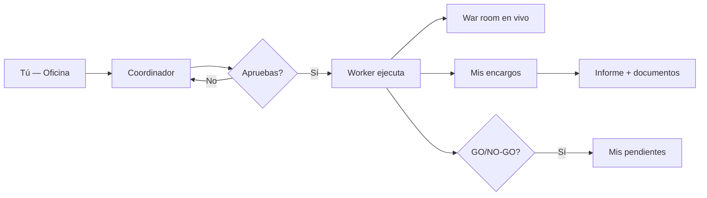
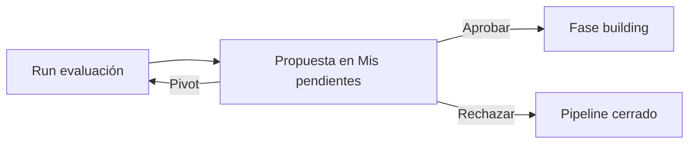

# Guía — Oficina y encargos

Cómo pedir trabajo, aprobar ejecuciones y recoger resultados desde la **Oficina**.

> **Rutina diaria (piloto):** si operas la plataforma con otro empleo en paralelo, usa la guía [/help/guia-piloto](/help/guia-piloto).

---

## Tabla de contenidos

1. [Flujo general](#flujo-general)
2. [Panel de inicio](#panel-de-inicio)
3. [Coordinador y alcance](#coordinador-y-alcance)
4. [Mis pendientes](#mis-pendientes)
5. [Mis encargos](#mis-encargos)
6. [War room](#war-room)
7. [War room general](#war-room-general)
8. [OpenCode para el operador](#opencode-operador)
9. [Archivo de la Oficina](#archivo-de-la-oficina)
10. [Servicios rápidos](#servicios-rápidos)
11. [Preguntas frecuentes](#preguntas-frecuentes)

---

## Flujo general

1. Escribes qué necesitas en **Inicio** (`/office`).
2. Pides **plan de equipo** (o el Coordinador lo propone al detectar intención clara).
3. Revisas alcance, agentes, coste y entregable en la tarjeta de propuesta.
4. Pulsas **Aprobar y ejecutar** — nada corre sin tu OK.
5. La app abre **War room** (con producto si aplica). Recoges el resultado en **Mis encargos**.
6. Si el flujo genera una propuesta GO/NO-GO, resuélvela en **Mis pendientes**.

> Por defecto todo es **bajo demanda**. Las programaciones automáticas son opcionales (ver guía de Flujos).

---

## Panel de inicio

La página **Inicio** (`/office`) concentra el pulso diario del tenant.

### Onboarding

Si es tu primera visita y aún no tienes agentes o actividad, aparece un panel con tres pasos:

| Paso | Acción sugerida |
|------|-----------------|
| Equipo | Contratar al menos un agente en `/settings/specialists` |
| Departamento | Crear un Org Unit en `/org-studio` |
| Primer encargo | Escribir en el chat del Coordinador |

Puedes **Ocultar** el panel — la preferencia se guarda en tu navegador.

### Franja KPI

Cinco tarjetas enlazan a las vistas clave:

| KPI | Enlace | Significado |
|-----|--------|-------------|
| **Gasto del mes** | Límites (`/settings?tab=limits`) | Coste acumulado vs tope mensual |
| **Encargos activos** | Mis encargos | Runs en curso (incluye OpenCode delegado) |
| **Pendientes** | Mis pendientes | Decisiones GO/NO-GO sin revisar |
| **Agentes** | Plantilla de especialistas | Total contratados; delta de ocupados |
| **ROI portfolio** | Productos activos | (Ingresos − inversión) / inversión cuando hay datos |

El **modo** en la cabecera indica **Bajo demanda**, **Tareas programadas** o **Modo autónomo** (regla Meta legacy).

Si hay pendientes, la cabecera muestra un botón destacado **Mis pendientes (N)**.

### Feed de actividad

Panel lateral izquierdo con los últimos eventos: encargos activos/completados, decisiones pendientes, coste por evento. Cada fila enlaza al destino relevante (encargo, pendientes, etc.).

Se actualiza automáticamente mientras haya encargos activos (cada ~8 s).

### Notificaciones

**Campana** en la barra superior (visible con tenant activo):

- Lista notificaciones in-app (completados, fallos, apertura de entrega al cliente…).
- Marca leídas individualmente o todas.
- Si activas permiso del navegador, también recibes alertas nativas.

Configura webhooks, Slack y email en **Configuración → Notificaciones** (`/settings?tab=notifications`). La opción **Notificaciones in-app** debe estar activa para la campana.

---

## Coordinador y alcance

### Oficina principal

En `/office` puedes filtrar por **departamento**. Eso carga contexto de `design.md`, agentes del dept. y pipeline de artefactos — no sustituye elegir un producto.

| Control | Efecto |
|---------|--------|
| **Departamento = cualquiera** | Agentes y flujos de la plataforma por defecto |
| **Departamento concreto** | Contexto Org (design.md, agentes del dept.) y lanzamiento desde la sala del departamento |

### Alcance de producto

El selector **Exploración general / producto** aparece en:

- **Salas de departamento** (`/org-units/:id`) — productos vinculados al dept.
- **War room** (`/war-room/:productId`) — chat siempre contextualizado al producto

En la propuesta del Coordinador, el campo **Alcance** muestra el producto detectado o «Exploración general». Puedes pasar `productId` explícito desde War room o una sala de departamento.

El Coordinador elige agentes sueltos, un **equipo ad hoc** o un **flujo** predefinido según el servicio y la complejidad del encargo.

### Modos de ejecución

| Modo | Cuándo |
|------|--------|
| **single** | Un solo agente |
| **team** | Varios agentes en secuencia ligera |
| **workflow** | Flujo guardado (p. ej. discovery, feature development) |

---

## Mis pendientes

Ruta: **Mis pendientes** (`/office/pendientes`) — entrada principal en el menú **Oficina**, con **badge** numérico cuando hay propuestas sin revisar. La ruta legacy `/decisions` redirige aquí.

Inbox operativo para decisiones **GO / NO-GO / pivot** tras workflows como `new-product-evaluation`.

### Pestañas

| Pestaña | Contenido |
|---------|-----------|
| **Pendientes** | `pending_review` y `drilling` — requieren tu acción |
| **Aprobadas** | Historial de GO confirmados |
| **Rechazadas** | NO-GO y canceladas |

URL: `/office/pendientes?tab=approved` o `?tab=rejected`.

### Por cada propuesta

- Título de la idea, estado, fecha y enlace al **encargo** origen
- **Rationale** — argumento del equipo IA
- **Evidencia** — documentos y extractos adjuntos (`DecisionEvidencePanel`)
- Acciones: **Aprobar**, **Rechazar**, **Pivot** (texto libre que relanza evaluación con nuevo criterio)

> Vista avanzada con KPIs agregados: **Oficina de depuración → Decisiones** (`/debug/decisions`) — no es el inbox diario.

---

## Mis encargos

Ruta: **Mis encargos** (`/office/encargos`).

Lista encargos con fases: en cola, en progreso, entregado, fallido, cancelado. Cada ficha incluye:

- Resumen y estado del run
- Producto vinculado (si aplica)
- Enlace a **War room** si sigue en curso (`?run=` para enfocar un run concreto)
- **Informe final** y pestaña **Documentos** (markdown por agente)
- **Entrega al cliente** cuando el encargo está entregado (ver [Flujo piloto](/help/guia-piloto#entrega-al-cliente))

Para auditar calidad de handoffs (JSON estructurado, archivos en disco), usa **War room → Salud de entregables** o **Consenso del producto → último run** — no la lista de encargos.

Si un paso no dejó archivo en `docs/{rol}/`, revisa **Consenso del producto → Revisiones** — ahí quedan los handoffs JSON parseados.

---

## War room

Ruta: **War room** (`/war-room` o `/war-room/:productId`).

Vista táctica **mientras el equipo trabaja**:

- Estado por agente y paso del flujo
- Selector de run activo — conserva `?run=<runId>` al cambiar de producto
- KPIs, panel OpenCode, banner de veto Munger
- **Salud de entregables** (diagnóstico del último run)
- Chat del Coordinador contextualizado al producto (en vista por producto)

Tras **Aprobar y ejecutar** desde la Oficina, la navegación te lleva aquí automáticamente cuando hay producto en scope.

---

## War room general

Ruta: **War room** sin producto (`/war-room`) — modo **portfolio**.

| Elemento | Qué muestra |
|----------|-------------|
| Selector superior | «General» vs cada producto activo |
| KPIs | Agentes de servicio, encargos en progreso, pendientes |
| Tabla de encargos | Hasta 12 encargos activos con enlace a detalle |
| Coordinador lateral | Chat con alcance de compañía (no un solo producto) |

Parámetro **`?run=<runId>`** resalta el encargo seleccionado y mantiene el contexto al cambiar entre General y un producto.

Útil cuando gestionas varios productos y quieres una mesa de control única antes de entrar al war room de uno concreto.

---

## OpenCode para el operador

Cuando OpenCode está habilitado (`/settings?tab=opencode` o configuración por producto), un encargo puede pausarse en estados especiales:

| Estado (UI) | Significado | Qué hacer |
|-------------|-------------|-----------|
| **Esperando decisión** (`AWAITING_USER`) | El run pide confirmación humana antes de delegar o continuar | War room, Mis encargos o detalle del encargo → panel OpenCode |
| **Delegado a OpenCode** (`DELEGATED`) | La sesión externa está ejecutando código | Espera o **Cancelar delegación** si necesitas abortar |

### Gate de confirmación

Si el agente propone delegar a OpenCode, verás:

- Vista previa del brief pendiente
- Campos: agente, modelo, ruta del proyecto (sugerida desde el producto)
- **Delegar a OpenCode** — continúa en instancia externa
- **Continuar en local** — sigue sin OpenCode
- **Cancelar encargo**

### Durante delegación

Panel con ID de sesión y estado. El war room hace polling más frecuente (~8 s). Puedes cancelar la delegación si el proceso se atasca.

> Configuración técnica: [Configuración del tenant](/help/guia-configuracion). Código del producto: `/products/:id/code`.

---

## Archivo de la Oficina

Ruta: **Archivo** (`/office/archive`) — enlace en la cabecera de la Oficina.

Índice de entregables del workspace: filtra por departamento, producto, agente o fuente. Útil para recuperar informes sin abrir el repo.

---

## Servicios rápidos

Plantillas en el panel derecho de la Oficina (IDs internos → workflow):

| ID | Workflow | Entregable típico |
|----|----------|-------------------|
| `market-scan` | `opportunity-discovery` | Informe de mercado |
| `idea-validation` | `new-product-evaluation` | Recomendación GO/NO-GO |
| `feature-sprint` | `feature-development` | Feature + docs |
| `product-launch` | `product-launch` | Paquete de lanzamiento |
| `pricing-review` | `pricing-and-monetization` | Modelo de precios |
| `marketing-sprint` | `marketing-sprint` | Plan de marketing |
| `weekly-review` | `weekly-review` | Informe operativo |
| `seo-audit` | `seo-review` | Informe SEO |
| `repo-analysis` | Equipo ad hoc (sin preset) | Informe de repo |

Al elegir una plantilla se precarga el chat. Edita el brief, pulsa **Planificar equipo** y **Aprobar y ejecutar**. Algunos presets **requieren producto** registrado — la UI te avisará si falta.

> Detalle de flujos y programaciones: [/help/guia-flujos](/help/guia-flujos).

---

## Preguntas frecuentes

### ¿Mis encargos y las ejecuciones del editor son lo mismo?

No del todo. Encargos aprobados desde la Oficina viven en **Mis encargos** (`/office/encargos`). Runs lanzados solo desde el editor de flujos aparecen en **Ejecuciones** (`/debug/runs`).

### ¿Mis pendientes o Decisiones en depuración?

| Vista | Ruta | Uso |
|-------|------|-----|
| **Mis pendientes** | `/office/pendientes` | Inbox diario — aprobar, rechazar, pivot |
| **Decisiones (debug)** | `/debug/decisions` | Vista avanzada / KPIs — no sustituye el inbox |

### ¿Qué significa el modo en la cabecera de la Oficina?

| Modo (UI) | Significado |
|-----------|-------------|
| Bajo demanda | Sin reglas activas — todo requiere tu aprobación |
| Tareas programadas | Hay reglas fixed activas (timers) |
| Modo autónomo | Queda al menos una regla Meta **legacy** — revisa en Operaciones |

### ¿Dónde audito handoffs JSON?

**War room → Salud de entregables** o consenso del producto → **Revisiones**. Ver [Handoffs y flujo](/help/guia-equipo-ia#handoffs-y-flujo).

### ¿Salas virtuales vs Org Units?

| Tipo | Ruta | Qué es |
|------|------|--------|
| Salas virtuales | `/office/departments/:slug` | Strategy, Engineering… — agentes de plataforma, sin `design.md` propio |
| Org Units | `/org-units/:id` | Departamentos reales con marca y galería — ver [Departamentos](/help/guia-departamentos) |
