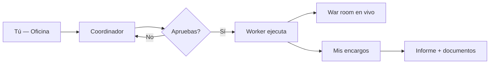

# Guía — Oficina y encargos

Cómo pedir trabajo, aprobar ejecuciones y recoger resultados desde la **Oficina**.

---

## Tabla de contenidos

1. [Flujo general](#flujo-general)
2. [Coordinador y alcance](#coordinador-y-alcance)
3. [Mis encargos](#mis-encargos)
4. [War room](#war-room)
5. [Archivo de la Oficina](#archivo-de-la-oficina)
6. [Servicios rápidos](#servicios-rápidos)
7. [Preguntas frecuentes](#preguntas-frecuentes)

---

## Flujo general

1. Escribes qué necesitas en **Inicio** (`/office`).
2. Pides **plan de equipo** (o el Coordinador lo propone al detectar intención clara).
3. Revisas alcance, agentes, coste y entregable en la tarjeta de propuesta.
4. Pulsas **Aprobar y ejecutar** — nada corre sin tu OK.
5. La app abre **War room** (con producto si aplica). Recoges el resultado en **Mis encargos**.

> Por defecto todo es **bajo demanda**. Las programaciones automáticas son opcionales (ver guía de Flujos).

---

## Coordinador y alcance

### Oficina principal

En `/office` puedes filtrar por **Departamento** (Org Unit). Eso carga contexto de `design.md`, agentes del dept. y pipeline de artefactos — no sustituye elegir un producto.

| Control | Efecto |
|---------|--------|
| **Departamento = cualquiera** | Agentes y flujos de la plataforma por defecto |
| **Departamento concreto** | Contexto Org (design.md, agentes del dept.) y lanzamiento desde la sala del departamento |

### Alcance de producto

El selector **Exploración general / producto** aparece en:

- **Salas de departamento** (`/org-units/:id`) — productos vinculados al dept.
- **War room** (`/war-room/:productId`) — chat siempre contextualizado al producto

En la propuesta del Coordinador, el campo **Alcance** muestra el producto detectado o «Exploración general». Puedes pasar `productId` explícito desde War room o una sala de departamento.

El Coordinador elige agentes sueltos, un **equipo ad hoc** o un **flujo** predefinido según el servicio y la complejidad del encargo.

### Modos de ejecución

| Modo | Cuándo |
|------|--------|
| **single** | Un solo agente |
| **team** | Varios agentes en secuencia ligera |
| **workflow** | Flujo guardado (p. ej. discovery, feature development) |

---

## Mis encargos

Ruta: **Mis encargos** (`/office/encargos`).

Lista encargos con fases: en cola, en progreso, entregado, fallido, cancelado. Cada ficha incluye:

- Resumen y estado del run
- Producto vinculado (si aplica)
- Enlace a **War room** si sigue en curso
- **Informe final** y pestaña **Documentos** (markdown por agente)
- Propuestas **GO/NO-GO** pendientes (workflow `new-product-evaluation`) con aprobar / rechazar / pivot

Para auditar calidad de handoffs (JSON estructurado, archivos en disco), usa **War room → Salud de entregables** o **Consenso del producto → último run** — no la lista de encargos.

Si un paso no dejó archivo en `docs/{rol}/`, revisa **Consenso del producto → Revisiones** — ahí quedan los handoffs JSON parseados.

---

## War room

Ruta: **War room** (`/war-room` o `/war-room/:productId`).

Vista táctica **mientras el equipo trabaja** sobre un producto:

- Estado por agente y paso del flujo
- Selector de run activo (si hay varios en paralelo)
- KPIs, panel OpenCode, banner de veto Munger
- **Salud de entregables** (diagnóstico del último run)
- Chat del Coordinador contextualizado al producto

Tras **Aprobar y ejecutar** desde la Oficina, la navegación te lleva aquí automáticamente cuando hay producto en scope.

---

## Archivo de la Oficina

Ruta: **Archivo** (`/office/archive`) — enlace en la cabecera de la Oficina.

Índice de entregables del workspace: filtra por departamento, producto, agente o fuente. Útil para recuperar informes sin abrir el repo.

---

## Servicios rápidos

Plantillas en el panel derecho de la Oficina (IDs internos → workflow):

| ID | Workflow | Entregable típico |
|----|----------|-------------------|
| `market-scan` | `opportunity-discovery` | Informe de mercado |
| `idea-validation` | `new-product-evaluation` | Recomendación GO/NO-GO |
| `feature-sprint` | `feature-development` | Feature + docs |
| `product-launch` | `product-launch` | Paquete de lanzamiento |
| `pricing-review` | `pricing-and-monetization` | Modelo de precios |
| `marketing-sprint` | `marketing-sprint` | Plan de marketing |
| `weekly-review` | `weekly-review` | Informe operativo |
| `seo-audit` | `seo-review` | Informe SEO |
| `repo-analysis` | Equipo ad hoc (sin preset) | Informe de repo |

Al elegir una plantilla se precarga el chat. Edita el brief, pulsa **Planificar equipo** y **Aprobar y ejecutar**. Algunos presets **requieren producto** registrado — la UI te avisará si falta.

> Detalle de flujos y programaciones: [/help/guia-flujos](/help/guia-flujos).

---

## Preguntas frecuentes

### ¿Mis encargos y las ejecuciones del editor son lo mismo?

No del todo. Encargos aprobados desde la Oficina viven en **Mis encargos** (`/office/encargos`). Runs lanzados solo desde el editor de flujos aparecen en **Ejecuciones** (`/debug/runs`).

### ¿Qué significa el modo en la cabecera de la Oficina?

| Modo (UI) | Significado |
|-----------|-------------|
| Bajo demanda | Sin reglas activas — todo requiere tu aprobación |
| Tareas programadas | Hay reglas fixed activas (timers) |
| Modo autónomo | Queda al menos una regla Meta **legacy** — revisa en Operaciones |

### ¿Dónde audito handoffs JSON?

**War room → Salud de entregables** o consenso del producto → **Revisiones**. Ver [Handoffs y flujo](/help/guia-equipo-ia#handoffs-y-flujo).
