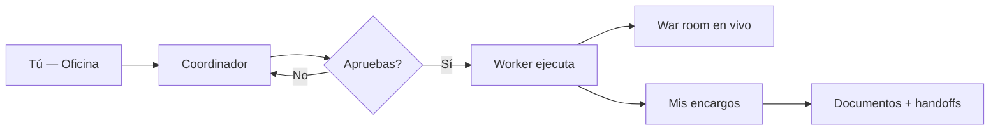

# Guía — Oficina y encargos

Cómo pedir trabajo, aprobar ejecuciones y recoger resultados desde la **Oficina**.

---

## Tabla de contenidos

1. [Flujo general](#flujo-general)
2. [Coordinador y alcance](#coordinador-y-alcance)
3. [Mis encargos](#mis-encargos)
4. [War room](#war-room)
5. [Servicios rápidos](#servicios-rápidos)

---

## Flujo general

1. Escribes qué necesitas en **Inicio** (`/office`).
2. El **Coordinador** propone equipo, entregables y estimación.
3. Pulsas **Aprobar y ejecutar** — nada corre sin tu OK.
4. Sigues el progreso en **War room** y recoges el resultado en **Mis encargos**.

> Por defecto todo es **bajo demanda**. Las programaciones automáticas son opcionales (ver guía de Flujos).

---

## Coordinador y alcance

Antes de aprobar puedes acotar el contexto:

| Alcance | Cuándo usarlo |
|---------|----------------|
| **Exploración general** | Ideas nuevas sin producto concreto |
| **Un producto** | Memoria, código y consenso de ese producto |
| **Un departamento** | Agentes, `design.md` y artefactos del dept. |

El Coordinador elige agentes sueltos o un **flujo** predefinido según la complejidad del encargo.

---

## Mis encargos

Ruta: **Mis encargos** (`/office/encargos`).

Cada encargo terminado incluye:

- Resumen ejecutivo del run
- Informes por agente (markdown)
- Estado de entregables: guardados en disco, solo handoff en memoria, o faltantes

Si un paso no dejó documento en `docs/{rol}/`, revisa la pestaña **Revisiones** del consenso del producto — ahí quedan los handoffs JSON parseados.

---

## War room

Vista táctica **mientras el equipo trabaja**:

- Estado por agente y paso del flujo
- Selector de run activo (si hay varios en paralelo)
- Salida parcial cuando está disponible

Úsala para detectar bloqueos antes de que termine el encargo.

---

## Servicios rápidos

Plantillas listas en la Oficina (discovery, validación de idea, sprint de feature…). Puedes editar el brief antes de lanzar. Equivalente a un encargo con semilla de tarea predefinida.
