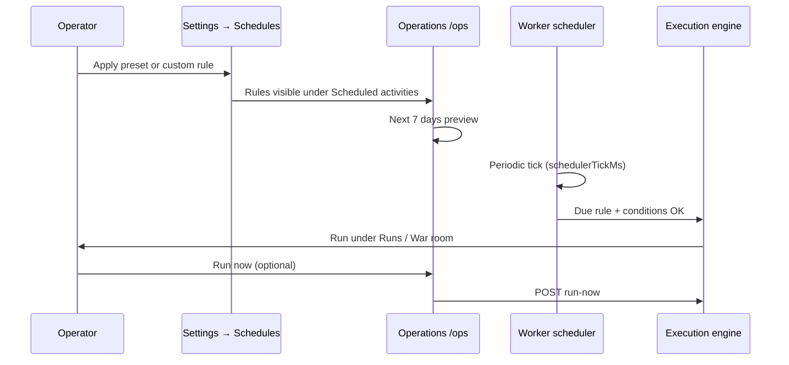

# Guide — Operations

Control panel for company KPIs, optional schedules, and a preview of automatic runs.

---

## Table of contents

1. [What Operations is](#what-operations-is)
2. [When to use it](#when-to-use-it)
3. [How to get there](#how-to-get-there)
4. [Panel sections](#panel-sections)
5. [Scheduled activities](#scheduled-activities)
6. [Preview — next 7 days](#preview--next-7-days)
7. [Skip reasons](#skip-reasons)
8. [Relationship to Settings → Schedules](#relationship-to-settings--schedules)
9. [Relationship to the worker and execution engine](#relationship-to-the-worker-and-execution-engine)
10. [Meta-orchestrator and next step](#meta-orchestrator-and-next-step)
11. [FAQ and troubleshooting](#faq-and-troubleshooting)

---

## What Operations is

**Operations** (`/ops`) is where you see tenant-wide status: company cycle, products, total revenue, pending decisions, and — if enabled — **automatic schedule rules**.

It does **not** replace the **Office**. The Office remains the primary **on-demand** flow: you request work, review the plan, and click **Approve and run**. Operations adds:

- A **phase map** (Discover → Evaluate → Build → Grow).
- **KPIs** summarizing the portfolio.
- Quick **schedule** management (pause, change frequency, run now).
- A **7-day projection** of rule firings, including whether each will run or be skipped.

```mermaid
flowchart TB
  subgraph demand [Primary flow — on demand]
    O[Office] --> A[Approve job]
    A --> R[Execution]
  end
  subgraph ops [Operations — optional]
    S[Active schedules]
    S --> W[Worker evaluates due rules]
    W --> R
  end
  O -.->|KPIs and preview| OPS[/ops panel]
  S -.->|advanced presets| CFG[Settings → Schedules]
```

For workflow playbooks and schedule presets, see **[Workflows and schedules](/help/guia-flujos)**. This guide focuses on the Operations panel and its tie-in to the scheduler.

---

## When to use it

| Situation | What to do in Operations |
|-----------|--------------------------|
| See company **phase** and the next workflow the system would pick | Check the phase banner and four-step stepper |
| **Schedules** are on and you want to pause, change interval, or fire one now | **Scheduled activities** panel |
| Wonder if weekly discovery **will fire** or be skipped this Saturday | **Next 7 days** panel |
| **GO/NO-GO decisions** are pending and autopilot is paused | Alert banner → **Review decisions** |
| A **run is already active** and nothing else starts automatically | “Meta cycle paused” banner → view runs |
| Pure on-demand mode (no timers) | KPIs + link to Office; schedules section empty (expected) |

---

## How to get there

| Route | Notes |
|-------|-------|
| **Debug office → Operations** | Sidebar entry (also `/debug/ops`) |
| `/ops` | Direct alias; **tenant login** redirects here after sign-in |
| Links from **Products** or **Settings → Schedules** | Contextual shortcuts |

> Operations is a **tenant operator** view. No CLI required; the background worker is handled by your deployed platform.

---

## Panel sections

### Header and primary action

- **Run scheduled rule** — shown when at least one rule is **enabled**. Fires the **highest-priority** rule (`POST /schedules/:id/run-now`). Product-scoped runs open **War room**; others open **Runs**.
- **Go to Office** — when no active schedules (on-demand mode).

The run button is **disabled** when the meta cycle is blocked (pending decisions or an active run).

### KPIs (top strip)

| KPI | Meaning |
|-----|---------|
| **Cycle** | Tenant cycle number and, when applicable, the **next workflow** the meta-orchestrator would pick |
| **Products** | Product count; split of active build/launch vs pipeline opportunities |
| **Total revenue** | Sum of all products’ `revenueUsd` |
| **Pending decisions** | GO/NO-GO proposals in `pending_review` or `drilling` |

### Alerts

- **Meta cycle paused** — blocks scheduled launch: active run or pending human decisions. Links to **Decisions** or **Runs** by block code.
- **Pending decisions** — standalone reminder with link to `/decisions`.
- **Products and opportunities** — shortcut to **Products** when pipeline or products exist.

### Phase banner and stepper

Shows **company phase** (`exploring`, `validating`, `building`, `growing`; `launching` is grouped with building in the stepper) and the workflow planned for the next automatic cycle.

The **stepper** shows four stages:

1. **Discover** — agents propose ideas → they appear under Products.
2. **Evaluate** — you approve → evaluation workflow (GO/NO-GO).
3. **Build** — on GO, code lands in `projects/{slug}/`.
4. **Grow** — launch, pricing, and revenue.

Below you may see:

- **Next meta step** — meta-orchestrator explanation (`reason` from `/ops/next-run`).
- **Next action** — tenant consensus `nextAction`, if set.
- Link to **focused product** → that product’s War room.

### Scheduled activities

See dedicated section below.

### Next 7 days

See dedicated section below.

### Recent runs

Up to **5** recent runs with status and timestamp. Link to **Runs** for full history.

### Automatic scheduling (optional)

Informational footer: Office is on-demand; three steps to enable presets in Settings.

---

## Scheduled activities

Lists tenant `AutonomousSchedule` rules, sorted by **priority** (higher number wins ties).

For each rule you see:

| Field | Description |
|-------|-------------|
| **Name** | Label from preset or custom rule |
| **Status** | Active (running) or paused |
| **Meta** | **Legacy** badge when `orchestrationMode === meta_dynamic`: the meta-orchestrator picked the workflow each tick. **New Meta rules cannot be created** (API deprecated); current presets use **fixed workflow** only |
| **Fixed workflow** | Linked flow name when mode is `fixed` |
| **Every** | Cron (e.g. Saturday 9:00) or interval (15 min – 24 h in UI presets) |
| **Priority** | Tie-break when several rules are due |
| **Next / Last** | Timestamps using the tenant schedule timezone |

**Per-rule actions:**

| Action | Effect |
|--------|--------|
| **Run now** | Enqueues immediately (same guards as the scheduler) |
| **Pause / Enable** | `enabled: false/true` without deleting the rule |
| **Frequency** | Selector: 15 min, 30 min, 1 h, 2 h, 6 h, 12 h, 24 h (minimum **60 s** on backend) |
| **Cancel** | Deletes the rule (`DELETE /schedules/:id`); does not delete runs or workflows |

**Configure presets →** opens **Settings → Schedules** (`/settings?tab=schedules`).

Empty state (no rules) is normal in **On demand** mode — buttons to Office or presets.

---

## Preview — next 7 days

The **Next 7 days** panel calls `GET /ops/orchestration-preview?days=7` and lists up to **50** projected firings, sorted by time.

Each row includes:

- Rule name
- Projected workflow (fixed or what the meta-orchestrator would resolve at preview time)
- Mode: **Fixed workflow** or **Dynamic orchestrator**
- Local date/time
- **Will run** (conditions met) or **Skipped: {reason}**

> Preview evaluates conditions against **current** tenant state; it does not simulate future pipeline changes. Approving an idea today can turn a “Pipeline has no ideas” skip into “Will run” after refresh.

If no enabled rules fire in the window: “No enabled rules scheduled in the next 7 days.”

---

## Skip reasons

A rule may show as **Skipped** in preview or be skipped at runtime by the worker. Reasons verified in code:

### Rule conditions (`evaluateScheduleConditions`)

| Reason (API text, often English) | Operator meaning |
|----------------------------------|------------------|
| Pipeline is not empty | Rule requires empty pipeline (e.g. weekly discovery) but ideas exist |
| Pipeline has no ideas | Rule requires pending ideas (e.g. evaluation) but pipeline is empty |
| Company phase is {phase} | Current phase not in the rule’s allowed list |
| No building/launching product | “Has product under construction” condition not met |
| No growing product | “Has growing product” condition not met |
| No pending idea to evaluate | No idea ready for automatic evaluation |
| Human decisions pending | Unreviewed GO/NO-GO — open **Decisions** |
| Department has no linked work items | Rule scoped to a department with no linked products |
| Conditions not met | Generic fallback |

Example presets (see **[Workflows](/help/guia-flujos)**):

- **Weekly discovery** — `pipelineEmpty`, often plus `noPendingDecisions`
- **Idea evaluation** — `hasPendingIdea` + `noPendingDecisions`

### Execution blocks (worker / manual launch)

| Reason | When |
|--------|------|
| Active run in progress | A run is already `PENDING`, `RUNNING`, `DELEGATED`, or `AWAITING_USER` |
| Could not start run | Engine failed to enqueue (e.g. usage limits or missing workflow) |

### “Run scheduled rule” button blocks

| Code | Typical message | Action |
|------|-----------------|--------|
| `PENDING_DECISIONS` | GO/NO-GO decisions pending | `/decisions` |
| `ACTIVE_RUN` | Workflow already running | `/runs` |

> Pending decisions **do not block** manual Office jobs; they affect the meta cycle and rules with `noPendingDecisions`.

---

## Relationship to Settings → Schedules

| Operations | Settings → Schedules |
|------------|----------------------|
| Day-to-day operational view | Plan design: presets and custom rules |
| Change interval, pause, run now, delete rule | Apply preset (**On demand**, **Discovery only**, **Light exploration**, custom rule) |
| 7-day preview | Condition detail, cron, fixed vs dynamic orchestrator, priority |
| — | Tenant schedule timezone |

Recommended flow:

1. Define the plan under **Settings → Schedules** (**Operations plan** panel).
2. Monitor and tune in **Operations** without long forms.
3. Audit outcomes under **Runs** and **My jobs**.



---

## Relationship to the worker and execution engine

The **worker** (`npm run worker` in deployment) runs a **scheduler** that calls `tickOrchestrationSchedules` each tick (interval `schedulerTickMs` from platform settings).

Each tick, per tenant:

1. Find **enabled** rules whose `nextRunAt` is due.
2. If a **run is active**, defer all tenant rules and record skip “Active run in progress”.
3. Otherwise pick the **due** rule with highest priority whose **conditions** pass (`pickDueScheduleForTenant`).
4. Executes the rule’s **fixed workflow** with consensus/product initial memory. (**Legacy Meta** rules, if any, would delegate to the meta-orchestrator — deprecated mode.)
5. Update `lastRunAt`, `nextRunAt`, and optionally `lastSkipReason` / `lastSkippedAt`.

As an operator you **do not** start the worker; schedules **only fire** when the worker is running in your environment. If rules never fire despite OK conditions, contact your platform admin (out of scope for this user guide).

---

## Meta-orchestrator and next step

When a **legacy Meta** rule exists, or when the page queries `/ops/next-run`, the **meta-orchestrator** picks the workflow from portfolio, phase, pending ideas, and focus product. **New schedule rules** are always fixed workflow; the meta-orchestrator still powers the banner **next step** even without Meta rules.

| Situation | Typical workflow |
|-----------|------------------|
| Idea pending evaluation | New product evaluation |
| Products in building/launching | Feature development or product launch |
| Growing product with no revenue | Pricing / monetization |
| Empty pipeline | Opportunity discovery |
| Default by company phase | exploring → discovery, validating → evaluation, etc. |

The **Next meta step** line in Operations shows that decision’s `reason` (e.g. “Evaluate pipeline idea: …” or “Build product acme-saas”).

For autonomous cycle prompt rules (`topIdeas`, `goNoGo`, required artifacts), see **[Workflows and schedules → GO/NO-GO decisions](/help/guia-flujos#go--no-go-decisions)**.

---

## FAQ and troubleshooting

### Does Operations run agents without my permission?

Only if you enabled **schedules** with active rules and the worker is running. **Office** jobs still require **Approve and run**. Scheduled rules enqueue workflows directly (no Coordinator proposal card).

### Preview says “Will run” but nothing happened

Check: (1) rule **enabled**, (2) worker running in the environment, (3) no **active run** that deferred the tick, (4) tenant usage limits did not block start.

### Everything shows “Skipped: Human decisions pending”

Open **Decisions** (`/decisions`). Until GO/NO-GO proposals are resolved, rules with `noPendingDecisions` will not fire.

### I changed the interval but “Next” looks wrong

**Next run** uses the timezone from Schedules settings. After saving interval, refresh Operations. Cron expressions (e.g. `0 9 * * 6`) follow the calendar, not the interval field.

### Can I delete the Meta rule?

From Operations you can **pause** or **cancel** (delete) like any rule. To return to **On demand**, apply that preset in Settings.

### Where do Products and War room fit?

Operations does not manage pipeline or focus in detail — it links to **Products** and the **focused product**. For approving ideas, evaluation, and live war room, see **[Products](/help/guia-productos)** and **[Office](/help/guia-oficina)**.

### Difference vs Workflows and schedules

| Topic | Guide |
|-------|-------|
| Create/edit workflows, canvas, presets, advanced conditions | [Workflows and schedules](/help/guia-flujos) |
| KPIs, 7-day preview, pause/run existing rules | This guide (Operations) |
