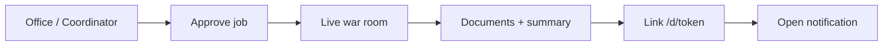

# Guide — Daily pilot workflow

How to run **your company** on the platform in **30–60 minutes per day** while holding another job: from intake to client delivery, without technical shortcuts.

> For screen-by-screen detail, combine this guide with [Office and jobs](/help/guia-oficina).

---

## Table of contents

1. [Daily routine](#daily-routine)
2. [Step-by-step flow](#step-by-step-flow)
3. [Client delivery](#client-delivery)
4. [Weekly checklist](#weekly-checklist)
5. [Useful shortcuts](#useful-shortcuts)
6. [When something fails](#when-something-fails)

---

## Daily routine

| When | Action | Where |
|------|--------|-------|
| **Start** | Review active jobs, pending decisions, notifications | **Home** (`/office`) → KPIs and bell |
| **Brief** | Define or refine the job with the coordinator | Office chat or department room |
| **Launch** | Approve brief and run procedure | Department → **Procedures** → **Use** |
| **Follow-up** | Watch live (handoffs, Munger veto, OpenCode) | **War room** (`?run=` when several runs) |
| **GO/NO-GO** | Resolve pending proposals | **My pending** (`/office/pendientes`) |
| **Close** | Review documents and final summary | Job page → Documents / Summary |
| **Deliver** | Create link (optional PIN) and send to client | **Delivered** job → **Client delivery** |
| **Wrap** | Log revenue if applicable | Product settings → Revenue |

---

## Step-by-step flow

### 1. Intake — define the work

1. Open **Home** (`/office`) or the right department (virtual `/office/departments/:slug` or Org Unit `/org-units/:id`).
2. Open the **Coordinator** and describe the job in natural language:
   - What you need (report, feature, repo analysis, commercial proposal…)
   - Which product or scope (company / specific product)
   - Deadline or constraints
3. Review the synthesized **brief** before **Approve and run**.

See also: [Coordinator and scope](/help/guia-oficina#coordinator-and-scope).

### 2. Launch procedure

1. In the department room, **Department procedures** panel.
2. Pick the procedure (e.g. idea evaluation, feature development).
3. Confirm scope, team, and LLM budget if shown.
4. The job appears in **My jobs** (`/office/encargos`).

Admin catalog: `/settings/procedures`.

### 3. Live follow-up

| View | When to use |
|------|-------------|
| **Product war room** (`/war-room/:productId`) | Tactical ring + side coordinator |
| **General war room** (`/war-room`) | Full portfolio — several products |
| **Department room** | Dept/procedure context; focus run with `?run=<runId>` |

If **Munger issues VETO**, the job is **cancelled** — read the reason on the job page before relaunching with more context.

If the run enters **Delegated to OpenCode** or **Awaiting decision**, act from War room or job detail — see [OpenCode for operators](/help/guia-oficina#opencode-for-operators).

### 4. Review deliverables

1. Open the job in **My jobs**.
2. **Final summary** and **Team documents** tabs.
3. **Office archive** (`/office/archive`) — filters by department, product, or role.

### 5. External client delivery

See dedicated section [Client delivery](#client-delivery).

### 6. Log revenue

On the linked product → **Settings** → **Revenue** tab (`/products/:id/settings?tab=revenue`). See [Products](/help/guia-productos).

---

## Client delivery

When the job is **Delivered**, the **Client delivery** section on the job page (`/office/encargos/:runId`) lets you share results outside the platform.

### Create link

1. Select documents to include and whether to add the **Final report**.
2. Pick expiry: never, 7, 30, or 90 days.
3. *(Recommended)* Set an **Access PIN** — share it on another channel (SMS, WhatsApp).
4. Confirm you understand content will leave the tenant.
5. Optional **Preview** before publishing.
6. **Create link** — you get public URL `/d/:token`.

### Share

| Method | Detail |
|--------|--------|
| **Copy link** | URL ready to paste |
| **Send email** | Form with recipient and optional message (requires SMTP in Settings) |
| **Revoke / rotate** | Invalidate or regenerate token on existing links |

### Public view `/d/:token`

The client sees a tenant-branded page (logo, color, contact, legal notice):

- **Summary** and **Documents** tabs per inclusion
- PIN unlock screen when configured
- Expired or revoked links show a clear message
- `noindex` — not indexed by search engines

You get an **in-app notification** (and email if configured) when the client **opens the link for the first time**.

### Branding

Customize logo, primary color, contact email, footer, and confidentiality notice under **Settings → Client delivery** (`/settings?tab=delivery`). See [/help/guia-configuracion](/help/guia-configuracion).

---

## Weekly checklist

- [ ] At least **1 job** completed with visible documents
- [ ] **My pending** at zero (or every NO-GO reviewed with reason)
- [ ] **0 Munger vetoes** left unexplained
- [ ] **1 external delivery** tested (you can be the client at `/d/:token`)
- [ ] **1 UX friction** noted for next week

---

## Useful shortcuts

| Need | Route |
|------|------|
| Active jobs | `/office/encargos` |
| GO/NO-GO decisions | `/office/pendientes` |
| Document archive | `/office/archive` |
| General war room | `/war-room` |
| Delivery branding | `/settings?tab=delivery` |
| Procedures (admin) | `/settings/procedures` |
| Help center | `/help/guia-piloto` |

---

## When something fails

| Symptom | What to do |
|---------|------------|
| Job completed, empty documents | Open job detail and check the report; confirm the job had a linked **product**. See [My jobs](/help/guia-oficina#my-jobs). |
| Munger VETO | Read the error on the job page; adjust brief or data and relaunch. |
| Client does not open delivery | Check link expiry or revocation; resend **PIN** on another channel. |
| `/d/:token` asks for PIN | PIN is not in the URL — send separately. Browser may remember it for the session. |
| Job stuck | Check OpenCode (delegation) or refresh **My jobs**; if it persists, contact your platform admin. |

---

## Related guides

| Topic | Link |
|-------|------|
| Office, coordinator, war room | [/help/guia-oficina](/help/guia-oficina) |
| Products and revenue | [/help/guia-productos](/help/guia-productos) |
| Department procedures | [/help/guia-flujos](/help/guia-flujos) |
| Tenant settings | [/help/guia-configuracion](/help/guia-configuracion) |
| Full manual | [/help/guia-completa](/help/guia-completa) |
