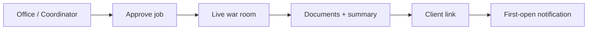

# Guide — Daily pilot workflow

How to run **your company** on the platform in **30–60 minutes per day** while you have another job: from the front desk to client delivery, without technical workarounds.

> For screen-by-screen detail, combine this guide with [Office and jobs](/help/guia-oficina).

---

## Table of contents

1. [Daily routine](#daily-routine)
2. [Step-by-step flow](#step-by-step-flow)
3. [Weekly checklist](#weekly-checklist)
4. [Useful shortcuts](#useful-shortcuts)
5. [When something fails](#when-something-fails)

---

## Daily routine

| When | Action | Where |
|------|--------|-------|
| **Start** | Review active jobs and notifications | **Home** (`/office`) → **My jobs** |
| **Brief** | Define or refine the job with the coordinator | Office chat or department room |
| **Launch** | Approve brief and run a procedure | Department → **Procedures** → **Use** |
| **Follow-up** | Watch the live meeting (handoffs, Munger veto) | Meeting room or **War room** |
| **Close** | Review documents and final summary | Job detail → Documents / Summary |
| **Deliver** | Create link (optional PIN) and send to client | **Delivered** job → **Client delivery** |
| **Wrap** | Log revenue if applicable | **Product** page (revenue / notes) |

---

## Step-by-step flow

### 1. Reception — define the work

1. Open **Home** (`/office`) or the right department (Strategy, Engineering…).
2. Open the **Coordinator** and describe the job in natural language:
   - What you need (report, feature, repo analysis, commercial proposal…)
   - Product or scope (company-wide / specific product)
   - Deadline or constraints
3. Review the synthesized **brief** before **Approve and run**.

See also: [Coordinator and scope](/help/guia-oficina#coordinator-and-scope).

### 2. Launch a procedure

1. In the department room, open **Department procedures**.
2. Pick a procedure (e.g. idea evaluation, feature development).
3. Confirm scope, team, and LLM budget if shown.
4. The job appears under **My jobs** (`/office/encargos`).

### 3. Live follow-up

| View | When to use it |
|------|----------------|
| **Product war room** (`/war-room/:productId`) | Tactical ring + side coordinator |
| **General war room** (`/war-room`) | Full portfolio |
| **Department room** | Dept/procedure context; multiple runs with `?watchRun=` |

If **Munger issues a VETO**, the job is **cancelled** — read the reason on the job page before relaunching with more context.

### 4. Review deliverables

1. Open the job from **My jobs**.
2. Tabs **Final summary** and **Team documents**.
3. **Office archive** (`/office/archive`) — filter by department, product, or role.

### 5. Deliver to an external client

When the job is **Delivered**:

1. **Client delivery** section on the job page.
2. Pick documents, link expiry, and **preview**.
3. *(Recommended)* Set an **access PIN** and share it on another channel (SMS, WhatsApp).
4. **Copy link** or **Send email** from the panel.
5. You get a notification when the client **opens the link for the first time**.

Link branding: **Settings** → **Client delivery** tab (`/settings?tab=delivery`).

### 6. Log revenue

On the linked product, record **revenue** or closing notes when you get paid — manual is fine at first. See [Products](/help/guia-productos).

---

## Weekly checklist

- [ ] At least **1 job** completed with visible documents
- [ ] **0 Munger vetoes** left unread
- [ ] **1 external delivery** tested (you can be the client)
- [ ] **1 UX friction** noted for the next week

---

## Useful shortcuts

| Need | Route |
|------|-------|
| Active jobs | `/office/encargos` |
| Document archive | `/office/archive` |
| General war room | `/war-room` |
| Delivery branding | `/settings?tab=delivery` |
| Procedures (admin) | `/settings?tab=procedures` |
| Help center | `/help/guia-piloto` |

---

## When something fails

| Symptom | What to do |
|---------|------------|
| Job completed, empty documents | Open job detail and check the report; confirm the job had a linked **product**. See [My jobs](/help/guia-oficina#my-jobs). |
| Munger VETO | Read the error on the job page; adjust brief or inputs and relaunch. |
| Client cannot open delivery | Check link expiry or revocation; resend the **PIN** on another channel. |
| Job stuck | Refresh **My jobs**; if it persists, contact your platform administrator. |

---

## Related guides

| Topic | Link |
|-------|------|
| Office, coordinator, war room | [/help/guia-oficina](/help/guia-oficina) |
| Products and revenue | [/help/guia-productos](/help/guia-productos) |
| Department procedures | [/help/guia-flujos](/help/guia-flujos) |
| Full manual | [/help/guia-completa](/help/guia-completa) |
