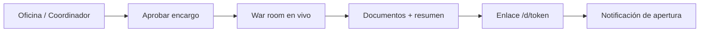

# Guía — Flujo diario piloto

Cómo operar **tu empresa** con la plataforma en **30–60 minutos al día** mientras tienes otro empleo: de la recepción a la entrega al cliente, sin atajos técnicos.

> Si buscas el detalle de cada pantalla, combina esta guía con [Oficina y encargos](/help/guia-oficina).

---

## Tabla de contenidos

1. [Rutina diaria](#rutina-diaria)
2. [Flujo paso a paso](#flujo-paso-a-paso)
3. [Entrega al cliente](#entrega-al-cliente)
4. [Checklist semanal](#checklist-semanal)
5. [Atajos útiles](#atajos-útiles)
6. [Cuando algo falla](#cuando-algo-falla)

---

## Rutina diaria

| Momento | Acción | Dónde |
|---------|--------|-------|
| **Inicio** | Revisar encargos activos, pendientes y notificaciones | **Inicio** (`/office`) → KPIs y campana |
| **Brief** | Definir o refinar el encargo con el coordinador | Chat en Oficina o sala de departamento |
| **Lanzar** | Aprobar brief y ejecutar procedimiento | Departamento → **Procedimientos** → **Usar** |
| **Seguimiento** | Ver reunión en vivo (handoffs, veto Munger, OpenCode) | **War room** (`?run=` si hay varios runs) |
| **GO/NO-GO** | Resolver propuestas pendientes | **Mis pendientes** (`/office/pendientes`) |
| **Cierre** | Revisar documentos y resumen final | Ficha del encargo → Documentos / Resumen |
| **Entrega** | Crear enlace (PIN opcional) y enviar al cliente | Encargo **Entregado** → **Entrega al cliente** |
| **Fin** | Anotar ingreso si aplica | Configuración del producto → Revenue |

---

## Flujo paso a paso

### 1. Recepción — definir el trabajo

1. Entra en **Inicio** (`/office`) o al departamento adecuado (virtual `/office/departments/:slug` u Org Unit `/org-units/:id`).
2. Abre el **Coordinador** y describe el encargo en lenguaje natural:
   - Qué necesitas (informe, feature, análisis de repo, propuesta comercial…)
   - Para qué producto o ámbito (empresa / producto concreto)
   - Plazo o restricciones
3. Revisa el **brief** sintetizado antes de pulsar **Aprobar y ejecutar**.

Ver también: [Coordinador y alcance](/help/guia-oficina#coordinador-y-alcance).

### 2. Lanzar procedimiento

1. En la sala del departamento, panel **Procedimientos del departamento**.
2. Elige el procedimiento (p. ej. evaluación de idea, desarrollo de feature).
3. Confirma alcance, equipo y presupuesto LLM si aplica.
4. El encargo aparece en **Mis encargos** (`/office/encargos`).

Catálogo admin: `/settings/procedures`.

### 3. Seguimiento en vivo

| Vista | Cuándo usarla |
|-------|---------------|
| **War room de producto** (`/war-room/:productId`) | Anillo táctico + coordinador lateral |
| **War room general** (`/war-room`) | Portfolio completo — varios productos |
| **Sala del departamento** | Contexto dept/procedimiento; enfoca run con `?run=<runId>` |

Si **Munger emite VETO**, el encargo se **cancela** — lee el motivo en la ficha antes de relanzar con más contexto.

Si el run entra en **Delegado a OpenCode** o **Esperando decisión**, actúa desde War room o detalle del encargo — ver [OpenCode para el operador](/help/guia-oficina#opencode-operador).

### 4. Revisar entregables

1. Abre la ficha del encargo en **Mis encargos**.
2. Pestañas **Resumen final** y **Documentos del equipo**.
3. **Archivo de la Oficina** (`/office/archive`) — filtros por departamento, producto o rol.

### 5. Entrega al cliente externo

Ver sección dedicada [Entrega al cliente](#entrega-al-cliente).

### 6. Registrar ingreso

En el producto asociado → **Configuración** → pestaña **Revenue** (`/products/:id/settings?tab=revenue`). Ver [Productos](/help/guia-productos).

---

## Entrega al cliente

Cuando el encargo esté en fase **Entregado**, la sección **Entrega al cliente** en la ficha del encargo (`/office/encargos/:runId`) permite compartir resultados fuera de la plataforma.

### Crear enlace

1. Selecciona documentos a incluir y si lleva **Informe final**.
2. Elige caducidad: sin límite, 7, 30 o 90 días.
3. *(Recomendado)* Define un **PIN de acceso** — compártelo por otro canal (SMS, WhatsApp).
4. Confirma que entiendes que el contenido saldrá del tenant.
5. **Vista previa** opcional antes de publicar.
6. **Crear enlace** — obtienes URL pública `/d/:token`.

### Compartir

| Método | Detalle |
|--------|---------|
| **Copiar enlace** | URL lista para pegar |
| **Enviar email** | Formulario con destinatario y mensaje opcional (requiere SMTP en Configuración) |
| **Revocar / rotar** | Invalida o regenera token en enlaces existentes |

### Vista pública `/d/:token`

El cliente ve una página con marca del tenant (logo, color, contacto, aviso legal):

- Pestañas **Resumen** y **Documentos** según lo incluido
- Si hay PIN, pantalla de desbloqueo antes del contenido
- Enlaces expirados o revocados muestran mensaje claro
- `noindex` — no indexada en buscadores

Recibirás **notificación in-app** (y email si está configurado) cuando el cliente **abra el enlace por primera vez**.

### Branding

Personaliza logo, color principal, email de contacto, pie y aviso de confidencialidad en **Configuración → Entrega cliente** (`/settings?tab=delivery`). Ver [/help/guia-configuracion](/help/guia-configuracion).

---

## Checklist semanal

- [ ] Al menos **1 encargo** completado con documentos visibles
- [ ] **Mis pendientes** en cero (o cada NO-GO revisado con motivo)
- [ ] **0 vetos** de Munger sin revisar el motivo
- [ ] **1 entrega externa** probada (puedes ser tú mismo el cliente en `/d/:token`)
- [ ] **1 fricción UX** anotada para mejorar la semana siguiente

---

## Atajos útiles

| Necesidad | Ruta |
|-----------|------|
| Encargos activos | `/office/encargos` |
| Decisiones GO/NO-GO | `/office/pendientes` |
| Archivo documentos | `/office/archive` |
| War room general | `/war-room` |
| Branding entrega | `/settings?tab=delivery` |
| Procedimientos (admin) | `/settings/procedures` |
| Centro de ayuda | `/help/guia-piloto` |

---

## Cuando algo falla

| Síntoma | Qué hacer |
|---------|-----------|
| Encargo completado, documentos vacíos | Abre el detalle del encargo y revisa el informe; confirma que el encargo tenía **producto** vinculado. Ver [Mis encargos](/help/guia-oficina#mis-encargos). |
| VETO Munger | Lee el mensaje de error en la ficha; ajusta brief o datos y relanza. |
| Cliente no abre la entrega | Comprueba caducidad o revocación del enlace; reenvía el **PIN** por canal alternativo. |
| Página `/d/:token` pide PIN | El PIN no va en la URL — envíalo aparte. El navegador puede recordarlo en la sesión. |
| El encargo no avanza | Revisa OpenCode (delegación) o refresca **Mis encargos**; si persiste, contacta al administrador de la plataforma. |

---

## Guías relacionadas

| Tema | Enlace |
|------|--------|
| Oficina, coordinador, war room | [/help/guia-oficina](/help/guia-oficina) |
| Productos e ingresos | [/help/guia-productos](/help/guia-productos) |
| Procedimientos por departamento | [/help/guia-flujos](/help/guia-flujos) |
| Configuración tenant | [/help/guia-configuracion](/help/guia-configuracion) |
| Manual completo | [/help/guia-completa](/help/guia-completa) |
