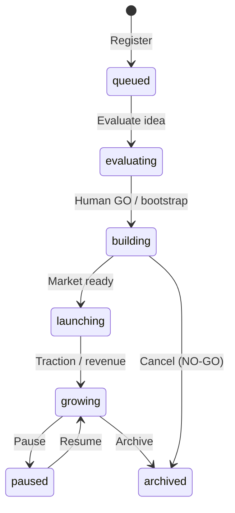
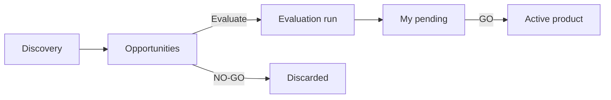

# Guide — Products

Register products, link departments, manage opportunities, and use per-product memory.

---

## Table of contents

1. [Lifecycle](#lifecycle)
2. [Opportunities and pipeline](#opportunities-and-pipeline)
3. [Link a department](#link-a-department)
4. [Product memory and consensus](#product-memory-and-consensus)
5. [Desk detail](#desk-detail)
6. [Product settings](#product-settings)
7. [War room and launching work](#war-room-and-launching-work)
8. [Frequently asked questions](#frequently-asked-questions)

---

## Lifecycle

Each product has a workspace under `projects/{slug}/` with its own `consensus.md` (synced from the UI) and `docs/` folders.

From **Products** you can register an existing one, bootstrap a new workspace, import detected folders, set focus, pause, or archive.

---

## Opportunities and pipeline

Route: **Products** (`/products`) — **Opportunities** tab (default). Active products: **Active** tab (`/products?tab=active`).

### Opportunities tab

Lists pipeline ideas (`PipelineIdea`) before they become active products. **Agent evaluation starts automatically** when an opportunity appears. You only decide GO/NO-GO once the report is ready.

| Row state | Meaning |
|-----------|---------|
| **Under evaluation** | Agents are running `new-product-evaluation` |
| **Ready for your decision** | Report in **My pending** — review evidence and approve or discard |
| **Retry evaluation** | Only if the run failed |

| Action | Effect |
|--------|--------|
| **Review report** | Opens **My pending** with the GO/NO-GO proposal and agent documentation |
| **Discard (NO-GO)** | Closes the idea without creating a product (shortcut; formal decision is in My pending) |
| **Delete** | Removes the idea from the pipeline |

Tab badge: total opportunities or how many are **ready for decision**.

### Active tab

Registered products by phase (`queued`, `evaluating`, `building`, `launching`, `growing`, `paused`, `archived`):

- **In focus** — priority product for War room and meta-orchestrator
- Quick links: Desk, War room, Settings, Consensus
- **OpenCode active** indicator when delegation is running (link to run)

### Vertical packs

**Vertical packs** panel at the top of Products: niche templates (SaaS, agency, etc.) that preload context when creating products. Apply a pack and review generated opportunities.

---

## Link a department

1. Open **Products** → product → **Settings** (`/products/:id/settings`).
2. **General** tab → **Department** → pick the Org Unit (e.g. marketing agency).
3. Optional: adjust **Work item type** (`product`, `client`, `campaign`, `project`).
4. Save.

Effect:

- Runs scoped to the department use that Org Unit's agents and `design.md`.
- Completed handoffs create **gallery artifacts** (when product + dept. are linked).
- From the department page you can **launch work** choosing a linked product.

---

## Product memory and consensus

Each product keeps **its own memory**: positioning, pricing, feature decisions, learnings.

| View | Route | Contents |
|------|------|----------|
| Product consensus | `/debug/products/:productId/consensus` (link from product Settings) | Live document + **Revisions** tab (one handoff per agent step) |
| Tenant global consensus | `/debug/consensus` (Debug office → Consensus) | Company strategy, idea pipeline, cycle next action |

The **Revisions** tab lists `consensusUpdate`, decisions, open questions, and vetoes per step. The main document accumulates cycles with timestamps.

After an important job, ask the Coordinator to summarize decisions or edit memory yourself.

> Handoff detail: [Handoffs and flow](/help/guia-equipo-ia#handoffs-and-flow).

---

## Desk detail

Route: **Desk** (`/products/:id/desk`).

Four operational tabs per product:

### Desk (kanban)

Board columns:

| Zone | Meaning | Actions |
|------|---------|---------|
| **For you** | Items needing your OK | Approve, archive, run recommended playbook |
| **Ready** | Items ready to send to an agent | Dispatch to eligible agent |
| **In progress** | Work already launched | Link to job |
| **Done** | Completed | Review |

Items may be playbook recommendations or consensus pipeline deliverables.

### Roadmap

Four-column kanban: **Backlog → Approved → In progress → Done**. Advance items with the move button.

### Signals

Market/user signal summary (`ProductSignal`) with counters and detail list — context to prioritize the desk.

### Playbooks

Available playbooks for the product. From a recommended item you can **Run playbook** — creates a job with the linked procedure.

---

## Product settings

Route: `/products/:id/settings` — tabs via `?tab=` or hash.

| Tab | Contents |
|-----|----------|
| **General** | Name, description, GitHub repo, Org Unit, work item type |
| **Intake** | Intake form preview and regeneration |
| **Revenue** | Revenue, investment, financial notes |
| **OpenCode** | Project path, agent, and model override for this product |
| **Integrations** | Product-specific integration config |

Prominent link to **Product consensus** from the header.

> Tenant-wide settings (global LLM, SMTP, delivery branding): [/help/guia-configuracion](/help/guia-configuracion).

---

## War room and launching work

| View | Route | Use |
|------|------|-----|
| **War room** | `/war-room/:id` | Live progress, deliverable health, chat |
| **Code** | `/products/:id/code` | Workspace explorer + OpenCode history |
| **Team** | `/products/:id/team` | Active agents on the product |

Ways to launch work:

- **War room** or **department room** → product scope + Coordinator.
- **Office** → Coordinator infers product from brief or asks; quick services with focus product too.
- **Department** → “Launch work” + linked product (`/org-units/:id`).
- **Desk** → dispatch item or run playbook.
- **Workflows** → run from editor with tenant consensus or seed naming the slug.

The worker loads product consensus into shared memory before the first agent when the job is linked to that product.

---

## Frequently asked questions

### What's the difference between `evaluating` and `building`?

- **`evaluating`** — pipeline idea; usually needs `new-product-evaluation` and human GO/NO-GO.
- **`building`** — approved GO; code and docs live in `projects/{slug}/`.

### Can I have several products in build at once?

Yes, with a platform limit (max **2** products in `building`/`launching` per tenant).

### Where do I approve a pipeline idea?

**My pending** (`/office/pendientes`) or job detail in **My jobs**. See [/help/guia-flujos](/help/guia-flujos#go--no-go-decisions).

### Opportunities vs Active?

**Opportunities** = ideas without a registered product. **Active** = products with workspace and phase. Evaluate moves an opportunity toward evaluation; GO in My pending promotes it to active `building`.
