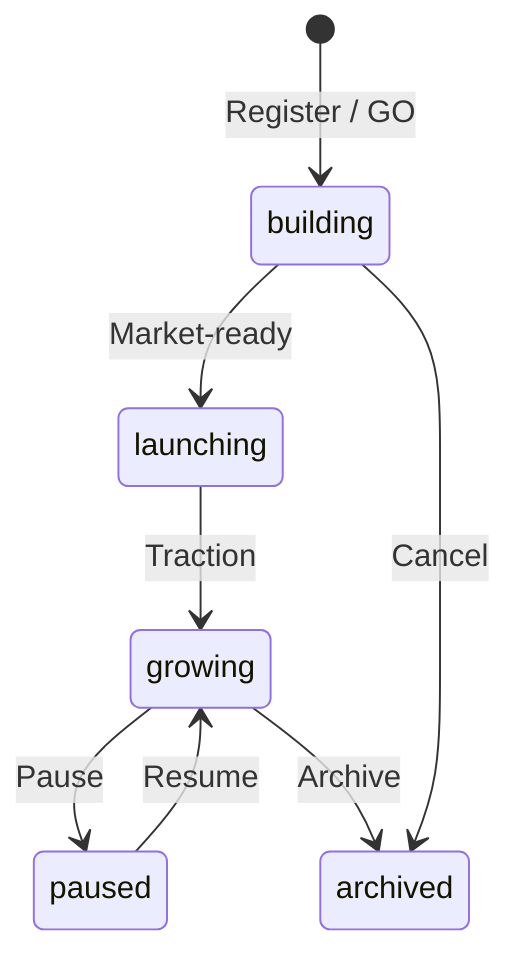

# Guide — Products

Register products, link departments, and use per-product memory.

---

## Table of contents

1. [Lifecycle](#lifecycle)
2. [Link a department](#link-a-department)
3. [Product memory and consensus](#product-memory-and-consensus)
4. [Launch work on a product](#launch-work-on-a-product)

---

## Lifecycle

Each product has a workspace under `projects/{slug}/` with its own `consensus.md` and `docs/` folders.

---

## Link a department

1. Open **Product settings**.
2. **Department** section → pick the department (e.g. Marketing).
3. Save.

Effects:

- Jobs scoped to «department» use that dept's agents and `design.md`.
- Run artifacts may appear in the **department gallery**.
- From the department you can launch runs with this product as the work item.

---

## Product memory and consensus

Each product keeps **its own memory**: positioning, pricing, feature decisions, learnings.

| View | Route | Contents |
|------|-------|----------|
| Product consensus | Product → Consensus | Live document + **Revisions** tab (one handoff per step) |
| Tenant-wide consensus | Debug menu → Consensus | Company strategy (separate from product) |

After an important job, ask the Coordinator to summarize decisions or edit memory yourself.

> Handoff details: **Handoffs and flow** article.

---

## Launch work on a product

- **Office** → «One product» scope when approving.
- **Department** → «Launch department work» + linked product.
- **Workflows** → run with a seed that names the product slug.

The worker loads product consensus into shared memory before the first agent.
