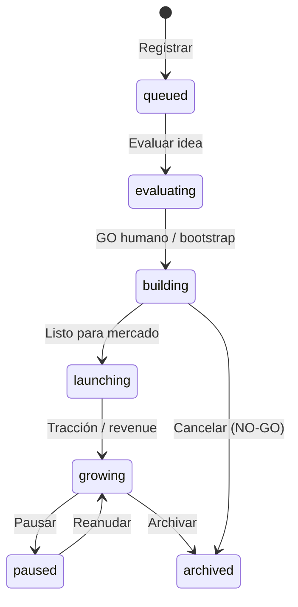
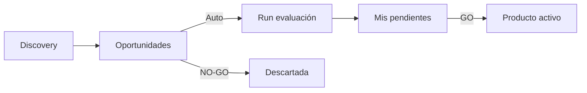

# Guía — Productos

Registrar productos, vincular departamentos, gestionar oportunidades y usar la memoria por producto.

---

## Tabla de contenidos

1. [Ciclo de vida](#ciclo-de-vida)
2. [Oportunidades y pipeline](#oportunidades-y-pipeline)
3. [Vincular departamento](#vincular-departamento)
4. [Memoria y consenso del producto](#memoria-y-consenso-del-producto)
5. [Escritorio detalle](#escritorio-detalle)
6. [Configuración del producto](#configuración-del-producto)
7. [War room y lanzar trabajo](#war-room-y-lanzar-trabajo)
8. [Preguntas frecuentes](#preguntas-frecuentes)

---

## Ciclo de vida

Cada producto tiene workspace bajo `projects/{slug}/` con su propio `consensus.md` (sincronizado desde la UI) y carpetas `docs/`.

Desde **Productos** puedes registrar uno existente, crear workspace nuevo (bootstrap), importar carpetas detectadas, marcar foco, pausar o archivar.

---

## Oportunidades y pipeline

Ruta: **Productos** (`/products`) — pestaña **Oportunidades** (por defecto). Productos en curso: pestaña **Activos** (`/products?tab=active`).

### Pestaña Oportunidades

Lista ideas del pipeline (`PipelineIdea`) antes de convertirse en producto activo. **La evaluación con agentes es automática** en cuanto aparece una oportunidad (discovery o backfill). Tú solo decides GO/NO-GO cuando el informe está listo.

| Estado en la fila | Qué significa |
|-------------------|---------------|
| **En evaluación** | Los agentes están ejecutando `new-product-evaluation` |
| **Lista para tu decisión** | Informe en **Mis pendientes** (`/office/pendientes`) — revisa evidencia y aprueba o descarta |
| **Reintentar evaluación** | Solo si el run falló |

| Acción | Efecto |
|--------|--------|
| **Revisar informe** | Abre **Mis pendientes** con la propuesta GO/NO-GO y documentación de agentes |
| **Descartar (NO-GO)** | Cierra la idea sin crear producto (atajo; la decisión formal está en Mis pendientes) |
| **Eliminar** | Quita la idea del pipeline |

Badge en la pestaña: total de oportunidades o cuántas **listas para decidir**.

### Pestaña Activos

Productos registrados con fase (`queued`, `evaluating`, `building`, `launching`, `growing`, `paused`, `archived`):

- **En foco** — producto prioritario para War room y meta-orchestrator
- Enlaces rápidos: **Entregas**, War room, Escritorio, Configuración, Consenso
- Indicador **OpenCode activo** si hay delegación en curso (enlace al run)

### Vertical packs

Panel **Paquetes verticales** en la parte superior de Productos: plantillas de nicho (SaaS, agencia, etc.) que precargan contexto al crear productos. Aplica un pack y revisa oportunidades generadas.

---

## Vincular departamento

1. Abre **Productos** → el producto → **Configuración** (`/products/:id/settings`).
2. Pestaña **General** → **Departamento** → elige el Org Unit (p. ej. agencia de marketing).
3. Opcional: ajusta **Tipo de work item** (`product`, `client`, `campaign`, `project`).
4. Guarda.

Efecto:

- Runs con alcance de departamento usan agentes y `design.md` de ese Org Unit.
- Los handoffs completados crean **artefactos en la galería** del departamento (si hay producto + dept. vinculados).
- Desde la ficha del departamento puedes **lanzar trabajo** eligiendo producto vinculado.

---

## Memoria y consenso del producto

Cada producto mantiene **memoria propia**: positioning, pricing, decisiones de feature, aprendizajes.

| Vista | Ruta | Qué contiene |
|-------|------|--------------|
| Consenso del producto | `/debug/products/:productId/consensus` (enlace desde Configuración del producto) | Documento vivo + pestaña **Revisiones** (un handoff por paso de agente) |
| Consenso global tenant | `/debug/consensus` (Oficina de depuración → Consenso) | Estrategia de compañía, pipeline de ideas, next action de ciclo |

La pestaña **Revisiones** lista `consensusUpdate`, decisiones, preguntas abiertas y vetos por paso. El documento principal acumula ciclos con timestamp.

Tras un encargo importante, pide al Coordinador que resuma decisiones o edita la memoria tú mismo.

> Detalle de handoffs: [Handoffs y flujo](/help/guia-equipo-ia#handoffs-y-flujo).

---

## Escritorio detalle

Ruta: **Escritorio** (`/products/:id/desk`).

Cuatro pestañas operativas por producto:

### Escritorio (kanban)

Columnas del tablero:

| Zona | Significado | Acciones |
|------|-------------|----------|
| **Para ti** | Items que requieren tu OK | Aprobar, archivar, ejecutar playbook recomendado |
| **Listo** | Items listos para enviar a un agente | Despachar a agente elegible |
| **En curso** | Trabajo ya lanzado | Enlace al encargo |
| **Hecho** | Completados | Consulta |

Items pueden ser recomendaciones de playbook o entregables del pipeline de consenso.

### Roadmap

Kanban de cuatro columnas: **Backlog → Aprobado → En progreso → Hecho**. Mueve items con el botón de avance.

### Señales

Resumen de señales de mercado/usuario (`ProductSignal`) con contadores y lista detallada — contexto para priorizar el escritorio.

### Playbooks

Lista playbooks disponibles para el producto. Desde un item recomendado puedes **Ejecutar playbook** — crea un encargo con el procedimiento asociado.

---

## Configuración del producto

Ruta: `/products/:id/settings` — pestañas vía `?tab=` o hash.

| Pestaña | Contenido |
|---------|-----------|
| **General** | Nombre, descripción, repo GitHub, Org Unit, tipo de work item |
| **Intake** | Vista previa del formulario de intake y regeneración |
| **Revenue** | Ingresos, inversión, notas financieras del producto |
| **OpenCode** | Override de ruta de proyecto, agente y modelo para este producto |
| **Integraciones** | Configuración específica del producto (webhooks, etc.) |

Enlace destacado al **Consenso del producto** desde la cabecera.

> Ajustes de tenant (LLM global, SMTP, marca de entrega): [/help/guia-configuracion](/help/guia-configuracion).

---

## Entregas del producto

Ruta: **Entregas** (`/products/:id/entregas`).

Vista unificada de **resultados** por producto — un solo sitio para recoger lo que salió de cada encargo:

| Zona | Contenido |
|------|-----------|
| **Requiere tu atención** | Decisiones GO/NO-GO, encargos fallidos, OpenCode en espera, items del escritorio «Para ti» |
| **En curso** | Encargos activos con enlace al war room en vivo |
| **Entregado** | Historial con informe final, documentos por agente y entrega al cliente |

Desde cada entrega puedes expandir el **informe final** y los **documentos** sin salir de la página. El war room queda solo para **seguimiento en vivo**.

### Atajos relacionados

| Vista | Ruta | Uso |
|-------|------|-----|
| **War room** | `/war-room/:id` | Progreso en vivo y chat (no archivo de resultados) |
| **Escritorio** | `/products/:id/desk` | Kanban operativo y playbooks |
| **Consenso** | `/debug/products/:id/consensus` | Memoria profunda y trazas técnicas |
| **Código** | `/products/:id/code` | Workspace + historial OpenCode |

---

## War room y lanzar trabajo

| Vista | Ruta | Uso |
|-------|------|-----|
| **Entregas** | `/products/:id/entregas` | **Resultados** — informes, docs, decisiones pendientes |
| **War room** | `/war-room/:id` | Progreso en vivo y chat del Coordinador |
| **Código** | `/products/:id/code` | Explorador del workspace + historial OpenCode |
| **Equipo** | `/products/:id/team` | Agentes activos en el producto |

Formas de lanzar trabajo:

- **Entregas** o **War room** → «Pedir trabajo» abre el Coordinador con el producto en contexto.
- **Oficina** → el Coordinador infiere producto del brief o pregunta; también servicios rápidos con producto en foco.
- **Departamento** → «Lanzar trabajo» + producto vinculado (`/org-units/:id`).
- **Escritorio** → despachar item o ejecutar playbook.
- **Flujos** → ejecutar desde el editor con consenso tenant o semilla que nombre el slug.

Recoge resultados siempre en **Entregas** del producto. **Mis encargos** (`/office/encargos`) sigue siendo la bandeja global de todos los productos.

El worker carga el consenso del producto en memoria compartida antes del primer agente cuando el encargo está vinculado a ese producto.

---

## Preguntas frecuentes

### ¿Cuál es la diferencia entre fases `evaluating` y `building`?

- **`evaluating`** — idea en pipeline; suele requerir workflow `new-product-evaluation` y decisión humana GO/NO-GO.
- **`building`** — GO aprobado; código y docs viven en `projects/{slug}/`.

### ¿Puedo tener varios productos en build a la vez?

Sí, con límite de plataforma (máx. **2** productos en `building`/`launching` por tenant).

### ¿Dónde apruebo una idea del pipeline?

**Mis pendientes** (`/office/pendientes`) o el detalle del encargo en **Mis encargos**. Ver [/help/guia-flujos](/help/guia-flujos#decisiones-go--no-go).

### ¿Oportunidades vs Activos?

**Oportunidades** = ideas sin producto registrado. **Activos** = productos con workspace y fase. Tras discovery, cada oportunidad se evalúa sola; cuando el informe está listo, decide en **Mis pendientes** — GO promueve a activo en fase `building`.
