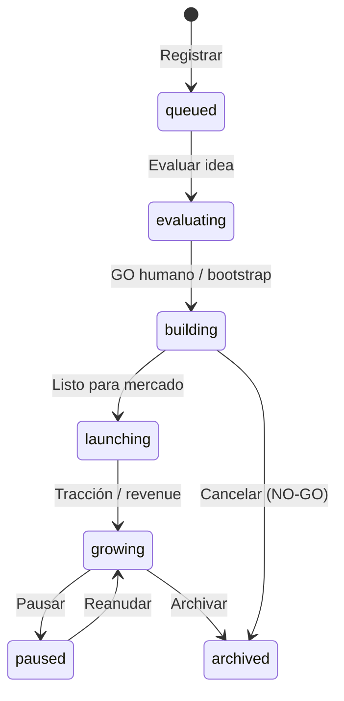

# Guía — Productos

Registrar productos, vincular departamentos y usar la memoria por producto.

---

## Tabla de contenidos

1. [Ciclo de vida](#ciclo-de-vida)
2. [Vincular departamento](#vincular-departamento)
3. [Memoria y consenso del producto](#memoria-y-consenso-del-producto)
4. [Escritorio y war room](#escritorio-y-war-room)
5. [Lanzar trabajo sobre un producto](#lanzar-trabajo-sobre-un-producto)
6. [Preguntas frecuentes](#preguntas-frecuentes)

---

## Ciclo de vida

Cada producto tiene workspace bajo `projects/{slug}/` con su propio `consensus.md` (sincronizado desde la UI) y carpetas `docs/`.

Desde **Productos** puedes registrar uno existente, crear workspace nuevo (bootstrap), importar carpetas detectadas, marcar foco, pausar o archivar.

---

## Vincular departamento

1. Abre **Productos** → el producto → **Configuración** (`/products/:id/settings`).
2. Pestaña **General** → **Departamento** → elige el Org Unit (p. ej. agencia de marketing).
3. Opcional: ajusta **Tipo de work item** (`product`, `client`, `campaign`, `project`).
4. Guarda.

Efecto:

- Runs con alcance de departamento usan agentes y `design.md` de ese Org Unit.
- Los handoffs completados crean **artefactos en la galería** del departamento (si hay producto + dept. vinculados).
- Desde la ficha del departamento puedes **lanzar trabajo** eligiendo producto vinculado.

---

## Memoria y consenso del producto

Cada producto mantiene **memoria propia**: positioning, pricing, decisiones de feature, aprendizajes.

| Vista | Ruta | Qué contiene |
|-------|------|--------------|
| Consenso del producto | `/debug/products/:productId/consensus` (también enlace desde Configuración del producto) | Documento vivo + pestaña **Revisiones** (un handoff por paso de agente) |
| Consenso global tenant | `/debug/consensus` (Oficina de depuración → Consenso) | Estrategia de compañía, pipeline de ideas, next action de ciclo |

La pestaña **Revisiones** lista `consensusUpdate`, decisiones, preguntas abiertas y vetos por paso. El documento principal acumula ciclos con timestamp.

Tras un encargo importante, pide al Coordinador que resuma decisiones o edita la memoria tú mismo.

> Detalle de handoffs: artículo **Handoffs y flujo**.

---

## Escritorio y war room

| Vista | Ruta | Uso |
|-------|------|-----|
| **Escritorio** | `/products/:id/desk` | Kanban, roadmap, señales, playbooks por producto |
| **War room** | `/war-room/:id` | Progreso en vivo, salud de entregables, chat |
| **Código** | `/products/:id/code` | Explorador del workspace |
| **Equipo** | `/products/:id/team` | Agentes activos en el producto |

---

## Lanzar trabajo sobre un producto

- **War room** o **sala de departamento** → selector de alcance «producto» + Coordinador.
- **Oficina** → el Coordinador infiere producto del brief o pregunta; también puedes partir de un servicio rápido con producto en foco.
- **Departamento** → «Lanzar trabajo» + producto vinculado (`/org-units/:id`).
- **Flujos** → ejecutar desde el editor con consenso tenant o semilla que nombre el slug.

El worker carga el consenso del producto en memoria compartida antes del primer agente cuando el encargo está vinculado a ese producto.

---

## Preguntas frecuentes

### ¿Cuál es la diferencia entre fases `evaluating` y `building`?

- **`evaluating`** — idea en pipeline; suele requerir workflow `new-product-evaluation` y decisión humana GO/NO-GO.
- **`building`** — GO aprobado; código y docs viven en `projects/{slug}/`.

### ¿Puedo tener varios productos en build a la vez?

Sí, con límite de plataforma (máx. **2** productos en `building`/`launching` por tenant — ver código `MAX_BUILDING_PRODUCTS`).

### ¿Dónde apruebo una idea del pipeline?

**Decisiones** (`/decisions`) o el detalle del encargo en **Mis encargos**. Ver [/help/guia-flujos](/help/guia-flujos#decisiones-go--no-go).
