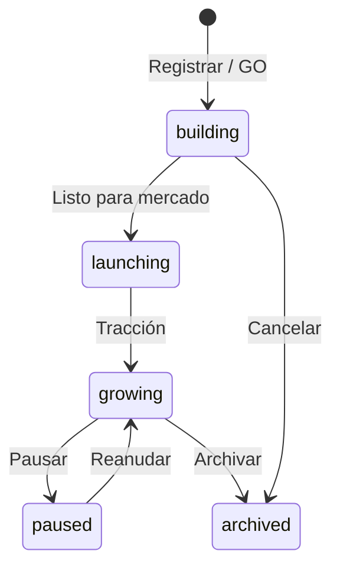

# Guía — Productos

Registrar productos, vincular departamentos y usar la memoria por producto.

---

## Tabla de contenidos

1. [Ciclo de vida](#ciclo-de-vida)
2. [Vincular departamento](#vincular-departamento)
3. [Memoria y consenso del producto](#memoria-y-consenso-del-producto)
4. [Lanzar trabajo sobre un producto](#lanzar-trabajo-sobre-un-producto)

---

## Ciclo de vida

Cada producto tiene workspace bajo `projects/{slug}/` con su propio `consensus.md` y carpetas `docs/`.

---

## Vincular departamento

1. Abre **Configuración del producto**.
2. Sección **Departamento** → elige el departamento (p. ej. Marketing).
3. Guarda.

Efecto:

- Encargos con alcance «departamento» usan agentes y `design.md` de ese dept.
- Los artefactos del run pueden aparecer en la **galería del departamento**.
- Desde el departamento puedes lanzar runs con este producto como work item.

---

## Memoria y consenso del producto

Cada producto mantiene **memoria propia**: positioning, pricing, decisiones de feature, aprendizajes.

| Vista | Ruta | Qué contiene |
|-------|------|--------------|
| Consenso del producto | Producto → Consenso | Documento vivo + pestaña **Revisiones** (un handoff por paso) |
| Consenso global tenant | Menú depuración → Consenso | Estrategia de compañía (separado del producto) |

Tras un encargo importante, pide al Coordinador que resuma decisiones o edita la memoria tú mismo.

> Detalle de handoffs: artículo **Handoffs y flujo**.

---

## Lanzar trabajo sobre un producto

- **Oficina** → alcance «Un producto» al aprobar.
- **Departamento** → «Lanzar trabajo del departamento» + producto vinculado.
- **Flujos** → ejecutar con semilla que mencione el slug del producto.

El worker carga el consenso del producto en memoria compartida antes del primer agente.
