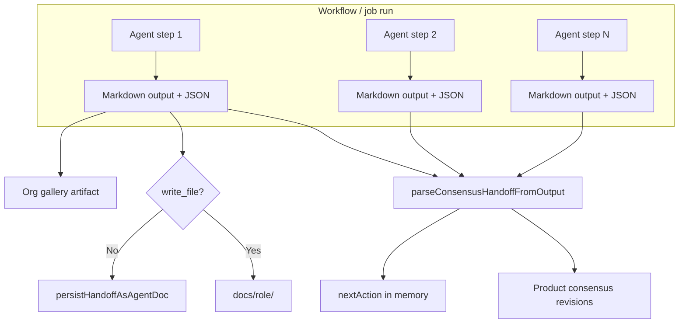
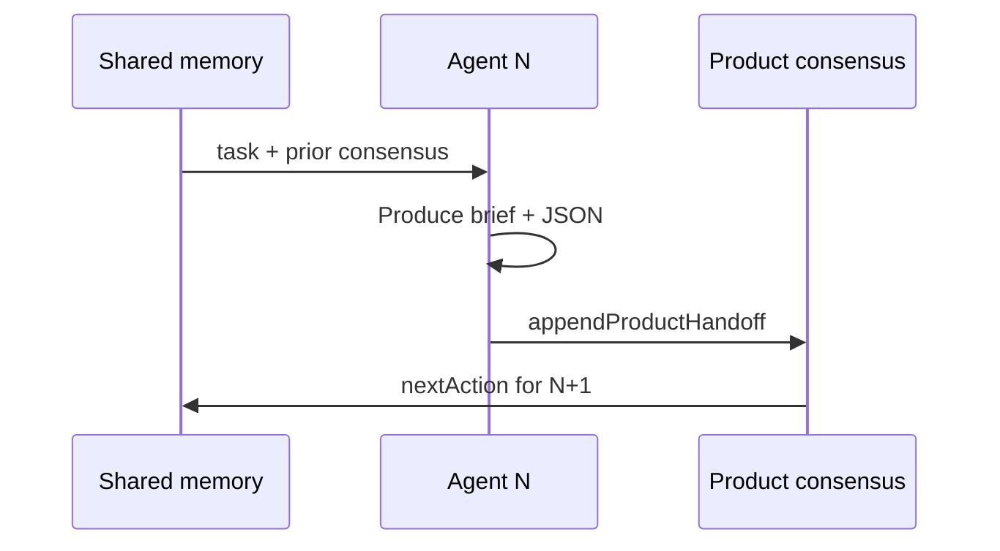
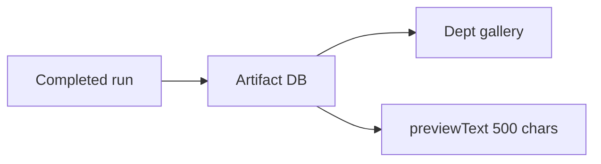
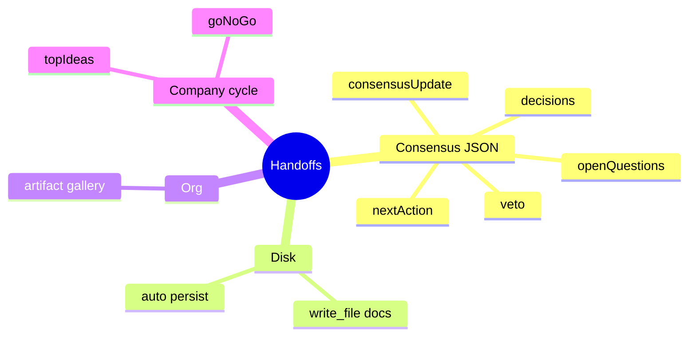

# Handoffs and flow

Exclusive reference for **all handoffs** in Auto-Company: what they are, where they land, and how they affect execution.

---

## Table of contents

1. [Pipeline overview](#pipeline-overview)
2. [Consensus handoff (per agent step)](#consensus-handoff-per-agent-step)
3. [On-disk deliverables (write_file)](#on-disk-deliverables-write_file)
4. [Department artifacts](#department-artifacts)
5. [Tenant vs product memory](#tenant-vs-product-memory)
6. [Autonomous cycle handoffs](#autonomous-cycle-handoffs)
7. [Munger VETO](#munger-veto)
8. [Formats by department type](#formats-by-department-type)
9. [Deliverable status in the UI](#deliverable-status-in-the-ui)
10. [What is NOT a platform handoff](#what-is-not-a-platform-handoff)

---

## Pipeline overview



When a run **completes** with a product in scope, `processConvergenceAfterRun`:

1. Walks run `_history`.
2. Extracts JSON handoff from each step.
3. Appends to product consensus (one revision per step).
4. Optionally persists markdown under `docs/{role}/`.
5. Creates department gallery artifacts when applicable.

---

## Consensus handoff (per agent step)

**The primary handoff.** Each agent in a product-scoped workflow must end with:

```json
{
  "consensusUpdate": "<step markdown>",
  "nextAction": "<next action>",
  "decisions": [{ "by": "agent-name", "what": "...", "why": "..." }],
  "openQuestions": ["..."],
  "veto": null
}
```

### Parsed fields

| Field | Parser | Flow effect |
|-------|--------|-------------|
| `consensusUpdate` | `product-consensus.ts` | Revision body; visible under Product → Consensus → Revisions |
| `nextAction` | Same + `product-run-closure` | Next focus; stuck-cycle detection if repeated |
| `decisions` | Same | Decision list on the revision |
| `openQuestions` | Same | Explicit open items |
| `veto` | Same + Munger gate | Valid `by` + `reason` → run may stop |

If the JSON block is **missing**, the system uses markdown outside fences as content — you lose structured fields.

### Chain between agents



The next agent **reads** product `consensus.md` and revision history — not a custom `DesignHandoff` JSON.

---

## On-disk deliverables (write_file)

Second handoff type: **persistent file** in the workspace.

| Mechanism | When | Path |
|-----------|------|------|
| Agent uses `write_file` | Explicit tool | `docs/{role}/timestamp-workflow.md` |
| Auto-persist | No write_file and no prior doc | Same via `persistHandoffAsAgentDoc` |

`agentDocsPath(agentName)` maps name prefix:

- `research-*` → `docs/research/`
- `ui-*` → `docs/ui/`
- `marketing-*` → `docs/marketing/`
- `design-lead` → `docs/` (`design` prefix not mapped)

**Effect:** UI shows `saved_to_disk` on last run; no duplicate persist if write_file already ran.

---

## Department artifacts

Third destination: **Org gallery** (`persistOrgUnitHandoffsFromRun`).

- Type inferred per agent: `design-lead` → `design`, `copy-manager` → `copy`, etc.
- Body = full step output (markdown + JSON).
- Visible on department page → Gallery.
- Requires run linked to product + org unit.



---

## Tenant vs product memory

| Handoff / memory | Scope | Where you edit | Written by |
|------------------|-------|----------------|------------|
| **Product consensus** | One product | Product → Consensus | Each agent step (JSON) |
| **Tenant consensus** | Whole company | Debug → Consensus | Autonomous cycles / CEO |
| **Run shared memory** | One run | Internal worker | Engine between steps |

Do not mix: a marketing step JSON handoff **does not** replace company-wide consensus.

---

## Autonomous cycle handoffs

Extra rules for company cycles (`convergencePromptSection`):

| Cycle | JSON / memory field | Effect |
|-------|---------------------|--------|
| 1 | `topIdeas[]` (3 titles) | Feeds idea pipeline |
| 2 | `goNoGo`: `"GO"` / `"NO-GO"` | Bootstrap or drop product |
| 3+ | Real artifacts required | No discussion-only output |
| Any | `revenueUsd`, `productSlug`, … | structured-memory enrichment |

Extracted via `collectJsonObjects` / `structured-memory.ts`, in addition to standard consensus handoff.

---

## Munger VETO

Special handoff — control agents only (`critic-munger` or Munger gate in Catalog Studio):

```json
{
  "veto": {
    "by": "critic-munger",
    "reason": "Unit economics fail at current CAC assumptions."
  }
}
```

**Effects:**

- Catalog Studio: blocks **Approve and apply** when Munger vetoes.
- Workflow run: `_stoppedByVeto` may stop later convergence.
- Shown on revision as highlighted **VETO**.

---

## Formats by department type

Beyond consensus JSON, templates suggest **content** inside `consensusUpdate`:

| Dept / agent | Expected markdown content |
|--------------|---------------------------|
| Marketing / copy | Ready copy, CTAs, tone per design.md |
| Marketing / community | Calendar + posts; hooks/hashtags in markdown or bullets |
| Marketing / design-lead | UX brief + referenced tokens |
| Product studio / fullstack | Implementation notes, code paths |
| SEO / content | Briefs, keywords, H1-H3 structure |

None replace the consensus JSON wrapper.

---

## Deliverable status in the UI

After a run, `product-last-run.ts` classifies:

| Status | Meaning |
|--------|---------|
| `saved_to_disk` | At least one step used write_file or persisted doc |
| `handoff_only` | Output / JSON but no workspace files |
| `missing` | No useful output |
| `no_docs_and_weak_handoff` | No docs and no structured JSON — lost deliverables |
| `partial_handoff` | Some steps with JSON, some without |

Use these in **My jobs** and product view to audit handoff quality.

---

## What is NOT a platform handoff

External AI schemas **not parsed**:

- `DesignHandoff` / `schema.org`
- JSON with `componentName`, `layout`, `children[]` as the only closing block
- Any JSON without `consensusUpdate` / `nextAction` / `veto` / `decisions`

You **may** include them as an annex inside brief markdown — documentation for humans or `fullstack-dhh`, not engine memory.

### Quick summary



**Golden rule:** markdown deliverable + consensus JSON at the end. Everything else is complementary.
