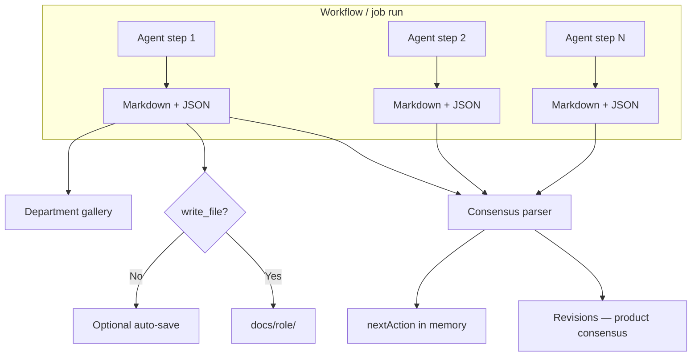
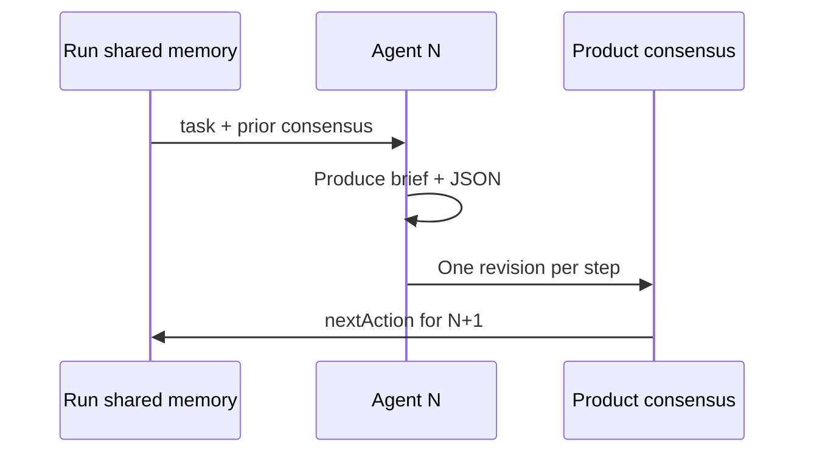
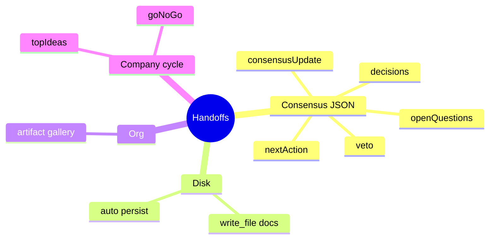

# Handoffs and flow

Reference for **all handoffs** in Auto-Company: what they are, where they land, and how they affect execution.

---

## Table of contents

1. [Pipeline overview](#pipeline-overview)
2. [Consensus handoff (per agent step)](#consensus-handoff-per-agent-step)
3. [On-disk deliverables (write_file)](#on-disk-deliverables-write_file)
4. [Department artifacts](#department-artifacts)
5. [Tenant vs product memory](#tenant-vs-product-memory)
6. [Autonomous cycle handoffs](#autonomous-cycle-handoffs)
7. [Munger VETO](#munger-veto)
8. [Formats by department type](#formats-by-department-type)
9. [Deliverable status in the UI](#deliverable-status-in-the-ui)
10. [What is NOT a platform handoff](#what-is-not-a-platform-handoff)

---

## Pipeline overview



When a run **completes** with a product in scope, the engine:

1. Walks the run step history.
2. Extracts the consensus JSON block from each output.
3. Appends **one revision per step** to product consensus.
4. Persists markdown under `docs/{role}/` if the agent did not use `write_file`.
5. Creates department gallery artifacts when an Org Unit is linked.

---

## Consensus handoff (per agent step)

**The primary handoff.** Each agent in a product-scoped workflow must end with:

```json
{
  "consensusUpdate": "<step markdown>",
  "nextAction": "<next action>",
  "decisions": [{ "by": "agent-name", "what": "...", "why": "..." }],
  "openQuestions": ["..."],
  "veto": null
}
```

### Fields the platform interprets

| Field | Effect |
|-------|--------|
| `consensusUpdate` | Revision body; visible under Product consensus → **Revisions** |
| `nextAction` | Next focus; stuck-cycle detection if repeated |
| `decisions` | Decision list on the revision |
| `openQuestions` | Explicit open items |
| `veto` | Valid `by` + `reason` → may stop the run or block convergence |

The parser scans JSON objects in the output (fenced blocks or embedded) and takes the **first object** with at least one recognized field.

If the JSON block is **missing**, the system uses markdown outside fences as content — you lose structured fields.

### Chain between agents



The next agent **reads** product `consensus.md` and revision history — not a custom `DesignHandoff` JSON.

---

## On-disk deliverables (write_file)

Second handoff type: **persistent file** in the product workspace.

| Mechanism | When | Path |
|-----------|------|------|
| Agent uses `write_file` | Explicit tool under `docs/` | `docs/{role}/…` |
| Auto-persist | No write_file on the step | Same convention at run close |

Agent prefix → folder:

| Prefix | Folder |
|--------|--------|
| `research-*` | `docs/research/` |
| `ui-*` | `docs/ui/` |
| `marketing-*` | `docs/marketing/` |
| `fullstack-*` | `docs/fullstack/` |
| *(other role prefixes)* | `docs/{prefix}/` or `docs/` fallback |
| `design-lead` | `docs/` (`design` prefix not mapped) |

**Effect:** if the step already wrote via `write_file`, auto-save is skipped (no duplicate).

---

## Department artifacts

Third destination: Org **gallery** for the department linked to the product.

- Type inferred per agent: `design-lead` → `design`, `copy-manager` → `copy`, etc.
- Body = full step output (markdown + JSON).
- Visible on department → Settings → **Design & artifacts**.
- Requires product with `orgUnitId` and completed run.

---

## Tenant vs product memory

| Handoff / memory | Scope | Where you edit | Written by |
|------------------|-------|----------------|------------|
| **Product consensus** | One product | Debug → Consensus (product) | Each agent step (JSON) |
| **Tenant consensus** | Whole company | Debug → Consensus (`/debug/consensus`) | Last agent of autonomous cycle / CEO |
| **Run memory** | One run | Internal (not editable) | Engine between steps |

Do not mix: a marketing step JSON handoff **does not** replace company-wide consensus. After product-scoped runs, product `nextAction` **does not** leak into tenant consensus.

---

## Autonomous cycle handoffs

Extra rules for company cycles (convergence prompts + structured memory):

| Cycle | JSON / memory field | Effect |
|-------|---------------------|--------|
| 1 | `topIdeas[]` (3 titles) | Feeds idea pipeline |
| 2 | `goNoGo`: `"GO"` / `"NO-GO"` | Bootstrap or drop product (per workflow) |
| 3+ | Real artifacts required | No discussion-only output |
| Any | `revenueUsd`, `productSlug`, … | Structured memory enrichment |

Extracted in addition to the standard consensus handoff.

---

## Munger VETO

Special handoff — control agents (`critic-munger`) or Munger gate in studios:

```json
{
  "veto": {
    "by": "critic-munger",
    "reason": "Unit economics fail at current CAC assumptions."
  }
}
```

**Effects:**

- **Catalog Studio / Org Studio:** blocks **Approve and apply** when Munger rejects the proposal.
- **Workflow run:** `_stoppedByVeto` may cancel convergence; run error `VETO:…`.
- Shown on revision as highlighted **VETO** and War room banner.

---

## Formats by department type

Beyond consensus JSON, templates suggest **content** inside `consensusUpdate`:

| Dept / agent | Expected markdown content |
|--------------|---------------------------|
| Marketing / copy | Ready copy, CTAs, tone per design.md |
| Marketing / community | Calendar + posts; hooks/hashtags in markdown |
| Marketing / design-lead | UX brief + referenced tokens |
| Product studio / fullstack | Implementation notes, code paths |
| SEO / content | Briefs, keywords, H1-H3 structure |

None replace the consensus JSON wrapper.

---

## Deliverable status in the UI

After a product-scoped run, the last-run trace classifies **each step**:

| Status | Meaning |
|--------|---------|
| `saved_to_disk` | At least one step used write_file or persisted doc |
| `handoff_only` | Output / JSON but no workspace files |
| `missing` | No useful output |

Aggregate run diagnoses (e.g. `partial_handoff`, `no_docs_and_weak_handoff`, `munger_veto`):

| Diagnosis | Meaning |
|-----------|---------|
| `partial_handoff` | Some steps with structured JSON, some without |
| `no_docs_and_weak_handoff` | No docs and no structured JSON |
| `munger_veto` | Run cancelled by veto |

**Where to see it:** War room → **Deliverable health**; Product consensus → last run panel. **My jobs** shows reports and documents, not these per-step status codes.

---

## What is NOT a platform handoff

External AI schemas **not parsed** as consensus:

- `DesignHandoff` / `schema.org`
- JSON with `componentName`, `layout`, `children[]` as the only closing block
- Any JSON without recognized consensus fields

You **may** include them as an annex inside brief markdown — documentation for humans or `fullstack-dhh`, not engine memory.

### Quick summary



**Golden rule:** markdown deliverable + consensus JSON at the end. Everything else is complementary.
