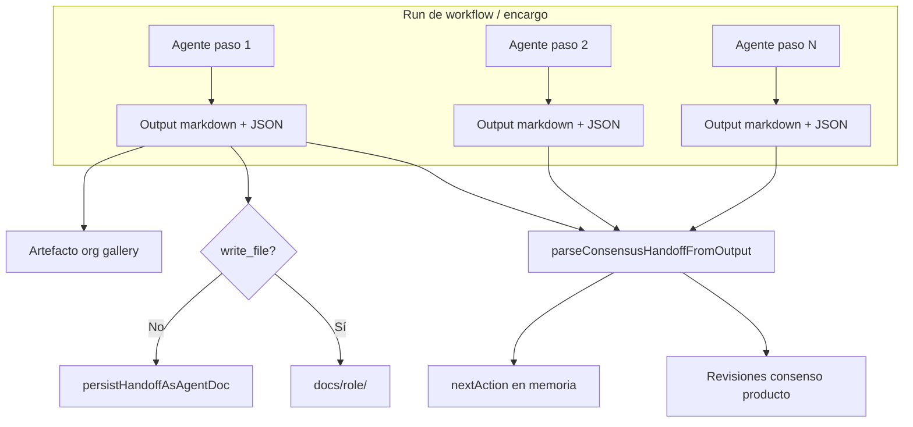
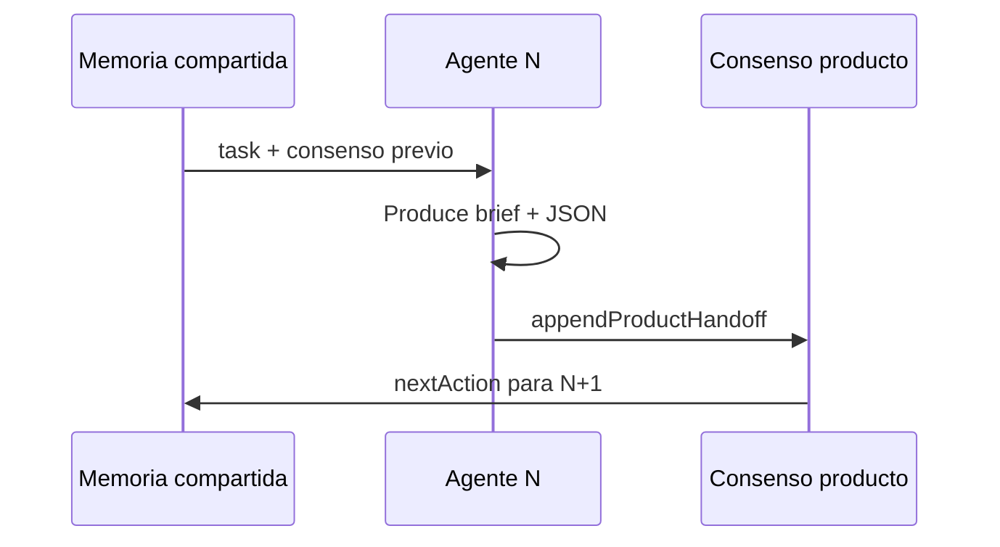
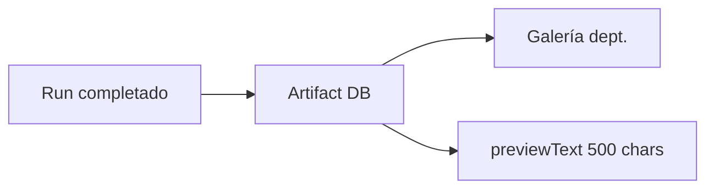
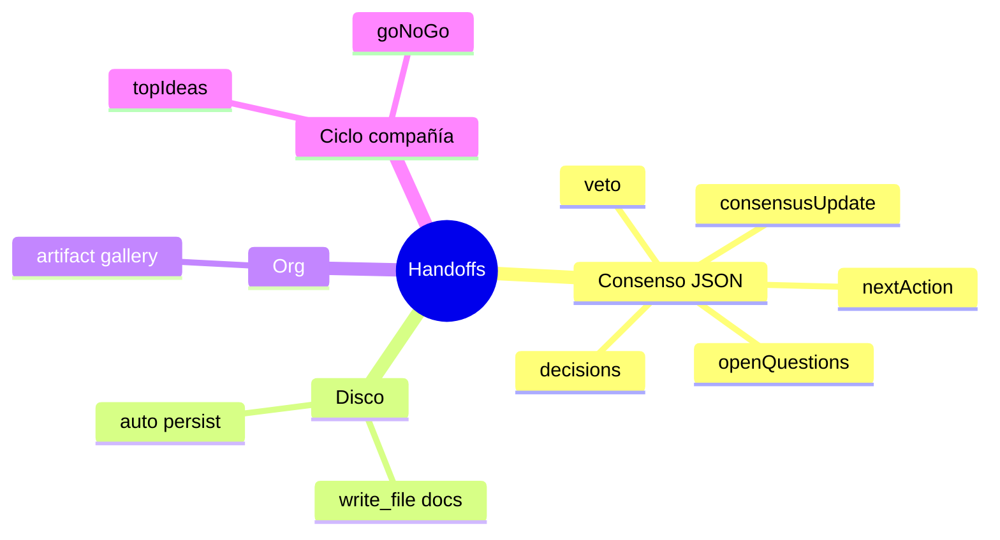

# Handoffs y flujo

Referencia exclusiva de **todos los handoffs** en Auto-Company: qué son, dónde se guardan y cómo afectan la ejecución.

---

## Tabla de contenidos

1. [Visión general del pipeline](#visión-general-del-pipeline)
2. [Handoff de consenso (por paso de agente)](#handoff-de-consenso-por-paso-de-agente)
3. [Entregables en disco (write_file)](#entregables-en-disco-write_file)
4. [Artefactos de departamento](#artefactos-de-departamento)
5. [Memoria tenant vs producto](#memoria-tenant-vs-producto)
6. [Handoffs de ciclo autónomo](#handoffs-de-ciclo-autónomo)
7. [VETO de Munger](#veto-de-munger)
8. [Formatos por tipo de departamento](#formatos-por-tipo-de-departamento)
9. [Estados de entregable en la UI](#estados-de-entregable-en-la-ui)
10. [Qué NO es un handoff de plataforma](#qué-no-es-un-handoff-de-plataforma)

---

## Visión general del pipeline



Al **completar** un run con producto en scope, `processConvergenceAfterRun`:

1. Recorre `_history` del run.
2. Extrae handoff JSON de cada paso.
3. Append a consenso del producto (una revisión por paso).
4. Opcionalmente persiste markdown en `docs/{rol}/`.
5. Crea artefactos en galería del departamento si aplica.

---

## Handoff de consenso (por paso de agente)

**El handoff principal.** Cada agente en un flujo con producto debe cerrar con:

```json
{
  "consensusUpdate": "<markdown del paso>",
  "nextAction": "<siguiente acción>",
  "decisions": [{ "by": "agent-name", "what": "...", "why": "..." }],
  "openQuestions": ["..."],
  "veto": null
}
```

### Campos parseados

| Campo | Parser | Efecto en el flujo |
|-------|--------|-------------------|
| `consensusUpdate` | `product-consensus.ts` | Cuerpo de la revisión; visible en Producto → Consenso → Revisiones |
| `nextAction` | Igual + `product-run-closure` | Próximo foco; detecta ciclos atascados si se repite |
| `decisions` | Igual | Lista de decisiones en la revisión |
| `openQuestions` | Igual | Pendientes explícitos |
| `veto` | Igual + Munger gate | Si `by` + `reason` válidos → run puede detenerse |

Si **falta** el bloque JSON, el sistema usa el markdown fuera del fence como contenido (`stripConsensusJsonBlocks` fallback) — pierdes campos estructurados.

### Cadena entre agentes



El agente siguiente **lee** `consensus.md` del producto y el historial de revisiones — no un JSON `DesignHandoff` custom.

---

## Entregables en disco (write_file)

Segundo tipo de handoff: **archivo persistente** en el workspace.

| Mecanismo | Cuándo | Ruta |
|-----------|--------|------|
| Agente usa `write_file` | Herramienta explícita | `docs/{rol}/timestamp-workflow.md` |
| Auto-persist | Sin write_file y sin doc previo | Misma convención vía `persistHandoffAsAgentDoc` |

`agentDocsPath(agentName)` mapea prefijo del nombre:

- `research-*` → `docs/research/`
- `ui-*` → `docs/ui/`
- `marketing-*` → `docs/marketing/`
- `design-lead` → `docs/` (prefijo `design` no mapeado)

**Efecto:** UI muestra `saved_to_disk` en último run; no se duplica persist si ya hubo write_file.

---

## Artefactos de departamento

Tercer destino: **galería Org** (`persistOrgUnitHandoffsFromRun`).

- Tipo inferido por agente: `design-lead` → `design`, `copy-manager` → `copy`, etc.
- Body = output completo del paso (markdown + JSON).
- Visible en ficha del departamento → Galería.
- Requiere run vinculado a producto + org unit.



---

## Memoria tenant vs producto

| Handoff / memoria | Scope | Dónde editas | Quién escribe |
|-------------------|-------|--------------|---------------|
| **Consenso producto** | Un producto | Producto → Consenso | Cada paso de agente (JSON) |
| **Consenso tenant** | Toda la compañía | Depuración → Consenso | Ciclos autónomos / CEO |
| **Shared memory run** | Un run | Interno worker | Engine entre pasos |

No mezcles: el handoff JSON de un paso de marketing **no** reemplaza el consenso global de la compañía.

---

## Handoffs de ciclo autónomo

Reglas extra inyectadas en ciclos de compañía (`convergencePromptSection`):

| Ciclo | Campo JSON / memoria | Efecto |
|-------|----------------------|--------|
| 1 | `topIdeas[]` (3 títulos) | Alimenta pipeline de ideas |
| 2 | `goNoGo`: `"GO"` / `"NO-GO"` | Bootstrap o descarta producto |
| 3+ | Artefactos reales obligatorios | No solo discusión |
| Cualquiera | `revenueUsd`, `productSlug`, … | Enriquecimiento structured-memory |

Estos campos se extraen con `collectJsonObjects` / `structured-memory.ts`, además del handoff de consenso estándar.

---

## VETO de Munger

Handoff especial — solo agentes de control (`critic-munger` o gate Munger en Catalog Studio):

```json
{
  "veto": {
    "by": "critic-munger",
    "reason": "Unit economics fail at current CAC assumptions."
  }
}
```

**Efectos:**

- Catalog Studio: bloquea **Aprobar y aplicar** si Munger veta la propuesta.
- Run de workflow: `_stoppedByVeto` puede detener convergencia posterior.
- Visible en revisión como **VETO** destacado.

---

## Formatos por tipo de departamento

Además del JSON de consenso, las plantillas sugieren **contenido** dentro de `consensusUpdate`:

| Dept / agente | Contenido esperado en markdown |
|---------------|-------------------------------|
| Marketing / copy | Copy listo, CTAs, tono según design.md |
| Marketing / community | Calendario + posts; hooks/hashtags pueden ir en markdown o bullets |
| Marketing / design-lead | Brief UX + tokens referenciados |
| Product studio / fullstack | Notas de implementación, paths de código |
| SEO / content | Briefs, keywords, estructura H1-H3 |

Ninguno sustituye el wrapper JSON de consenso.

---

## Estados de entregable en la UI

Tras un run, `product-last-run.ts` clasifica:

| Estado | Significado |
|--------|-------------|
| `saved_to_disk` | Al menos un paso usó write_file o doc persistido |
| `handoff_only` | Hay output / JSON pero sin archivos en workspace |
| `missing` | Sin output útil |
| `no_docs_and_weak_handoff` | Sin docs ni JSON estructurado — entregables perdidos |
| `partial_handoff` | Algunos pasos con JSON, otros no |

Usa estos indicadores en **Mis encargos** y vista de producto para auditar calidad de handoffs.

---

## Qué NO es un handoff de plataforma

Esquemas de IAs externas **no parseados**:

- `DesignHandoff` / `schema.org`
- JSON con `componentName`, `layout`, `children[]` como cierre único
- Cualquier JSON sin `consensusUpdate` / `nextAction` / `veto` / `decisions`

**Puedes** incluirlos como anexo dentro del markdown del brief — son documentación para humanos o `fullstack-dhh`, no memoria del motor.

### Resumen rápido



**Regla de oro:** markdown entregable + JSON de consenso al final. Todo lo demás es complemento.
