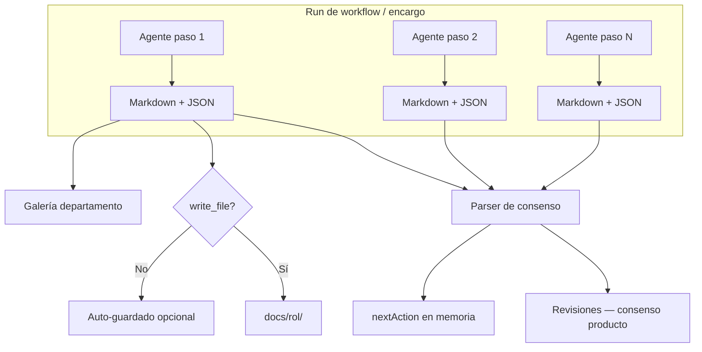
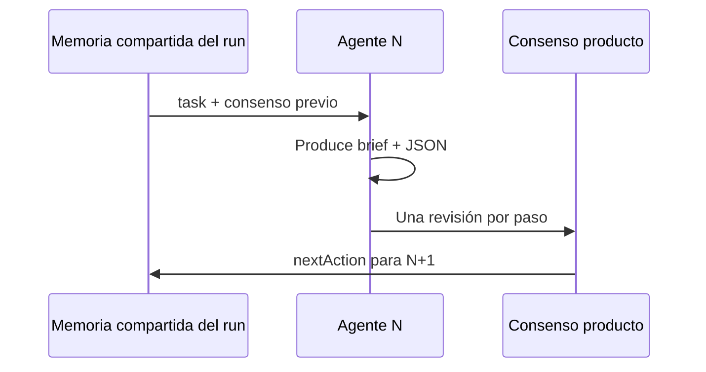
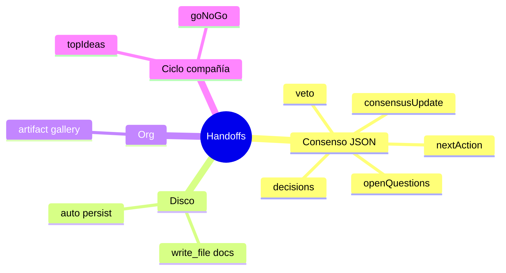

# Handoffs y flujo

Referencia de **todos los handoffs** en Auto-Company: qué son, dónde se guardan y cómo afectan la ejecución.

---

## Tabla de contenidos

1. [Visión general del pipeline](#visión-general-del-pipeline)
2. [Handoff de consenso (por paso de agente)](#handoff-de-consenso-por-paso-de-agente)
3. [Entregables en disco (write_file)](#entregables-en-disco-write_file)
4. [Artefactos de departamento](#artefactos-de-departamento)
5. [Memoria tenant vs producto](#memoria-tenant-vs-producto)
6. [Handoffs de ciclo autónomo](#handoffs-de-ciclo-autónomo)
7. [VETO de Munger](#veto-de-munger)
8. [Formatos por tipo de departamento](#formatos-por-tipo-de-departamento)
9. [Estados de entregable en la UI](#estados-de-entregable-en-la-ui)
10. [Qué NO es un handoff de plataforma](#qué-no-es-un-handoff-de-plataforma)

---

## Visión general del pipeline



Al **completar** un run con producto en scope, el motor:

1. Recorre el historial de pasos del run.
2. Extrae el bloque JSON de consenso de cada output.
3. Añade **una revisión por paso** al consenso del producto.
4. Persiste markdown en `docs/{rol}/` si el agente no usó `write_file`.
5. Crea artefactos en galería del departamento cuando hay Org Unit vinculado.

---

## Handoff de consenso (por paso de agente)

**El handoff principal.** Cada agente en un flujo con producto debe cerrar con:

```json
{
  "consensusUpdate": "<markdown del paso>",
  "nextAction": "<siguiente acción>",
  "decisions": [{ "by": "agent-name", "what": "...", "why": "..." }],
  "openQuestions": ["..."],
  "veto": null
}
```

### Campos que la plataforma interpreta

| Campo | Efecto |
|-------|--------|
| `consensusUpdate` | Cuerpo de la revisión; visible en Consenso del producto → **Revisiones** |
| `nextAction` | Próximo foco; detección de ciclos atascados si se repite |
| `decisions` | Lista de decisiones en la revisión |
| `openQuestions` | Pendientes explícitos |
| `veto` | Si `by` + `reason` válidos → puede detener el run o bloquear convergencia |

El parser busca objetos JSON en el output (bloques fenced o embebidos) y toma el **primer objeto** con al menos uno de esos campos reconocidos.

Si **falta** el bloque JSON, el sistema usa el markdown fuera de fences como contenido — pierdes campos estructurados.

### Cadena entre agentes



El agente siguiente **lee** `consensus.md` del producto y el historial de revisiones — no un JSON `DesignHandoff` custom.

---

## Entregables en disco (write_file)

Segundo tipo de handoff: **archivo persistente** en el workspace del producto.

| Mecanismo | Cuándo | Ruta |
|-----------|--------|------|
| Agente usa `write_file` | Herramienta explícita bajo `docs/` | `docs/{rol}/…` |
| Auto-persist | Sin write_file en el paso | Misma convención al cerrar el run |

Prefijos de agente → carpeta:

| Prefijo | Carpeta |
|---------|---------|
| `research-*` | `docs/research/` |
| `ui-*` | `docs/ui/` |
| `marketing-*` | `docs/marketing/` |
| `fullstack-*` | `docs/fullstack/` |
| *(otros prefijos de rol)* | `docs/{prefijo}/` o `docs/` fallback |
| `design-lead` | `docs/` (prefijo `design` no mapeado) |

**Efecto:** si el paso ya escribió con `write_file`, no se duplica el auto-guardado.

---

## Artefactos de departamento

Tercer destino: **galería Org** del departamento vinculado al producto.

- Tipo inferido por agente: `design-lead` → `design`, `copy-manager` → `copy`, etc.
- Body = output completo del paso (markdown + JSON).
- Visible en departamento → Configuración → **Design & artifacts**.
- Requiere producto con `orgUnitId` y run completado.

---

## Memoria tenant vs producto

| Handoff / memoria | Scope | Dónde editas | Quién escribe |
|-------------------|-------|--------------|---------------|
| **Consenso producto** | Un producto | Depuración → Consenso (producto) | Cada paso de agente (JSON) |
| **Consenso tenant** | Toda la compañía | Depuración → Consenso (`/debug/consensus`) | Último agente del ciclo autónomo / CEO |
| **Memoria del run** | Un run | Interno (no editable) | Motor entre pasos |

No mezcles: el handoff JSON de un paso de marketing **no** reemplaza el consenso global de la compañía. Tras runs con producto, el `nextAction` del producto **no** se filtra al consenso tenant.

---

## Handoffs de ciclo autónomo

Reglas extra en ciclos de compañía (prompts de convergencia + memoria estructurada):

| Ciclo | Campo JSON / memoria | Efecto |
|-------|----------------------|--------|
| 1 | `topIdeas[]` (3 títulos) | Alimenta pipeline de ideas |
| 2 | `goNoGo`: `"GO"` / `"NO-GO"` | Bootstrap o descarta producto (según workflow) |
| 3+ | Artefactos reales obligatorios | No solo discusión |
| Cualquiera | `revenueUsd`, `productSlug`, … | Enriquecimiento de memoria estructurada |

Estos campos se extraen además del handoff de consenso estándar.

---

## VETO de Munger

Handoff especial — agentes de control (`critic-munger`) o gate Munger en estudios:

```json
{
  "veto": {
    "by": "critic-munger",
    "reason": "Unit economics fail at current CAC assumptions."
  }
}
```

**Efectos:**

- **Catalog Studio / Org Studio:** bloquea **Aprobar y aplicar** si Munger no aprueba la propuesta.
- **Run de workflow:** `_stoppedByVeto` puede cancelar convergencia; error `VETO:…` en el run.
- Visible en revisión como **VETO** destacado y banner en War room.

---

## Formatos por tipo de departamento

Además del JSON de consenso, las plantillas sugieren **contenido** dentro de `consensusUpdate`:

| Dept / agente | Contenido esperado en markdown |
|---------------|-------------------------------|
| Marketing / copy | Copy listo, CTAs, tono según design.md |
| Marketing / community | Calendario + posts; hooks/hashtags en markdown |
| Marketing / design-lead | Brief UX + tokens referenciados |
| Product studio / fullstack | Notas de implementación, paths de código |
| SEO / content | Briefs, keywords, estructura H1-H3 |

Ninguno sustituye el wrapper JSON de consenso.

---

## Estados de entregable en la UI

Tras un run con producto, la traza del último run clasifica **cada paso**:

| Estado | Significado |
|--------|-------------|
| `saved_to_disk` | Al menos un paso usó write_file o doc persistido |
| `handoff_only` | Hay output / JSON pero sin archivos en workspace |
| `missing` | Sin output útil |

Diagnósticos agregados del run (códigos internos en `buildProductLastRunDiagnosis`):

| Diagnóstico | Significado |
|-------------|-------------|
| `ok` | Pasos con output; handoffs estructurados coherentes |
| `partial_handoff` | Algunos pasos con JSON estructurado (`consensusUpdate`/`nextAction`), otros solo texto |
| `no_docs_and_weak_handoff` | Sin archivos en workspace ni JSON estructurado en los pasos |
| `no_docs_on_disk` | Hay handoff JSON pero ningún doc persistido |
| `munger_veto` | Run cancelado por veto |
| `run_failed` / `run_in_progress` | Fallo o aún en curso |
| `empty_agent_output` | Pasos sin output útil |

**Dónde verlo:** War room → **Salud de entregables**; Consenso del producto → panel del último run. **Mis encargos** muestra informes y documentos, no estos códigos de estado por paso.

---

## Qué NO es un handoff de plataforma

Esquemas de IAs externas **no parseados** como consenso:

- `DesignHandoff` / `schema.org`
- JSON con `componentName`, `layout`, `children[]` como cierre único
- Cualquier JSON sin campos de consenso reconocidos

**Puedes** incluirlos como anexo dentro del markdown del brief — son documentación para humanos o `fullstack-dhh`, no memoria del motor.

### Resumen rápido



**Regla de oro:** markdown entregable + JSON de consenso al final. Todo lo demás es complemento.
