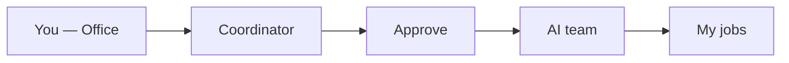
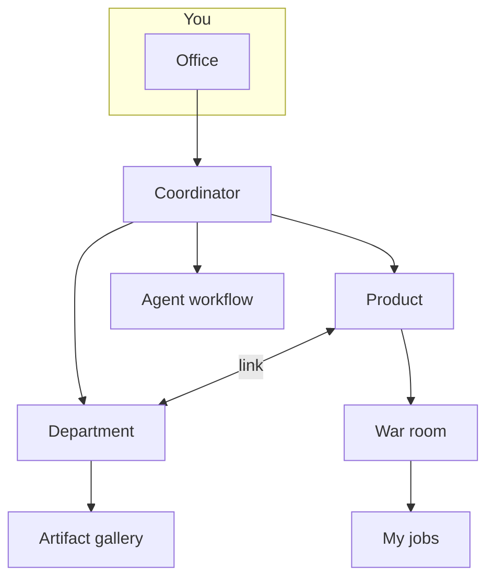

# User manual — Your virtual office with AI agents

Welcome. This manual is your **entry point**: quick start, platform map, and links to detailed topic guides. No programming or infrastructure knowledge required.

---

## Quick start (Office)

If you just logged in, start here. In **five minutes** you can complete your first job.

### Step 1 — Open the Office

After login, open **Home** in the sidebar (your **Office**). You will see the **Coordinator** chat — your single entry point to the agent team.

### Step 2 — Say what you need

Write in natural language, as you would to a project lead:

- *“Research whether a invoicing SaaS for freelancers in Mexico makes sense”*
- *“Draft three LinkedIn posts for our product launch”*
- *“Review competitor X’s pricing proposal”*

You can also use **Quick services**: ready-made templates (discovery, idea validation, feature sprint…) editable before launch.

### Step 3 — Choose scope (optional)

| Scope | When |
|-------|------|
| **General exploration** | New ideas without a specific product |
| **One product** | That product’s context, memory, and code |
| **One department** | Department agents, `design.md`, and deliverables |

### Step 4 — Review and approve

The Coordinator proposes a **team plan**, deliverables, time, and cost. Click **Approve and run** — nothing runs without your OK.

### Step 5 — Track and collect

- **War room** — live progress.
- **My jobs** — summary and documents when done.

> By default everything is **on demand**. Automatic schedules are optional (see Workflows guide).

---

## Platform map and guides

Each topic has its **own guide** with diagrams and detail. Open it from **Articles** in Help or from the links below.

### Guides by topic

| Topic | What you will find | Open |
|-------|-------------------|------|
| **Office and jobs** | Coordinator, scope, My jobs, War room | [/help/guia-oficina](/help/guia-oficina) |
| **Products** | Lifecycle, opportunities, per-product memory | [/help/guia-productos](/help/guia-productos) |
| **Departments** | Org Studio, `design.md`, tokens, gallery | [/help/guia-departamentos](/help/guia-departamentos) |
| **AI team and skills** | Agents, skills, Catalog Studio | [/help/guia-equipo-ia](/help/guia-equipo-ia) |
| **Workflows and schedules** | Playbooks, timers, cycle GO/NO-GO | [/help/guia-flujos](/help/guia-flujos) |
| **How to build agents** | System prompt, `docs/` folders, JSON handoff | [/help/como-construir-agentes](/help/como-construir-agentes) |
| **Handoffs and flow** | Handoff types and execution effects | [/help/handoffs](/help/handoffs) |

### How it fits together

**Practical rule:** start with **Office + Products**. Add **departments** when you need unified brand and dedicated teams. Use **workflows** for repeatable processes.

### Cross-cutting topics (summary)

| Topic | Where in the app | Related guide |
|-------|------------------|---------------|
| Company memory | Debug → Consensus | [Products](/help/guia-productos) |
| Per-product memory | Product → Consensus | [Products](/help/guia-productos) |
| GO/NO-GO decisions | Debug → Decisions | [Workflows](/help/guia-flujos) |
| LLM settings, limits, integrations | Settings (admin) | — |
| Human team and roles | Team (admin) | — |

---

## Frequently asked questions

### Do agents run things without my permission?

Not in **on demand** mode. You always see a plan and click **Approve and run**. Automatic schedules are opt-in.

### What is the difference between Office and War room?

- **Office** — request and plan work (any scope).
- **War room** — follow one **specific product** live.

### Do I need a department to get started?

No. **Office + Products** is enough. Departments help with brand, artifacts, and specialized teams.

### What is Munger and VETO?

**Risk review** before creating departments or applying Catalog Studio proposals. Serious flaws require adjustments before you can continue.

### Where do I see AI spend?

**Office** (month KPIs) and **Settings → Limits**. Each job shows estimated cost before approval.

### What if a job fails?

Check **My jobs** or **Runs**, read the error, adjust the brief, and retry. Ask your admin about limits and models if it keeps failing.

### How do I build a marketing or design agent?

Read [/help/como-construir-agentes](/help/como-construir-agentes) and [/help/handoffs](/help/handoffs). Do not use invented JSON like `DesignHandoff` — the platform expects **consensus** handoff.

---

*Something unclear? Ask the Coordinator in the Office: “Explain how to create a marketing department” — it will guide you inside the app.*
