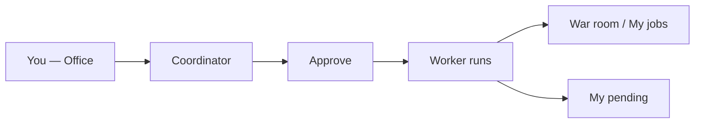
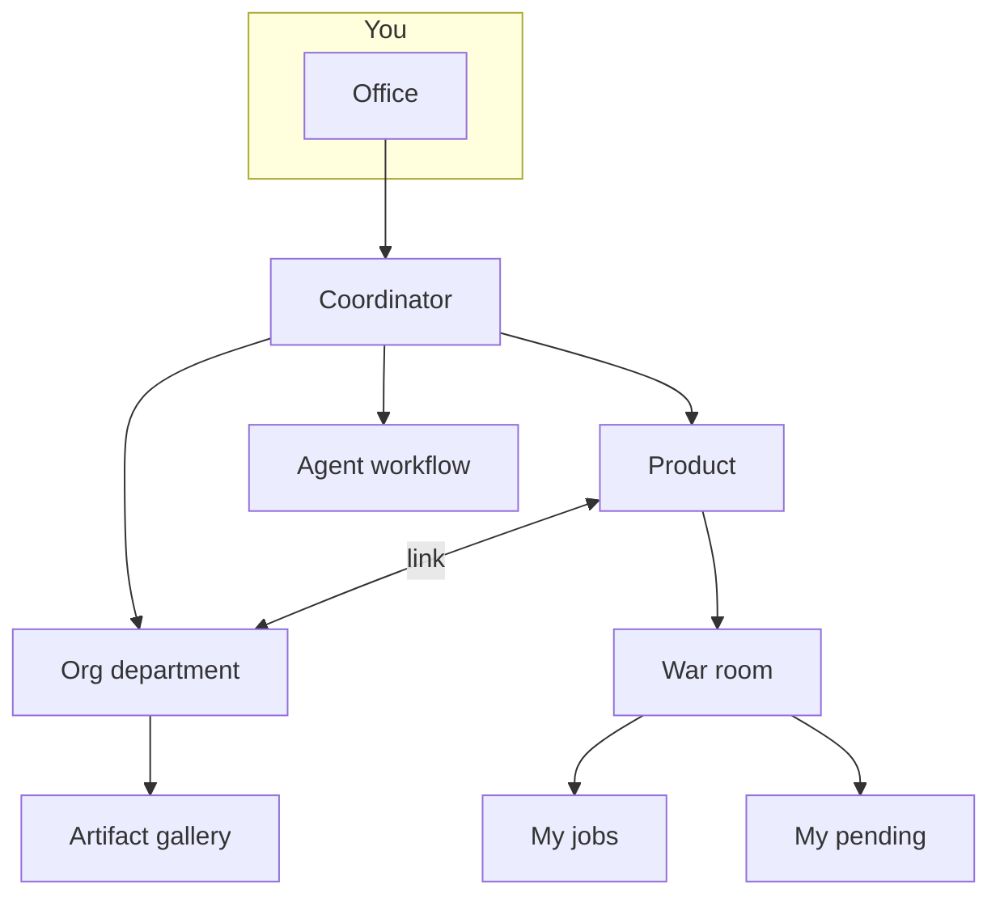

# User manual — Your virtual office with AI agents

Welcome. This manual is your **entry point**: quick start, platform map, and links to detailed topic guides. No programming or infrastructure required.

---

## Table of contents

1. [Quick start (Office)](#quick-start-office)
2. [Platform map and guides](#platform-map-and-guides)
3. [Frequently asked questions](#frequently-asked-questions)

---

## Quick start (Office)

If you just signed in, start here. In **five minutes** you can complete your first job.

### Step 1 — Open the Office

After **tenant** login, the app lands on **Operations** (`/ops`). Open **Home** in the sidebar (`/office`) for the **Coordinator** chat, monthly KPIs, department floor plan, and **Quick services**.

The Office mode indicator shows **On demand**, **Scheduled tasks**, or **Autonomous mode** depending on active rules and any legacy Meta (`meta_dynamic`) rules.

### Step 2 — Say what you need

Write in natural language, as you would to a project lead:

- *“Research whether a invoicing SaaS for freelancers in Mexico makes sense”*
- *“Draft three LinkedIn posts for our product launch”*
- *“Review competitor X’s pricing proposal”*

You can also use **Quick services**: ready templates (discovery, idea validation, feature sprint…) that preload the chat — edit before planning.

Click **Plan team** (or send and ask for a plan) so the Coordinator proposes team, deliverables, time, and cost.

### Step 3 — Narrow context (optional)

| Where | What you control |
|-------|------------------|
| **Main Office** | **Department** selector — limits agents, `design.md`, and dept. pipeline |
| **Department room** (`/org-units/:id`) or **product War room** | **Scope** selector — general exploration vs. a specific product |
| **Coordinator proposal** | Shows inferred scope (product name or “General exploration”) before approve |

If the task fits a product but you have not picked one, the Coordinator may **ask you** before proposing the plan.

### Step 4 — Review and approve

Click **Approve and run** — nothing runs without your OK. If roles are missing from your catalog, you will see links to create them under **Specialist templates** (`/settings/specialists`).

### Step 5 — Follow and collect

After approval, the app opens **War room** (with product when applicable). You can also use:

- **My jobs** (`/office/encargos`) — summary, final report, documents per agent
- **My pending** (`/office/pendientes`) — GO/NO-GO decisions with sidebar badge
- **Office archive** (`/office/archive`) — deliverables indexed by department/product

> By default everything is **on demand**. Automatic schedules are optional (see the Workflows guide).

---

## Platform map and guides

Each topic has its **own guide** with diagrams and detail. Open from **Articles** in Help or the links below.

### Guides by topic

| Topic | What you will find | Open |
|-------|-------------------|------|
| **Office and jobs** | Coordinator, KPIs, My pending, My jobs, War room, OpenCode | [/help/guia-oficina](/help/guia-oficina) |
| **Products** | Opportunities, active products, desk, per-product settings | [/help/guia-productos](/help/guia-productos) |
| **Departments** | Org Studio, Staff, virtual rooms vs Org Units | [/help/guia-departamentos](/help/guia-departamentos) |
| **Specialist templates** | Hire/configure roles and skills | [/help/guia-equipo-ia](/help/guia-equipo-ia) → `/settings/specialists` |
| **Procedures** | Playbooks, AI Studio, schedules, Operations | [/help/guia-flujos](/help/guia-flujos) → `/settings/procedures` |
| **Tenant settings** | LLM, integrations, MCP, human team, client delivery | [/help/guia-configuracion](/help/guia-configuracion) |
| **Daily pilot workflow** | 30–60 min routine: job → client delivery | [/help/guia-piloto](/help/guia-piloto) |

### Office navigation (main menu)

| Entry | Route |
|-------|------|
| Home | `/office` |
| **My pending** (badge) | `/office/pendientes` |
| My jobs | `/office/encargos` |
| Archive | `/office/archive` |
| War room | `/war-room` |
| Products | `/products` |
| Departments | `/org-units` |

### How it fits together

**Practical rule:** start with **Office + Products**. Add **departments** (Org Studio) when you need unified brand and dedicated teams. Use **workflows** for repeatable processes. **Settings** when integrating GitHub, SMTP, or human team.

### Cross-cutting topics (summary)

| Topic | Where in the app | Related guide |
|-------|------------------|---------------|
| Company memory | Debug office → Consensus (`/debug/consensus`) | [Products](/help/guia-productos) |
| Product memory | Consensus (`/debug/products/:id/consensus`) or product Settings | [Products](/help/guia-productos) |
| GO/NO-GO decisions | **My pending** (`/office/pendientes`) or job detail | [Office](/help/guia-oficina#my-pending-decisions) |
| Decisions (advanced view) | Debug office → Decisions (`/debug/decisions`) | [Workflows](/help/guia-flujos) |
| Operations / meta-orchestrator | Debug office → Operations (`/ops`) | [Workflows](/help/guia-flujos#operations-ops) |
| LLM, limits, schedules | Settings (`/settings`) — tenant admin | [Settings](/help/guia-configuracion) |
| Human team and roles | Debug office → Team (`/debug/team`) | [Settings](/help/guia-configuracion#human-team) |

---

## Frequently asked questions

### Do agents run things without my permission?

Not in **on demand** mode. You always see a plan and click **Approve and run**. Automatic schedules are opt-in under **Settings → Schedules** (`/settings?tab=schedules`).

### What is the difference between Office and War room?

- **Office** — request and plan work (any scope).
- **War room** — follow a **specific product** or the portfolio live (agents, runs, deliverable health, contextual chat).

### My pending vs Debug Decisions?

**My pending** (`/office/pendientes`) is the daily inbox with badge. **Decisions** under debug (`/debug/decisions`) is an advanced view — it does not replace the inbox.

### Do I need a department to start?

No. **Office + Products** is enough. Departments created in Org Studio help with brand, artifacts, and dedicated teams.

### What is Munger and VETO?

**Risk review** before applying proposals in Catalog Studio or Org Studio, or during runs with `critic-munger`. On serious failure you must adjust before continuing (or the run may stop).

### Where do I see AI spend?

**Office** (“Monthly spend” KPI) and **Settings → Limits** (`/settings?tab=limits`). Each job shows estimated cost before approval.

### What if a job fails?

**My jobs** or **Debug → Runs**, read the error, adjust the brief, retry. Review limits and models with your admin if it persists.

### How do I build a marketing or design agent?

Read [/help/guia-equipo-ia#cómo-construir-agentes](/help/guia-equipo-ia#cómo-construir-agentes) and [/help/guia-equipo-ia#handoffs-and-flow](/help/guia-equipo-ia#handoffs-and-flow). Do not invent JSON like `DesignHandoff` — the platform expects the **consensus** handoff.

---

*Something unclear? Ask the Coordinator in the Office: “Explain how to create a marketing department” — it will guide you inside the app.*
