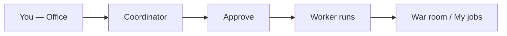
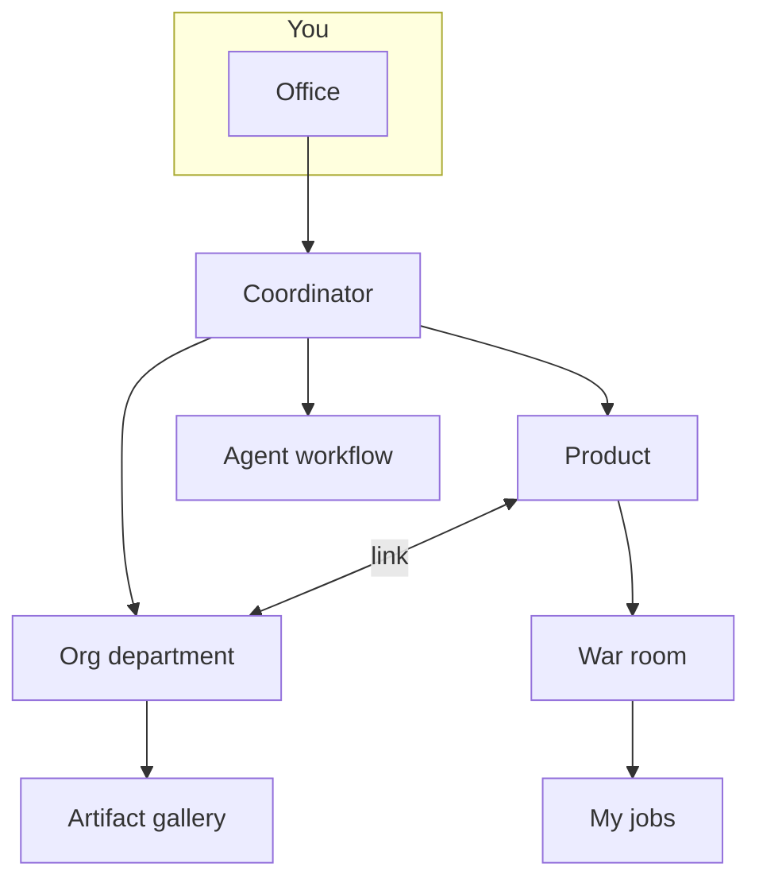

# User manual — Your virtual office with AI agents

Welcome. This manual is your **entry point**: quick start, platform map, and links to detailed topic guides. No programming or infrastructure knowledge required.

---

## Quick start (Office)

If you just logged in, start here. In **five minutes** you can complete your first job.

### Step 1 — Open the Office

After **tenant** login, the app sends you to **Operations** (`/ops`). Open **Home** in the sidebar (`/office`) for the **Coordinator** chat, month KPIs, the department floor plan, and **Quick services**.

The mode pill on the Office shows **On demand**, **Scheduled tasks**, or **Autonomous mode** depending on active rules and any legacy Meta rules (`meta_dynamic`).

### Step 2 — Say what you need

Write in natural language, as you would to a project lead:

- *“Research whether an invoicing SaaS for freelancers in Mexico makes sense”*
- *“Draft three LinkedIn posts for our product launch”*
- *“Review competitor X’s pricing proposal”*

You can also use **Quick services**: ready-made templates (discovery, idea validation, feature sprint…) that seed the chat — edit before planning.

Click **Plan team** (or send and request a plan) so the Coordinator proposes team, deliverables, time, and cost.

### Step 3 — Narrow context (optional)

| Where | What you control |
|-------|------------------|
| **Main Office** | **Department** selector — limits agents, `design.md`, and dept pipeline |
| **Department room** (`/org-units/:id`) or product **War room** | **Scope** selector — general exploration vs. one product |
| **Coordinator proposal** | Shows inferred scope (product name or “General exploration”) before approval |

If the task fits a product but you have not picked one, the Coordinator may **ask** before proposing the plan.

### Step 4 — Review and approve

Click **Approve and run** — nothing executes without your OK. If roles are missing from your catalog, you will get links to create them under **AI team**.

### Step 5 — Track and collect

After approval, the app sends you to **War room** (with a product when applicable). You can also use:

- **My jobs** (`/office/encargos`) — summary, final report, and per-agent documents
- **Office archive** (`/office/archive`) — deliverables indexed by department/product

> By default everything is **on demand**. Automatic schedules are optional (see Workflows guide).

---

## Platform map and guides

Each topic has its **own guide** with diagrams and detail. Open it from **Articles** in Help or from the links below.

### Guides by topic

| Topic | What you will find | Open |
|-------|-------------------|------|
| **Office and jobs** | Coordinator, scope, My jobs, War room, archive | [/help/guia-oficina](/help/guia-oficina) |
| **Products** | Lifecycle, opportunities, per-product memory | [/help/guia-productos](/help/guia-productos) |
| **Departments** | Org Studio, `design.md`, tokens, gallery | [/help/guia-departamentos](/help/guia-departamentos) |
| **AI team and skills** | Agents, skills, building agents, and handoffs | [/help/guia-equipo-ia](/help/guia-equipo-ia) |
| **Workflows and schedules** | Playbooks, schedules, Operations panel, and GO/NO-GO | [/help/guia-flujos](/help/guia-flujos) |

### How it fits together

**Practical rule:** start with **Office + Products**. Add **departments** (Org Studio) when you need unified brand and dedicated teams. Use **workflows** for repeatable processes.

### Cross-cutting topics (summary)

| Topic | Where in the app | Related guide |
|-------|------------------|---------------|
| Company memory | Debug office → Consensus (`/debug/consensus`) | [Products](/help/guia-productos) |
| Per-product memory | Consensus (`/debug/products/:id/consensus`) or Product settings → link | [Products](/help/guia-productos) |
| GO/NO-GO decisions | Debug office → Decisions (`/decisions`) or job detail | [Workflows](/help/guia-flujos) |
| Operations / meta-orchestrator | Debug office → Operations (`/ops`) | [Workflows](/help/guia-flujos#operations-ops) |
| LLM settings, limits, schedules | Settings tabs (tenant admin) | [Workflows](/help/guia-flujos) |
| Human team and roles | Debug office → Team (admin) | — |

---

## Frequently asked questions

### Do agents run things without my permission?

Not in **on demand** mode. You always see a plan and click **Approve and run**. Automatic schedules are opt-in under **Settings → Schedules**.

### What is the difference between Office and War room?

- **Office** — request and plan work (any scope).
- **War room** — follow one **specific product** live (agents, runs, deliverable health, contextual chat).

### Do I need a department to get started?

No. **Office + Products** is enough. Departments created in Org Studio help with brand, artifacts, and specialized teams.

### What is Munger and VETO?

**Risk review** before applying proposals in Catalog Studio or Org Studio, or during runs with `critic-munger`. Serious flaws require adjustments before you can continue (or the run may stop).

### Where do I see AI spend?

**Office** (month spend KPI) and **Settings → Limits**. Each job shows estimated cost before approval.

### What if a job fails?

Check **My jobs** or **Debug → Runs**, read the error, adjust the brief, and retry. Ask your admin about limits and models if it keeps failing.

### How do I build a marketing or design agent?

Read [/help/guia-equipo-ia#how-to-build-agents](/help/guia-equipo-ia#how-to-build-agents) and [/help/guia-equipo-ia#handoffs-and-flow](/help/guia-equipo-ia#handoffs-and-flow). Do not use invented JSON like `DesignHandoff` — the platform expects **consensus** handoff.

---

*Something unclear? Ask the Coordinator in the Office: “Explain how to create a marketing department” — it will guide you inside the app.*
