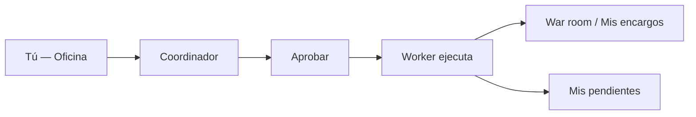
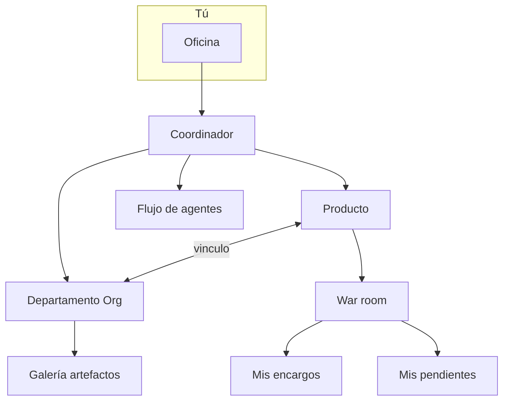

# Manual de usuario — Tu oficina virtual con agentes IA

Bienvenido. Este manual es tu **punto de entrada**: inicio rápido, mapa de la plataforma y enlaces a las guías detalladas por tema. No necesitas programación ni infraestructura.

---

## Tabla de contenidos

1. [Inicio rápido (Oficina)](#inicio-rápido-oficina)
2. [Mapa de la plataforma y guías](#mapa-de-la-plataforma-y-guías)
3. [Preguntas frecuentes](#preguntas-frecuentes)

---

## Inicio rápido (Oficina)

Si acabas de entrar, empieza aquí. En **cinco minutos** puedes completar tu primer encargo.

### Paso 1 — Entra a la Oficina

Tras iniciar sesión como **tenant**, la app te lleva a **Operaciones** (`/ops`). Abre **Inicio** en el menú lateral (`/office`) para el chat del **Coordinador**, KPIs del mes, el plano de departamentos y **Servicios rápidos**.

El indicador de modo en la Oficina muestra **Bajo demanda**, **Tareas programadas** o **Modo autónomo** según reglas activas y si queda alguna regla Meta legacy (`meta_dynamic`).

### Paso 2 — Di qué necesitas

Escribe en lenguaje natural, como hablarías con un jefe de proyectos:

- *«Investiga si tiene sentido un SaaS de facturación para freelancers en México»*
- *«Prepara tres posts de LinkedIn para el lanzamiento de nuestro producto»*
- *«Revisa la propuesta de precios del competidor X»*

También puedes usar **Servicios rápidos**: plantillas listas (discovery, validación de idea, sprint de feature…) que precargan el chat — edítalas antes de planificar.

Pulsa **Planificar equipo** (o envía y pide plan) para que el Coordinador proponga equipo, entregables, tiempo y coste.

### Paso 3 — Acota el contexto (opcional)

| Dónde | Qué controlas |
|-------|----------------|
| **Oficina principal** | Selector **Departamento** — limita agentes, `design.md` y pipeline del dept. |
| **Sala de un departamento** (`/org-units/:id`) o **War room** de un producto | Selector **Alcance** — exploración general vs. un producto concreto |
| **Propuesta del Coordinador** | Muestra el alcance inferido (nombre del producto o «Exploración general») antes de aprobar |

Si la tarea encaja con un producto pero no has elegido uno, el Coordinador puede **preguntarte** antes de proponer el plan.

### Paso 4 — Revisa y aprueba

Pulsa **Aprobar y ejecutar** — nada corre sin tu OK. Si faltan roles en tu catálogo, verás enlaces para crearlos en **Plantilla de especialistas** (`/settings/specialists`).

### Paso 5 — Sigue y recoge

Tras aprobar, la app te lleva a **War room** (con producto si aplica). También puedes usar:

- **Mis encargos** (`/office/encargos`) — resumen, informe final y documentos por agente
- **Mis pendientes** (`/office/pendientes`) — decisiones GO/NO-GO con badge en el menú
- **Archivo de la Oficina** (`/office/archive`) — entregables indexados por departamento/producto

> Por defecto todo es **bajo demanda**. Las programaciones automáticas son opcionales (ver guía de Flujos).

---

## Mapa de la plataforma y guías

Cada tema tiene su **guía propia** con diagramas y detalle. Ábrela desde **Artículos** en Ayuda o desde los enlaces de abajo.

### Guías por tema

| Tema | Qué encontrarás | Abrir |
|------|-----------------|-------|
| **Oficina y encargos** | Coordinador, KPIs, Mis pendientes, Mis encargos, War room, OpenCode | [/help/guia-oficina](/help/guia-oficina) |
| **Productos** | Oportunidades, activos, desk, configuración por producto | [/help/guia-productos](/help/guia-productos) |
| **Departamentos** | Org Studio, Personal, salas virtuales vs Org Units | [/help/guia-departamentos](/help/guia-departamentos) |
| **Plantilla de especialistas** | Contratar/configurar roles y skills | [/help/guia-equipo-ia](/help/guia-equipo-ia) → `/settings/specialists` |
| **Procedimientos** | Playbooks, AI Studio, programaciones, Operaciones | [/help/guia-flujos](/help/guia-flujos) → `/settings/procedures` |
| **Configuración tenant** | LLM, integraciones, MCP, equipo humano, entrega cliente | [/help/guia-configuracion](/help/guia-configuracion) |
| **Flujo diario piloto** | Rutina 30–60 min: encargo → entrega al cliente | [/help/guia-piloto](/help/guia-piloto) |

### Navegación Oficina (menú principal)

| Entrada | Ruta |
|---------|------|
| Inicio | `/office` |
| **Mis pendientes** (badge) | `/office/pendientes` |
| Mis encargos | `/office/encargos` |
| Archivo | `/office/archive` |
| War room | `/war-room` |
| Productos | `/products` |
| Departamentos | `/org-units` |

### Cómo encaja todo

**Regla práctica:** empieza con **Oficina + Productos**. Añade **departamentos** (Org Studio) cuando necesites marca unificada y equipos dedicados. Usa **flujos** para procesos que repites. **Configuración** cuando integres GitHub, SMTP o equipo humano.

### Temas transversales (resumen)

| Tema | Dónde en la app | Guía relacionada |
|------|-----------------|------------------|
| Memoria de compañía | Oficina de depuración → Consenso (`/debug/consensus`) | [Productos](/help/guia-productos) |
| Memoria por producto | Consenso (`/debug/products/:id/consensus`) o Configuración del producto | [Productos](/help/guia-productos) |
| Decisiones GO/NO-GO | **Mis pendientes** (`/office/pendientes`) o detalle del encargo | [Oficina](/help/guia-oficina#mis-pendientes) |
| Decisiones (vista avanzada) | Oficina de depuración → Decisiones (`/debug/decisions`) | [Flujos](/help/guia-flujos) |
| Operaciones / meta-orchestrator | Oficina de depuración → Operaciones (`/ops`) | [Flujos](/help/guia-flujos#operaciones-ops) |
| Configuración LLM, límites, programaciones | Configuración (`/settings`) — admin tenant | [Configuración](/help/guia-configuracion) |
| Equipo humano y roles | Oficina de depuración → Equipo (`/debug/team`) | [Configuración](/help/guia-configuracion#equipo-humano) |

---

## Preguntas frecuentes

### ¿Los agentes ejecutan cosas sin mi permiso?

No, en modo **bajo demanda**. Siempre ves un plan y pulsas **Aprobar y ejecutar**. Las programaciones automáticas son opt-in en **Configuración → Programaciones** (`/settings?tab=schedules`).

### ¿Cuál es la diferencia entre Oficina y War room?

- **Oficina** — pedir y planificar trabajo (cualquier alcance).
- **War room** — seguir un **producto concreto** o el portfolio en vivo (agentes, runs, salud de entregables, chat contextualizado).

### ¿Mis pendientes o Decisiones en depuración?

**Mis pendientes** (`/office/pendientes`) es el inbox diario con badge. **Decisiones** en depuración (`/debug/decisions`) es vista avanzada — no sustituye el inbox.

### ¿Necesito un departamento para empezar?

No. Basta **Oficina + Productos**. Los departamentos creados en Org Studio ayudan con marca, artefactos y equipos especializados.

### ¿Qué es Munger y el VETO?

Revisión de **riesgos** antes de aplicar propuestas en Catalog Studio u Org Studio, o durante runs con `critic-munger`. Si hay fallo grave, debes ajustar antes de continuar (o el run puede detenerse).

### ¿Dónde veo cuánto gasté en IA?

**Oficina** (KPI «Gasto del mes») y **Configuración → Límites** (`/settings?tab=limits`). Cada encargo muestra coste estimado antes de aprobar.

### ¿Qué hago si un encargo falla?

**Mis encargos** o **Depuración → Ejecuciones**, lee el error, ajusta el brief y reintenta. Revisa límites y modelos con tu admin si persiste.

### ¿Cómo construyo un agente de marketing o diseño?

Lee [/help/guia-equipo-ia#cómo-construir-agentes](/help/guia-equipo-ia#cómo-construir-agentes) y [/help/guia-equipo-ia#handoffs-y-flujo](/help/guia-equipo-ia#handoffs-y-flujo). No uses JSON inventado tipo `DesignHandoff` — la plataforma espera el handoff de **consenso**.

---

*¿Algo no está claro? Pide al Coordinador en la Oficina: «Explícame cómo crear un departamento de marketing» — te guiará dentro de la app.*
