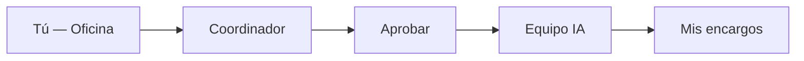
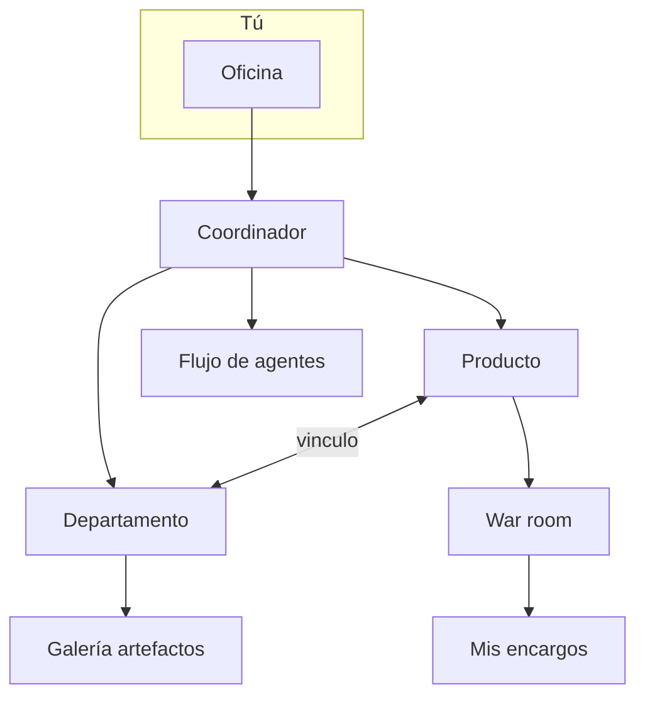

# Manual de usuario — Tu oficina virtual con agentes IA

Bienvenido. Este manual es tu **punto de entrada**: inicio rápido, mapa de la plataforma y enlaces a las guías detalladas por tema. No necesitas programación ni infraestructura.

---

## Inicio rápido (Oficina)

Si acabas de entrar, empieza aquí. En **cinco minutos** puedes completar tu primer encargo.

### Paso 1 — Entra a la Oficina

Tras iniciar sesión, abre **Inicio** en el menú lateral (es tu **Oficina**). Verás el chat del **Coordinador**, tu punto de contacto con todo el equipo de agentes.

### Paso 2 — Di qué necesitas

Escribe en lenguaje natural, como hablarías con un jefe de proyectos:

- *«Investiga si tiene sentido un SaaS de facturación para freelancers en México»*
- *«Prepara tres posts de LinkedIn para el lanzamiento de nuestro producto»*
- *«Revisa la propuesta de precios del competidor X»*

También puedes usar **Servicios rápidos**: plantillas listas (discovery, validación de idea, sprint de feature…) que puedes editar antes de lanzar.

### Paso 3 — Elige el alcance (opcional)

| Alcance | Cuándo |
|---------|--------|
| **Exploración general** | Ideas nuevas sin producto concreto |
| **Un producto** | Contexto, memoria y código de ese producto |
| **Un departamento** | Agentes, `design.md` y entregables del dept. |

### Paso 4 — Revisa y aprueba

El Coordinador te propone **plan de equipo**, entregables, tiempo y coste. Pulsa **Aprobar y ejecutar** — nada corre sin tu OK.

### Paso 5 — Sigue y recoge

- **War room** — progreso en vivo.
- **Mis encargos** — resumen y documentos al terminar.

> Por defecto todo es **bajo demanda**. Las programaciones automáticas son opcionales (ver guía de Flujos).

---

## Mapa de la plataforma y guías

Cada tema tiene su **guía propia** con diagramas y detalle. Ábrela desde **Artículos** en Ayuda o desde los enlaces de abajo.

### Guías por tema

| Tema | Qué encontrarás | Abrir |
|------|-----------------|-------|
| **Oficina y encargos** | Coordinador, alcance, Mis encargos, War room | [/help/guia-oficina](/help/guia-oficina) |
| **Productos** | Ciclo de vida, oportunidades, memoria por producto | [/help/guia-productos](/help/guia-productos) |
| **Departamentos** | Org Studio, `design.md`, tokens, galería | [/help/guia-departamentos](/help/guia-departamentos) |
| **Equipo IA y habilidades** | Agentes, skills, Catalog Studio | [/help/guia-equipo-ia](/help/guia-equipo-ia) |
| **Flujos y programaciones** | Playbooks, timers, GO/NO-GO de ciclo | [/help/guia-flujos](/help/guia-flujos) |
| **¿Cómo construir agentes?** | System prompt, carpetas `docs/`, handoff JSON | [/help/como-construir-agentes](/help/como-construir-agentes) |
| **Handoffs y flujo** | Tipos de handoff y efecto en ejecución | [/help/handoffs](/help/handoffs) |

### Cómo encaja todo

**Regla práctica:** empieza con **Oficina + Productos**. Añade **departamentos** cuando necesites marca unificada y equipos dedicados. Usa **flujos** para procesos que repites.

### Temas transversales (resumen)

| Tema | Dónde en la app | Guía relacionada |
|------|-----------------|------------------|
| Memoria de compañía | Depuración → Consenso | [Productos](/help/guia-productos) |
| Memoria por producto | Producto → Consenso | [Productos](/help/guia-productos) |
| Decisiones GO/NO-GO | Depuración → Decisiones | [Flujos](/help/guia-flujos) |
| Configuración LLM, límites, integraciones | Configuración (admin) | — |
| Equipo humano y roles | Equipo (admin) | — |

---

## Preguntas frecuentes

### ¿Los agentes ejecutan cosas sin mi permiso?

No, en modo **bajo demanda**. Siempre ves un plan y pulsas **Aprobar y ejecutar**. Las programaciones automáticas son opt-in.

### ¿Cuál es la diferencia entre Oficina y War room?

- **Oficina** — pedir y planificar trabajo (cualquier alcance).
- **War room** — seguir un **producto concreto** en vivo.

### ¿Necesito un departamento para empezar?

No. Basta **Oficina + Productos**. Los departamentos ayudan con marca, artefactos y equipos especializados.

### ¿Qué es Munger y el VETO?

Revisión de **riesgos** antes de crear departamentos o aplicar propuestas de Catalog Studio. Si hay fallo grave, debes ajustar antes de continuar.

### ¿Dónde veo cuánto gasté en IA?

**Oficina** (KPIs del mes) y **Configuración → Límites**. Cada encargo muestra coste estimado antes de aprobar.

### ¿Qué hago si un encargo falla?

**Mis encargos** o **Ejecuciones**, lee el error, ajusta el brief y reintenta. Revisa límites y modelos con tu admin si persiste.

### ¿Cómo construyo un agente de marketing o diseño?

Lee [/help/como-construir-agentes](/help/como-construir-agentes) y [/help/handoffs](/help/handoffs). No uses JSON inventado tipo `DesignHandoff` — la plataforma espera el handoff de **consenso**.

---

*¿Algo no está claro? Pide al Coordinador en la Oficina: «Explícame cómo crear un departamento de marketing» — te guiará dentro de la app.*
