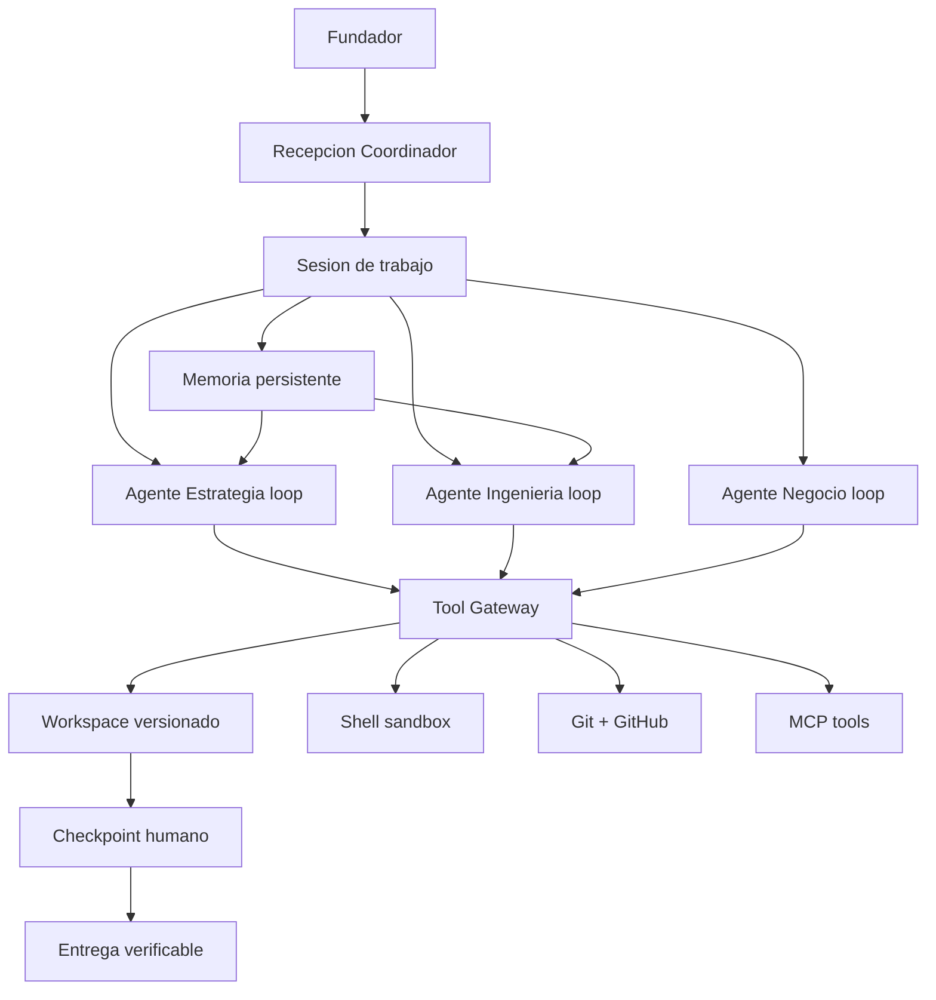
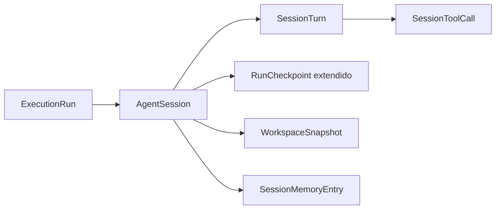

# Plan de Reingeniería — Auto-Company hacia concepto Paperclip con OpenRouter

> Estado: **EN EJECUCIÓN — Fase 0 implementada; validación E2E y siguientes fases pendientes**.
> Decisión: **APROBADO camino B — reemplazo directo del engine**. Autoriza modificar specs previas.
> Fecha: 2026-10-01. Base: branch actual + [`GAPS.md`](docs/GAPS.md:1) + [`virtual-office-design.md`](docs/product/virtual-office-design.md:1) + [`product-roadmap.md`](docs/product/product-roadmap.md:1).
>
> **Regla de seguimiento:** en cada avance de este plan, marcar inmediatamente con `[x]` cada tarea terminada, mantener `[ ]` las tareas pendientes y actualizar el estado/criterio de salida cuando corresponda. No marcar una tarea como terminada solo porque exista código: debe estar implementada y validada (tests o verificación explícita).

## 1. Diagnóstico — por qué no se siente como oficina

Tu intuición es correcta. La capa Oficina existe y está bien avanzada (planta, salas, war-room, archivo, entrega cliente), pero el motor debajo no trabaja como empleados reales.

| # | Síntoma que ves | Causa raíz en código |
|---|---|---|
| 1 | Agentes devuelven texto, no hacen trabajo | [`executeStep()`](src/core/engine.ts:787) hace [`generateText()`](src/core/engine.ts:879) con [`maxSteps`](src/core/engine.ts:886) limitado y luego una síntesis final con `Do not use tools` ([`engine.ts`](src/core/engine.ts:420)). El agente no itera, no verifica, no corrige. |
| 2 | Documentos vacíos o perdidos | Output se parsea como markdown + bloque JSON `consensusUpdate`. Si el modelo termina en tool-calls, `_history` queda vacío. Ya documentado en [`GAPS.md`](docs/GAPS.md:20). |
| 3 | War-room muestra pasos, no trabajo vivo | Eventos son `step_start` / `done` del DAG ordenado por [`topologicalSort()`](src/core/engine.ts:1513). No hay actividad intra-paso (tool-calls, lecturas, ediciones, reintentos). |
| 4 | Sin memoria de trabajo | [`sharedMemory`](prisma/schema.prisma:231) es un [`Json`](prisma/schema.prisma:231) que se pasa como prompt, no como estado versionado del loop. Consenso vive en [`TenantConsensus`](prisma/schema.prisma:334) y [`ProductConsensus`](prisma/schema.prisma:475) solo como output final. |
| 5 | OpenCode es excepción, no regla | Solo `fullstack-dhh` delega a OpenCode vía [`prepareOpencodeImplementationGate()`](src/core/engine.ts:179). El resto nunca toca código real. |
| 6 | Proveedor fragmentado | [`createLanguageModel()`](src/core/providers.ts:86) soporta OpenRouter vía OpenAI-compatible, pero Replicate va por [`runReplicateStep()`](src/core/replicate.ts:146) separado y cada agente resuelve credenciales en [`resolveCredentials()`](src/core/providers.ts:60). No hay capability routing por tool-calling. |

Conclusión: tienes una **oficina visual sobre un orquestador de documentos**. Paperclip invierte la pirámide: **sesión de trabajo con herramientas reales primero, documentos como rastro del trabajo**.

## 2. Concepto objetivo — Paperclip adaptado a tu stack

```
Encargo (Office) → Sesión de trabajo → Agentes en loop multi-turno con tools → Workspace real versionado → HITL (checkpoints) → Entrega verificable
```

Principios no negociables del nuevo concepto:

- Un encargo = una `AgentSession` viva, no un DAG estático.
- Cada agente corre un loop `pensar → actuar con tools → observar → repetir` hasta cumplir criterios de aceptación o agotar presupuesto.
- El workspace `projects/{tenant}/{encargo}/` es la fuente de verdad. Los docs en `docs/{role}/` son consecuencia, no el producto.
- OpenRouter es el único proveedor LLM. No más CLIs externos obligatorios. Los modelos se eligen por capability (tool-calling, contexto, costo).
- El humano interrumpe, aprueba, veta en cualquier turno vía [`RunCheckpoint`](prisma/schema.prisma:313) extendido.
- La UI muestra actividad viva: qué archivo lee, qué comando corre, qué edita, qué verifica.



## 3. Arquitectura destino

### 3.1 Componentes nuevos

| Componente | Responsabilidad | Reutiliza |
|---|---|---|
| `AgentSessionRuntime` en `src/core/agent-loop/` | Loop multi-turno por agente: prompt → tool-calls → exec → reinyectar → repetir hasta `done` / `need_input` / `veto` / presupuesto | [`createAgentTools()`](src/core/tools.ts:60), [`createLanguageModel()`](src/core/providers.ts:86), [`ExecutionRunEvent`](prisma/schema.prisma:285) |
| `ToolGateway` en `src/core/tools-gateway.ts` | Registro único de tools, policy, timeouts, auditoría, throttle por tenant | [`assertShellCommandAllowed()`](src/lib/shell-policy.ts:1), [`agentHasGitTools()`](src/lib/agent-tool-policy.ts:1), [`resolveSafePath()`](src/core/tools.ts:46) |
| `WorkspaceManager` en `src/lib/workspace-session.ts` | Crear, versionar, snapshot, diff, exponer árbol para UI | `projects/` layout, [`tenant-workspace.ts`](src/lib/tenant-workspace.ts:1) |
| `SessionMemory` en `src/lib/session-memory.ts` | Turnos, resúmenes rolling, handoffs agente→agente, consenso incremental | [`TenantConsensus`](prisma/schema.prisma:334), [`ProductConsensusRevision`](prisma/schema.prisma:491), [`office-encargos.ts`](src/lib/office-encargos.ts:1) |
| `ProviderRouter` en `src/core/provider-router.ts` | Elegir modelo OpenRouter por capability + costo + fallback | [`getProviderEnvConfig()`](src/core/providers.ts:17), [`estimateCostUsd()`](src/core/providers.ts:133) |
| `CheckpointHITL` extendido | Pausar loop en cualquier turno, pedir aprobación, veto, input | [`RunCheckpoint`](prisma/schema.prisma:313), [`RunCheckpointKind`](prisma/schema.prisma:299) |

### 3.2 Esquema de datos — cambios Prisma



- Nuevo [`model`](prisma/schema.prisma:224) `AgentSession`: `id`, `runId`, `agentId`, `status`, `budgetTokens`, `budgetUsd`, `maxTurns`, `acceptanceCriteria`, `workspacePath`, `currentTurn`, `summary`.
- Nuevo [`model`](prisma/schema.prisma:285) `SessionTurn`: `sessionId`, `turnNo`, `input`, `output`, `toolCallsJson`, `tokens`, `costUsd`, `startedAt`, `endedAt`.
- Nuevo [`model`](prisma/schema.prisma:266) `SessionToolCall`: `turnId`, `toolName`, `argsJson`, `resultJson`, `exitCode`, `durationMs`, `status`.
- Extender [`enum`](prisma/schema.prisma:299) `RunCheckpointKind` con `need_input`, `tool_approval`, `budget_exceeded`.
- Nuevo [`model`](prisma/schema.prisma:224) `WorkspaceSnapshot`: `sessionId`, `commitSha` o `tarballPath`, `filesChanged`, `createdAt`.
- No borrar [`ExecutionRun`](prisma/schema.prisma:224), [`ExecutionLog`](prisma/schema.prisma:266), [`ExecutionRunEvent`](prisma/schema.prisma:285). `ExecutionRun` pasa a ser contenedor de sesiones.

### 3.3 Loop de agente — pseudológica

- `runAgentSession(sessionId)`:
  - Cargar agente + skills + memoria + workspace + criterios.
  - Compilar system-prompt con rol, tools disponibles, reglas de entrega, formato de cierre.
  - Iterar hasta 25 turnos o presupuesto:
    - Llamar modelo OpenRouter con `tools` y `toolChoice: auto`.
    - Si solo texto + marcador `DONE` + artefactos verificados → cerrar.
    - Si `tool_calls` → ejecutar vía `ToolGateway`, persistir `SessionToolCall`, emitir evento SSE `tool_call` / `tool_result`, reinyectar observación.
    - Si tool sensible requiere aprobación → crear `RunCheckpoint` `tool_approval`, pausar loop, notificar Office.
    - Si veto Munger detectado → cancelar sesión y hermanas, como ya hace [`extractMungerVeto()`](src/core/engine.ts:474) pero a nivel sesión.
  - Al cerrar: sintetizar entregable, escribir a workspace, actualizar `SessionMemory`, emitir `session_completed`.

### 3.4 OpenRouter como proveedor universal

- Mantener [`createOpenAI()`](src/core/providers.ts:107) con `compatibility: compatible` y `baseURL` OpenRouter. Ya funciona.
- Añadir `ProviderRouter`:
  - Tabla `model_capabilities`: `supportsTools`, `contextWindow`, `inputPer1M`, `outputPer1M`, `tier` (cerebro / ejecutor / barato).
  - Resolución por agente: Estrategia → modelo razonador caro, Ejecución → modelo tool-calling medio, Síntesis/QA → modelo barato.
  - Validación al arrancar sesión: si modelo no soporta tools, fallback automático + warning en logs. No más runs silenciosos sin tools.
  - `TenantLlmConfig` y `platformSettings.providers` siguen como override, pero el default es OpenRouter.
- Replicate queda solo para media (`image` / `audio` vía [`isMediaModelConfig()`](src/core/providers.ts:74)). Nada de chat por Replicate.

### 3.5 Tools reales — catálogo mínimo viable

| Grupo | Tools | Política |
|---|---|---|
| Filesystem | `read_file`, `write_file`, `edit_file`, `list_files`, `search_files`, `delete_file` | Sandbox `resolveSafePath`, bloqueo `.env`, `.git/config`, diff obligatorio antes de overwrite grande |
| Shell | `run_shell_command` | [`shell-policy.ts`](src/lib/shell-policy.ts:1) unificada, timeout, `maxBuffer`, cwd en workspace, deny `rm -rf /`, `gh repo delete`, `wrangler delete`, force-push main |
| Git/GitHub | `git_status`, `git_commit`, `git_branch`, `gh_pr_create`, `repo_snapshot` | Solo agentes con grant git, igual que [`agent-tool-policy.ts`](src/lib/agent-tool-policy.ts:1) |
| Browser/Web | `http_fetch`, `web_search`, `repo_intake` | Reutilizar [`http-fetch.ts`](src/lib/http-fetch.ts:1), [`github-repo.ts`](src/lib/github-repo.ts:1) |
| MCP | `mcp_tool_call` dinámico | Reutilizar [`mcp-tools-bridge.ts`](src/lib/mcp-tools-bridge.ts:1), grants por [`AgentMcpGrant`](prisma/schema.prisma:749) |
| Oficina | `ask_human`, `propose_decision`, `write_consensus`, `request_review` | Crean `RunCheckpoint` o `DecisionProposal`, pausan loop |

Cada `execute` escribe `SessionToolCall` + `ExecutionRunEvent` para streaming a war-room.

## 4. Qué conservar, qué retirar, qué migrar

Autorizado a romper specs previas:

- Conservar: Office UI (planta, salas, archivo, encargos), [`office-coordinator.ts`](src/lib/office-coordinator.ts:1), [`coordinator-chat.ts`](src/lib/coordinator-chat.ts:1), [`RunCheckpoint`](prisma/schema.prisma:313), [`DecisionProposal`](prisma/schema.prisma:538), `ToolExecutionContext`, `shell-policy`, `agent-tool-policy`, `opencode-bridge` como tool opcional, multi-tenant + `projects/` + Prisma.
- Retirar: ejecución DAG one-shot como camino default (queda como `legacy_workflow` para compatibilidad), síntesis final sin tools, `resumeFromStepOrder` + `afterOpencodeDelegation` como mecanismo central, `meta-orchestrator` fijo por fase (se reemplaza por planner de sesiones), delegación OpenCode solo para fullstack.
- Migrar: `Workflow` → `ProcedureTemplate` (plantilla que genera sesiones, no pasos fijos), `WorkflowStep` → `SessionTemplate` (rol + acceptance + tools + presupuesto), `sharedMemory` → `SessionMemory` versionada, `convergence.ts` → verificador de aceptación, `opencode-processor` → `ToolGateway` + worker genérico.

## 5. Fases de implementación

### Fase 0 — Cimientos (desbloquea todo)

- [x] Crear `src/core/agent-loop/` con `types.ts`, `loop.ts`, `turn-executor.ts`, `acceptance.ts`.
- [x] Crear `src/core/tools-gateway.ts` envolviendo [`createAgentTools()`](src/core/tools.ts:60) + MCP + policy + auditoría.
- [x] Migración Prisma: `AgentSession`, `SessionTurn`, `SessionToolCall`, `WorkspaceSnapshot`, extensión `RunCheckpointKind`.
- [x] `ProviderRouter` con fallback si modelo no soporta tools + tests.
- [x] Worker: `session-processor.ts` con BullMQ, concurrencia por tenant, idempotencia, DLQ.
- [ ] Criterio salida: 1 test e2e `encargo → sesión → 3 turnos con read/write/shell → snapshot` en verde. Hay test preparado en `tests/agent-loop.test.ts`, pero queda condicionado a `DATABASE_URL`; falta ejecutarlo y dejarlo verde en un entorno con DB.

### Fase 1 — Primera oficina que trabaja

- [x] `WorkspaceManager`: `projects/{tenant}/sessions/{sessionId}/` aislado, snapshot, árbol API `GET /api/sessions/:id/files`.
- [x] Coordinador genera `acceptanceCriteria` + equipo mínimo + presupuesto (extender [`planOfficeTask()`](src/lib/office-coordinator.ts:1)).
- [x] Encargo de oficina crea `ExecutionRun` + N `AgentSession` en vez de workflow fijo (reemplazo directo de lanzadores del DAG).
- [x] War-room live: SSE `turn_started`, `tool_call`, `tool_result`, `file_changed`, `need_input`. Reutilizar [`ExecutionRunEvent`](prisma/schema.prisma:285) + [`run-events.ts`](src/lib/run-events.ts:1).
- [ ] Criterio salida: desde `/office` pedir `analiza este repo y propone ADR`, ver en war-room lecturas y ediciones en vivo, abrir archivo generado sin ir a debug. Falta validación E2E desde la UI.

### Fase 2 — Memoria y colaboración real

- [x] `SessionMemory`: resumen rolling cada 5 turnos, handoff estructurado agente→agente, consenso incremental a [`ProductConsensusRevision`](prisma/schema.prisma:491).
- [ ] Planner multi-agente: secuencial, paralelo con join, reviewer (Munger como gate hard, ya existe veto en [`engine.ts`](src/core/engine.ts:474) llevarlo a sesión). Parcial: hay veto a nivel sesión en `src/core/agent-loop/loop.ts` y lanzamiento de equipos vía `src/lib/office-session-launcher.ts`, pero no hay planner con join ni reviewer multi-sesión dedicado.
- [ ] `ask_human` / `propose_decision` pausan loop y crean checkpoint visible en `/office/encargos/:id`. Parcial: el loop pausa con checkpoints `need_input` y `tool_approval` (con API de listado/resolución en `src/server/routes/office.ts`), pero no existen tools `ask_human`/`propose_decision` ni UI de checkpoints en el frontend.
- [x] Dedupe entregables: si agente ya hizo `write_file`, no repersistir en convergencia (cerrar `GAP-009`).
- [ ] Criterio salida: encargo de 3 agentes deja 1 ADR + 1 informe + 1 revisión consenso trazable turno→tool→doc.

### Fase 3 — Endurecer para piloto diario (corte del DAG legacy)

- [ ] Presupuestos por sesión/encargo/tenant (`budgetTokens`, `budgetUsd`) con corte + checkpoint `budget_exceeded`. Conectar a `usage-limits`. Parcial: presupuesto por sesión implementado y aplicado en el loop (`src/core/agent-loop/loop.ts` + defaults en `src/lib/office-session-launcher.ts` + checkpoint `budget_exceeded`); falta el corte a nivel encargo/tenant y la conexión con `src/lib/usage-limits.ts`.
- [x] Shell/Git policy unificada + tests (cerrar `GAP-003`).
- [ ] Reintentos, timeouts, DLQ, `tenantHasActiveRun` en launch sesión. Parcial: reintentos (BullMQ 3 intentos + backoff), timeouts y DLQ implementados en `src/worker/session-processor.ts` y `src/worker/queue.ts`; falta `tenantHasActiveRun` en el launch de sesiones.
- [ ] Corte del DAG legacy: launchers migrados en Fase 0-1, DAG congelado en modo solo-lectura histórica (sin flag dual-run, decisión camino B). Parcial: existe `src/lib/workflow-session-bridge.ts` (convierte el DAG en plan de sesiones) y el coordinador lanza por sesiones; falta congelar el DAG para nuevas corridas.
- [ ] Criterio salida: 5 encargos seguidos sin docs vacíos, sin runs solapados, con costo visible.

### Fase 4 — Oficina completa Paperclip

- [ ] Sala departamento = vista de sesiones activas de ese dept. Falta: `DepartmentRoomView` (usado por `OfficeDepartmentPage`) no muestra sesiones; no hay "Pedir encargo a este dept" como sesión scoped.
- [ ] Archivo unificado ya existe ([`OfficeArchivePage.tsx`](frontend/src/pages/OfficeArchivePage.tsx:1)) — alimentarlo desde `WorkspaceSnapshot` + `SessionToolCall` (quién hizo qué archivo). Pendiente: la página no muestra autoría por `SessionToolCall` ni árbol de snapshot.
- [ ] Ficha especialista muestra sesiones recientes, tools usadas, costo, docs. Falta vista de especialista alimentada por sesiones.
- [ ] Entrega cliente desde snapshot verificado, no desde markdown suelto.
- [ ] Retirar DAG legacy del nav diario, dejarlo en `/debug` + script migración.
- [ ] Criterio salida: métrica `¿Se siente como oficina? >=4/5`, doc en `<=3 clicks`, 1 encargo real entregado a cliente externo.

### 5.5 Pendiente auditado — qué queda por hacer (auditoría 2026-10-01, sin re-revisar código)

> Esta sección congela el resultado de la auditoría de código del 2026-10-01. Si lees solo esto, sabes exactamente qué hacer sin volver a `grep` el repo. Cada pendiente trae: **qué falta**, **dónde tocar**, **cómo se valida**.

#### Fase 0 — solo falta validar el E2E
- **Hecho y validado:** `src/core/agent-loop/*`, `src/core/tools-gateway.ts`, migración Prisma `AgentSession`/`SessionTurn`/`SessionToolCall`/`WorkspaceSnapshot` + `RunCheckpointKind` (`need_input`/`tool_approval`/`budget_exceeded`), `src/core/provider-router.ts`, `src/worker/session-processor.ts` (BullMQ, lock por tenant, idempotencia, DLQ). Todo con tests unitarios.
- **Pendiente único — criterio de salida:** correr `tests/agent-loop.test.ts` ("encargo → sesión → 3 turnos read/write/shell → snapshot") en verde. Hoy queda `skip` sin `DATABASE_URL`. **Para cerrarlo:** `DATABASE_URL=... npx prisma migrate deploy && npm test -- tests/agent-loop.test.ts`. Marcar `[x]` solo cuando pase.

#### Fase 1 — cimientos hechos, falta el E2E de UI
- **Hecho:** `WorkspaceManager` en `src/lib/workspace-session.ts` + API `GET /office/sessions/:sessionId/files` en `src/server/routes/office.ts:510`, coordinador con `acceptanceCriteria` y presupuestos, launcher `src/lib/office-session-launcher.ts` (`engine=session`) y puente `src/lib/workflow-session-bridge.ts`, war-room SSE (`turn_started`/`tool_call`/`tool_result`/`file_changed`/`need_input`) en `src/lib/run-events.ts`.
- **Pendiente único — criterio de salida:** desde `/office` pedir "analiza este repo y propone ADR", ver en war-room lecturas/ediciones en vivo y abrir el archivo sin ir a `/debug`. Validación manual + captura. Marcar `[x]` solo tras ese flujo en un tenant real.

#### Fase 2 — memoria lista, planner y HITL incompletos
- **Hecho y con tests:** `SessionMemory` rolling cada 5 turnos + handoff a `ProductConsensusRevision` (`src/lib/session-memory.ts`, `src/lib/session-deliverables.ts` cierra GAP-009; tests `tests/session-memory.test.ts` / `tests/session-deliverables.test.ts`).
- **Pendiente 1 — Planner multi-agente:** falta orquestación secuencial / paralela con join y reviewer Munger como gate multi-sesión. Hoy solo hay veto intra-sesión (`src/core/agent-loop/loop.ts`) y lanzamiento de equipos sin grafo (`src/lib/office-session-launcher.ts`). **Tocar:** nuevo `src/lib/session-planner.ts` (o extender launcher) + tests de join. **Validación:** encargo de 3 agentes (research → exec → review) con handoff visible.
- **Pendiente 2 — `ask_human` / `propose_decision`:** el loop ya pausa con checkpoints `need_input`/`tool_approval` y hay API `GET /office/sessions/:id/checkpoints` + `POST .../resolve` + `POST .../resume` en `src/server/routes/office.ts`, y `frontend/src/lib/api.ts` ya tiene los clientes `fetchOfficeSessionCheckpoints`/`resolveOfficeSessionCheckpoint`, pero **no existen** las tools `ask_human`/`propose_decision`/`request_review`/`write_consensus` en `src/core/tools.ts` y no hay UI que muestre/resuelva checkpoints. **Tocar:** `src/core/tools.ts` (registrar office tools) + UI en `frontend/src/components/war-room/*` o `OfficeEncargoDetailPage`.
- **Criterio de salida de Fase 2:** encargo 3 agentes produce 1 ADR + 1 informe + 1 revisión consenso trazable `turno → tool → doc` con snapshot + `SessionToolCall` + `ProductConsensusRevision`.

#### Fase 3 — endurecer para piloto diario
- **Hecho:** shell/git policy unificada + tests (`src/lib/shell-policy.ts`, `src/lib/agent-tool-policy.ts`, `tests/shell-policy.test.ts`) y reintentos/timeouts/DLQ (`attempts:3 + backoff` en `src/worker/queue.ts`, manejo en `src/worker/session-processor.ts`).
- **Pendiente 1 — presupuestos encargo/tenant:** hoy solo presupuesto por sesión (defaults 150k tokens / $5 en `src/lib/office-session-launcher.ts:175` + checkpoint `budget_exceeded` en `src/core/agent-loop/loop.ts`). Falta agregación por encargo/tenant y conexión con `src/lib/usage-limits.ts` (`TenantUsageLimits`). **Tocar:** `src/lib/office-session-launcher.ts` + `src/lib/usage-limits.ts` + test.
- **Pendiente 2 — guard `tenantHasActiveRun` en sesiones:** existe `src/lib/orchestration-conditions.ts:tenantHasActiveRun` y se usa en `orchestration-plan.ts`/`run-guards.ts`/`schedule-enrichment.ts`, pero **no** en `src/lib/office-session-launcher.ts`. **Tocar:** añadir guard al inicio de `launchOfficeSession`.
- **Pendiente 3 — corte DAG legacy:** existe `src/lib/workflow-session-bridge.ts` y `office-coordinator.ts` ya lanza por sesiones, pero el DAG aún es lanzable (ver `src/core/meta-orchestrator.ts` aún referenciado desde `orchestration-plan.ts` y `ops.ts`). **Tocar:** congelar creación de `ExecutionRun(engine=dag)` para nuevas corridas (solo lectura histórica) y esconder el DAG del nav diario.
- **Criterio de salida:** 5 encargos seguidos sin docs vacíos, sin runs solapados, con costo visible.

#### Fase 4 — oficina completa
- **Pendientes todos abiertos:**
  1. **Sala departamento:** `frontend/src/components/office/DepartmentRoomView.tsx` (usado por `OfficeDepartmentPage.tsx` / `OrgUnitDetailPage.tsx`) no lista sesiones ni ofrece "Pedir encargo a este dept" como sesión scoped. **Tocar:** `DepartmentRoomView.tsx` + API de sesiones por orgUnit.
  2. **Archivo:** `frontend/src/pages/OfficeArchivePage.tsx` existe pero no alimenta `WorkspaceSnapshot` + autoría `SessionToolCall` (quién hizo qué). Backend ya expone snapshots (`src/lib/session-store.ts:recordWorkspaceSnapshot` + tipos `OfficeWorkspaceSnapshot` en `frontend/src/lib/api.ts`), falta el wiring en la página.
  3. **Ficha especialista:** no hay vista que muestre sesiones recientes / tools usadas / costo / docs (no existe `Specialist` page en `frontend/src/pages/`). **Tocar:** nueva ficha + endpoint agregado.
  4. **Entrega cliente:** debe salir de snapshot verificado, no de markdown suelto (`src/lib/encargo-delivery.ts` hoy no consume `WorkspaceSnapshot`).
  5. **Retirar DAG del nav:** `frontend/src` aún expone el DAG diario; moverlo a `/debug` + script de migración.
- **Criterio de salida:** NPS "¿Se siente como oficina? ≥4/5", doc en ≤3 clics, 1 encargo real entregado a cliente externo vía snapshot.

> Al completar cualquier pendiente de arriba, marcar el `[ ]` correspondiente en la fase y añadir en este mismo apartado la fecha + commit/PR que lo cierra.

## 6. Riesgos y mitigaciones

| Riesgo | Mitigación |
|---|---|
| OpenRouter modelo sin tool-calling rompe loop | `ProviderRouter` valida capability al inicio, fallback + error visible, nunca silent |
| Costo se dispara con loops de 25 turnos | Presupuestos duros por turno/sesión/tenant + resumen rolling para no reinflar contexto + modelos baratos para síntesis |
| Shell peligroso | `ToolGateway` + `shell-policy` + sandbox + approvals para writes destructivos + auditoría `SessionToolCall` |
| Migración rompe lo que hoy funciona | Camino B: cutover directo en Fase 0, congelar DAG legacy para nuevas corridas, runs históricos solo lectura, migrar todos los launchers en Fase 0-1 |
| SSE / war-room se satura | Eventos granulares con throttle, `tool_result` truncado a 4k, árbol files con polling separado |

## 7. Archivos a tocar primero

- Nuevo: `src/core/agent-loop/*`, `src/core/tools-gateway.ts`, `src/core/provider-router.ts`, `src/lib/workspace-session.ts`, `src/lib/session-memory.ts`, `src/worker/session-processor.ts`.
- Modificar: [`schema.prisma`](prisma/schema.prisma:1), [`office-coordinator.ts`](src/lib/office-coordinator.ts:1), [`coordinator-chat.ts`](src/lib/coordinator-chat.ts:1), [`office-run-department.ts`](src/lib/office-run-department.ts:1), [`run-events.ts`](src/lib/run-events.ts:1), `OfficePage`, `WarRoomContent`, `OfficeEncargoDetailPage`.
- No tocar aún: `product-desk`, `catalog-studio`, `org-studio`, billing, landing.

## 8. Decisión

- **Tomada (2026-10): camino B — reemplazo directo del engine para Fase 0.**
- No hay flag ni dual-run: el DAG legacy se congela para nuevas corridas y los launchers se migran a sesiones en Fase 0-1. Runs históricos permanecen legibles.
- Ver plan en `plans/paperclip-reingenieria.md`; Fase 0 está implementada y Fase 1 tiene los cimientos conectados.
- **Siguiente paso:** ejecutar y dejar verde el E2E de Fase 0 con `DATABASE_URL`, después validar el flujo completo desde `/office` y marcar cada criterio conforme quede comprobado.
